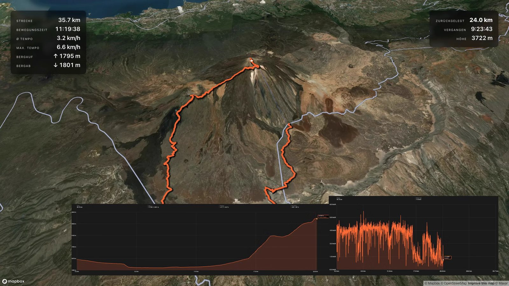
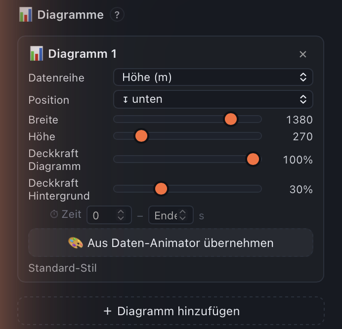

# Reisezoom GPS Studio — User Manual

Cross-platform suite for GPS workflows (macOS · Windows · Linux). **v0.3.3** — Beta.

Modules:
- **Animator** — GPX track as an animated 3D map video (MP4)
- **Travel Route** — the journey there as a video: start/destination → calculated route animated, with the loaded GPX shown as a ghost
- **Tour-Map** — GPX track as a static PNG (e.g. for YouTube thumbnails)
- **Geotagger** — write GPS coordinates from a GPX into JPG / RAW / video EXIF
- **GPX Inspector** — repair a track point by point: heal outliers, fill gaps, move points, trim the start/end

---

## 1 · Installation

### Download
Grab the right version for your operating system:

| Platform | File | Link |
|-----------|-------|------|
| macOS (Apple Silicon, M1 or newer) | `ReisezoomGPSStudio-macos.dmg` | https://s.reisezoom.com/gps-studio-mac |
| Windows (x64) | `ReisezoomGPSStudio-windows-setup.exe` | https://s.reisezoom.com/gps-studio-win |
| Linux (x64) | from source | see the **Linux** section below |

> **⚠️ macOS requires Apple Silicon (M1/M2/M3/…).** Older **Intel Macs are not supported** — the app won't launch on them. To check whether you have an Apple Silicon Mac, look under  → **About This Mac**: if it says "Chip: Apple M…", you're good; if it says "Processor: Intel", unfortunately not.

**On macOS & Windows you don't need to install anything extra** — `ffmpeg` and `exiftool` are bundled with the app. **Linux** runs directly from source (system packages + `python app.py`, see below).

### macOS (.dmg)
1. Double-click the `.dmg`
2. Drag & drop the app into the **Applications** folder
3. On the **first launch** macOS briefly asks once ("… is an app downloaded from the Internet. Are you sure you want to open it?" — with a note that Apple has checked it and found **no malware**) → click **"Open"**.
4. From the second launch on, a normal double-click is enough.

> The app is **signed and notarized by Apple** — the old "unverified developer" block is gone. macOS shows the one-time "Really open?" prompt for **every** app downloaded from the web (even signed ones), and only the first time.

If macOS unexpectedly says "damaged and can't be opened" (e.g. after an incomplete download):
```bash
xattr -dr com.apple.quarantine "/Applications/Reisezoom GPS Studio.app"
```

### Windows
1. Double-click `ReisezoomGPSStudio-windows-setup.exe`
2. SmartScreen dialog: **"More info"** → **"Run anyway"**
3. Click through the setup wizard (choose language → confirm path → optional desktop shortcut)
4. Done — the app launches automatically and adds a Start-menu entry
5. On the first render the app still downloads Chromium (~150 MB, one-time, takes 1-2 min)

> **Want to be extra safe?** The Windows version is not (yet) signed. If you like, you can check the downloaded `.exe` beforehand with a service like [VirusTotal](https://www.virustotal.com) — the builds come from an automated GitHub pipeline with no manual intermediate steps.

Uninstall like any other Windows app: **Control Panel → Apps & Features → Reisezoom GPS Studio → Uninstall**.

### Linux (from source)

There is **no prebuilt binary** for Linux — the map/render backend (pywebview) needs the system GTK/WebKit bindings, which can't be reliably packed into a single binary. Instead, the app runs directly from the (open) source code:

**1. System packages** (one-time — incl. ffmpeg + ExifTool for rendering & photo metadata):

```bash
# Fedora / RHEL
sudo dnf install git python3 python3-gobject gobject-introspection \
                 webkit2gtk4.1 python3-cairo ffmpeg perl-Image-ExifTool

# Debian / Ubuntu
sudo apt install git python3 python3-venv python3-gi python3-gi-cairo \
                 gir1.2-webkit2-4.1 libwebkit2gtk-4.1-0 ffmpeg libimage-exiftool-perl

# Arch
sudo pacman -S git python python-gobject webkit2gtk-4.1 ffmpeg perl-image-exiftool
```

**2. Get the repo & start:**

```bash
git clone https://github.com/docarzt123/reisezoom-gps-studio.git
cd reisezoom-gps-studio
python3 -m venv --system-site-packages .venv   # --system-site-packages → the venv can see the system GTK (gi)
source .venv/bin/activate
pip install -r requirements.txt
python app.py
```

On the first render the app downloads Chromium once (~150 MB).

Without ExifTool, JPEG, TIFF and HEIC photos still work (via piexif +
pillow-heif, both built in). Only RAW files (CR3, NEF, ARW, RAF, RW2, ORF,
DNG, PEF, RWL, SRW) and video metadata need exiftool, as does writing GPS
into HEIC.

---

## 2 · Getting Started

### Set up a Mapbox token 🗺️
Animator + Tour-Map need a **free Mapbox token** for the 3D maps. **The Geotagger works without one too**.

On the first app launch an onboarding modal opens automatically with two options:
- **With a Mapbox token** (recommended) — full features, free in 2 minutes
- **Without a token (OSM)** — works right away, but only the standard map (no satellite, no 3D)

**Here's how to get a free Mapbox token:**
1. Create an account at [account.mapbox.com](https://account.mapbox.com/auth/signup)
2. Click the confirmation email
3. In the dashboard, go to [Access tokens](https://account.mapbox.com/access-tokens/)
4. Copy the "Default public token" — it starts with `pk.eyJ…`
5. Paste it into the token field in the app → Save

> ⚠️ **Credit card required**: since mid-2026 Mapbox requires a credit card at sign-up — **even for the free account**. It sounds odd at first, but it has become common with many cloud services. **Nothing is charged** as long as you stay in the free tier.
>
> 💡 **Free tier: 50,000 map loads per month — free.** In practice that's enough for a great many renders. With normal hobby use you'll never see a bill — you'd have to produce really intensively to hit the limit.

**Change the token later**: macOS menu → **Reisezoom** → **Settings…** (or Cmd+,) — Windows/Linux: ⚙ button, top right.

### Change the language 🌍
The app starts automatically in the **system language** (German, English or Spanish — fallback English). Switch it in the **⚙ Settings modal** → language dropdown. Active immediately, no restart needed.

### Set render quality & export (since v0.9.245) ⭐
In the **⚙ Settings modal** there's a **"Quality & Export"** block — it applies globally to the Animator video export:
- **Frame capture:** **Fast (JPEG)** is the default and makes the render **~10× faster** (grabbing the individual frames was the real bottleneck). Since the video is lossily encoded anyway, the quality is visually identical. **Maximum (PNG, lossless)** is only needed if you genuinely require lossless individual frames — significantly slower.
- **JPEG quality** (JPEG only): default 92, perfectly sufficient.
- **Video codec:** H.264 (compatible, smallest file) · H.265/HEVC (better compression) · ProRes 4444 (master quality, large file).
- **Video quality (CRF)** and **encoder speed** (speed ↔ file size).

The **alpha mode** ("Without map" in the Animator) automatically uses lossless PNG frames and ProRes 4444 — you don't need to set that up separately here.

### What the app remembers
- The last module selection
- All render settings per module (style, pitch, resolution, color, codec, FPS, etc.)
- The last save folder (per module)
- The Mapbox token
- The language selection

Settings file:
- macOS: `~/Library/Application Support/Reisezoom GPS Studio/settings.json`
- Windows: `%APPDATA%\Reisezoom GPS Studio\settings.json`
- Linux: `~/.local/share/Reisezoom GPS Studio/settings.json`

### Sessions & Projects (since v0.8) ⭐

**Sessions** are track-bound: every GPX track automatically gets its own session (recognized via a hash of the track coordinates). Load the same track a second time and you get **all previously made settings + keyframes** back — no more "lost" state when switching modules.

**Projects** are variants within a session — e.g. "Standard variant" + "portrait reels" + "with photo inserts". You can create any number of projects per track.

**Where do I find this?** Top bar, top right — a project dropdown with 4 actions:
- 🆕 **New project** (with pristine defaults)
- 📋 **Duplicate current** (copies all settings + keyframes)
- ✏️ **Rename**
- 🗑 **Delete** (the last project of a session can't be deleted — it's automatically restored as "Standard")

The session data lives under:
- macOS: `~/Library/Application Support/Reisezoom GPS Studio/sessions/`

(One folder per track hash, with a GPX snapshot + projects.json holding all variants.)

---

## 2b · Opening track files — many formats (since v0.9.282) ⭐

You don't need to have a **GPX**. Just open (via the GPX bar or by drag & drop) any of these formats — the app converts it to a GPX automatically on load and works from there:

| Format | Extension | Typically comes from |
|---|---|---|
| **GPX** | `.gpx` | almost all apps (Komoot, Strava, Garmin Connect, …) |
| **FIT** | `.fit` | Garmin, Wahoo, Coros, Suunto, Strava (bike computers & sport watches) |
| **NMEA 0183** | `.nmea` / `.log` | Canon EOS 6D, marine GPS, GPS loggers |
| **KML / KMZ** | `.kml` / `.kmz` | Google Earth, Google My Maps |
| **TCX** | `.tcx` | Garmin Training Center, Strava export |
| **GeoJSON** | `.geojson` | web / OSM tools |

Elevations and timestamps are carried over — as far as the format contains them — which matters for geotagging and the speed readout.

**Export as GPX:** Via the menu **Reisezoom → "Export as GPX…"** you save the currently loaded track as a real `.gpx` file — even if it came from another format. Handy when, for example, you need a clean GPX out of a camera `.log`.

**Export as CSV:** Via **Reisezoom → "Export as CSV…"** you get the same track as a table (`index,lat,lon,ele,time`, time as ISO-UTC). Ideal for spreadsheets, your own analyses, or importing into other tools.

> Note: A `.json` is only recognized if it looks like a GeoJSON track; a `.txt` only if it contains real NMEA sentences (`$GP…`).

---

## 3 · Module: Animator — render a GPX as a video

### What it does
Loads a GPX file and renders an MP4 in which the track line is animated, drawn over a 3D Mapbox map. Use it for: YouTube video intros, website loops, memory animations.

### Workflow
1. **Load GPX**: the "📁 Choose GPX file" button, or drag & drop into the window
2. **The track is shown on the map** (live preview, in the WYSIWYG letterbox frame)
3. **Tune the settings** (see below) — all changes are immediately visible in the preview
4. Click **"▶ Render video"**

**Current frame as an image (snapshot, since v0.9.412):** Below the render button sits **"📸 Current frame as image"**. Scrub the preview to a nice spot and click the button — **exactly this frame** (track up to the current position, your camera framing, the overlays of the moment) is saved as a **full-resolution image**. Perfect for thumbnails or a still from a running flyover.

**Open as Tour-Map (since v0.9.412):** The button **"🗺 Open as Tour-Map"** switches to the Tour-Map and **takes over exactly your current framing** (position, zoom, rotation, tilt) — instead of fitting the whole route as it normally would. There you can render the still as a **PNG**; it keeps the adopted viewpoint. *(For an interactive map for the web, there's the dedicated ["🌐 Web Map"](#5c--modul-web-karte) module.)* With the **⤢** button (bottom right on the map) you jump back to the full view.

5. **Save dialog**: where should the MP4 go? Suggestion: `<GPX name>_<WxH>_<codec>.mp4`
6. The render runs — the live preview shows every frame
7. Done → the result view shows the MP4 + a "Show in Finder" button

> **Animate the journey / a route?** Since v0.9.205 there's a dedicated **🛣 Travel Route** module for that (start/destination → calculated route). See chapter 4.

### Settings

> **↩︎ Undo for everything (since v0.9.322):** Every settings change can be undone with **⌘Z** (Mac) / **Ctrl+Z** (Windows) — in **Animator, Tour-Map, Geotagger and Data Animator**: colors, font, line width, glow, overlay fields, keyframes, trim, time offset, etc. **Redo** with **⌘⇧Z** / **Ctrl+Y**. (One slider drag = one step.)

**Map:**
- **Style**: 6 Mapbox styles (Satellite 3D, Satellite+Streets, Outdoors, Streets, Light, Dark)
- Enable **3D terrain** — for Alpine tours this looks spectacular
- **Track color + thickness** — freely selectable
- **Line style** (since v0.6.5) — Solid / Dashed / Dotted / Dash-dot / **Tube**. For dash/dot variants there's an additional **spacing** slider (multiplies the dash or dot lengths). "Tube" (since v0.8.10, in the line-style dropdown since v0.8.12) lays a white highlight strip on top of the line → makes it look more three-dimensional, like a hose.
- **Drop shadow under the track** (since v0.4) — makes the track look like a line floating above the map. Strength 0–10 px (default 4). With 3D terrain active, the shadow stays on the ground while the track is rendered 150 m above it → a three-dimensional 3D look.
- **Waypoint signs (since v0.9.171, fully customizable since v0.9.179)** — place text signs along the route (e.g. "Summit reached!"). The **"🚩 Signs"** area in the sidebar:
  - **Placing:** **"📍 On track"** → click on the track (snaps into place), or **"📌 Place freely"** → click **anywhere** on the map (e.g. a landmark off the route). With free placement, the **display timing** still follows the nearest track point (anchored to the track + a free coordinate offset).
  - **Editing:** Clicking a sign (in the list or on the map) opens a **floating editor panel** — freely draggable by its header bar (⠿), even out of the map. The sign currently being edited is always visible (no matter where the playback point sits).
  - **Look (all live):** shape (speech bubble · destination banner · pin · signpost · plain), **background** + text color (the **"Background" picker** is the **one** box/bubble color of the sign — since v0.9.271 there is no separate "accent color" and no "Auto" anymore), font (System · Rounded · Narrow · Serif · Monospace · Bold display), size/weight/italic/alignment, multi-line text, corner radius, opacity, border (width + color), **post length** (only for destination banner + signpost — how long the posts/pole under the sign are) and drop shadow. **Add image** turns the sign into a **photo card** (the text then becomes the caption); the image size is adjustable separately.
    - **Speech-bubble arrow direction (since v0.9.408):** With the **speech bubble** style you choose in the editor under **"Arrow direction"** where the tip points — **down, up, left or right**. The bubble automatically shifts to the opposite side so the tip always points at the location. (Analogous to choosing the direction on the signpost; applies to Animator and Tour-Map.)
    - **One color instead of two (since v0.9.271):** There used to be an "accent color" **and** a "background" — both filled the same area, which was confusing. Now there's only the **"Background" picker** = the color of the sign (for the pin, also of the drop). You set the **border** separately under "Border".
    - **Background "None" (transparent, since v0.9.269):** For the background you can now choose **"None"** alongside "Auto" → the sign box becomes completely **transparent**. Handy for **photo cards without a colored frame**: then you see only the image (plus an optional border), instead of a colored edge around the photo that, together with the border, would otherwise look like a **double frame**.
  - **Editing is flicker-free (since v0.9.255):** When dragging the sliders (size, corners, border, shadow, post length …) the preview updates instantly and smoothly. In the test run and the finished video the signs move fluidly along with the camera.
  - **Behavior & timing:** "Grow with zoom" on/off, **"Show the whole time"** (continuously visible), **lead-in** X sec. (appears earlier) + **"Visible for"** X sec. (disappears later; 0 = stays until the end), **fade** (hard/fade-in). Otherwise it appears in the video exactly when the marker reaches the point; it stands upright facing the camera. **Since v0.9.204:** A sign right at the start of the track with a **lead-in** now already appears **in the intro** (lead-in = 1 sec → shows up in the last intro second, instead of popping up only at the track start).
  - **Trigger timing (since v0.9.259) — for out-and-back routes:** If your track passes the same spot **twice** (e.g. out and back), the app can't tell from the click position alone which pass you mean. The solution is in the **"Trigger timing"** block:
    1. Move the timeline **scrubber** to exactly the moment when the marker is at the spot on the **desired pass**.
    2. Click **🕐 "To timeline position"** → the sign is fixed to exactly this moment (status line: "Fixed time: NN %").
    3. **"Auto"** switches back to automatic position detection.
    This works identically in the preview and the finished video. (For **photo cards** this happens automatically via the photo's capture time.)
  - **Preview help:** the **"Show ALL signs in the preview"** checkbox — shows all signs at once while placing (preview only; in the video the timing still applies).
- **Ghost track (since v0.9.169)** — shows the **entire route** semi-transparently in the background while only the animated part is drawn fully opaque on top. That way you can see from the start where things are still headed. Adjustable: **its own ghost-track color** (its own color picker, independent of the track color — e.g. a subtle gray, since v0.9.170) and **opacity** (slider 5–80 %, default 30 %). Works in preview and render including the alpha/transparent mode. Off by default.
- **Multiple track colours (since v0.9.435, extended v0.9.448)** — the track line can **change colour**. The **"Colour by"** picker decides what drives it:
  - **Distance (km)** — colour stops **at km** (number), **at the current marker position** (adopts the scrubber position) or **at all GPX waypoints** (automatic). The first colour applies from km 0 (= track colour).
  - **Any data series of the track** — since v0.9.448 this offers **everything the Data Animator can plot**: elevation, speed, gradient and every sensor value from FIT/TCX files (**heart rate, power, cadence, temperature** …). The list only shows **what the loaded track actually contains**; the unit is in brackets.

    Colour stops are then set **in the value range of that series** (e.g. "from 145 bpm", "from 8 %", "from 2400 m"). **"＋ from &lt;series&gt; (here)"** adopts the value at the marker position, **"Auto (min → max)"** lays a blue→red ramp across the range. Negative values are allowed — which matters for **gradient** (descents) and **temperature** (frost).

  Each stop has **value + colour**, 🗑 removes it. The **"Transition"** switch sets whether the colour changes **hard** (crisp bands) or as a soft **gradient**. Works WYSIWYG in preview, probe run and render. Off by default. *(Single-track animator only for now.)*
- **Map without labels** (since v0.4.4) — hides place names, street names and POI icons on the map. Turns the map into a pure background — a good look when you want the track as the visual lead actor instead of a Google-Maps-style overview. Works with all map styles and also in the Tour-Map module.

**Overlays** (all individually toggleable, freely placeable):
- **Totals box** — total values of the track
- **Live box** — values that update during the animation
- **Elevation profile** — animated line

**🆕 Stats editor (since v0.9.321): you choose what's shown — and in what order.** Below the Totals and the Live box there's a **field list** each. Checking/unchecking determines what appears; with the **⠿ handle you drag the fields into the order you want**. Selectable values:
- **Live (updates with the animation):** Traveled, Remaining, **Speed (km/h)**, Elapsed, **Time left**, Elevation, **Gradient (%)**.
  - *WYSIWYG (since v0.9.325):* These values already update **in the preview** — while dragging the scrubber and in the test run they count exactly as in the finished video, and the elevation profile fills up to the marker position. So you see in advance, pixel-accurate, how the stats will look in the render.
- **Totals:** Distance, Time (total time), **Moving time** (motion time without pauses), **Ø speed** (from moving time), **Ø speed (overall)** (from total time), **Max. speed**, Ascent, Descent, **Highest point**, **Lowest point**.
  - *Default (since v0.9.324):* New tracks show **Distance · Moving time · Ø speed · Max. speed · Ascent · Descent**. The **moving time** is the displayed time instead of the total time — both stay freely selectable. Once you've set your favorite selection, the app remembers it with **"Save as my defaults"** (project menu) for **all** new projects.
  - *Pause detection:* A pause is a segment in which, over a **60-second window, you barely made net progress** — the instantaneous speed doesn't count. So slow steep hiking (~1 km/h, but steady) counts as movement, and only actually standing still counts as a pause.
  - *Accuracy (since v0.9.324):* **Moving time** and **Max. speed** are computed at the **full track resolution** — the peak speed is no longer smoothed away by the render simplification.
- **❤️ Sensor values (since v0.9.330):** If your track brings sensor data — say a **FIT/TCX file** from Garmin, Wahoo, Polar or Coros, or a **GPX file with heart-rate extensions** — the available fields (**heart rate, cadence, temperature, power** and possibly others) automatically appear **at the bottom of the Live field list**. Check, sort and style them like any other live value; they run **point by point in sync with the track** in the render and preview (WYSIWYG). If your track has no sensors, nothing shows up here.
  - **✎ Rename & unit (since v0.9.334):** Every sensor field has a **✎**. With it you can change the **label and unit per project** — make cryptic device abbreviations like `GRD_PCT` or `NGP` readable, rename "cadence" to "step rate / spm" for running, or specify speed in "knots" for sailing. "Reset" restores the default.
- Values your track doesn't provide (e.g. speed/time without timestamps, elevation/gradient without altitude data) are **automatically grayed out**.

**🎨 Appearance of the stats boxes (since v0.9.321):** at the bottom of the Overlays section you choose **font** (System, Nunito, Quicksand, Fredoka, Oswald, Bebas Neue), **text color**, **background color** and **background opacity** — applies to all boxes, with a live preview on the map.

**Positions (since v0.9.284):** stats boxes in a **3×3 grid** — four corners plus **top (↥)**, **bottom (↧)**, **left (⇤)**, **right (⇥)** centered and **center (✛)** (e.g. for a title/opening overlay). The **elevation profile** is narrower and additionally offers **top wide / bottom wide** (across the full width).

**📊 Charts in the video (since v0.9.443):** in the Overlays section, below the simple elevation profile, there's the **📊 Charts** area. With it you overlay **as many** fully styled data-series charts as you like directly onto the map video — elevation, heart rate, speed, power and any other series your track provides, including **color zones** and a **second Y axis**.



- **"＋ Add chart"** creates a card. Per chart you pick the **data series**, the **position** (9 corners/centers), **width** and **height**, plus a **time window** (from/to video second).
- **Separate foreground and background opacity (since v0.9.445):** **"Chart opacity"** controls the curve and labels, **"Background opacity"** the box behind it. Pull the **background down to 0 %** and the map shows fully through, with only the data line floating over the video. The preview now shows this **WYSIWYG** (real transparency instead of a white box).
- **Per-chart axes (since v0.9.447):** every chart card has its own **"Axes"** and **"Axis font size"** (8–60 px) controls. They override the style adopted from the Data Animator — so a small overlay can carry large labels, or do without axes entirely. Note: the font size refers to the **video resolution**, not to the chart box. Up to v0.9.446 the labels shrank with the box (a 270 px chart produced 5 px text) — that is fixed.



- **You design the look in the Data Animator** (line color, area, color zones, info bar, marker, second series …) and then click **"🎨 Adopt from Data Animator"** on the chart — after that the chart looks exactly the same. So you can, for example, set up an elaborate heart-rate chart, adopt it, and place a second one for elevation next to it.
- Every chart **stays in sync with the point on the map**: the marker sits exactly above the current position — you see this already in the preview while scrubbing and in the dry run.
- Works in the **alpha export** too (transparent ProRes 4444 .mov): the charts then sit as their own overlay layer above your video in Premiere / Final Cut / DaVinci.
- The **existing simple elevation profile** stays unchanged — the charts are an additional tool, not a replacement.

**⏱ Time window per box** (since v0.9.228): Under each overlay box you can
set **from which and up to which video second** it's shown — e.g. show the
Live box only from second 2, or hide the Totals box again after
second 8. Two fields "from … s" / "to … s", counted over the
**whole video** (intro + animation + hold). **Empty or 0** = as before (visible
the whole time). You can see the fade in/out already in the **test run**, before you
render.

**Camera:**
- **🎥 Steady camera (3D terrain)** (checkbox, at the very top of the section, **default: off**) — *against the up-and-down bobbing of the camera over mountainous terrain.* With keyframe camera flights over 3D terrain, the camera normally "rides" the mountains and bobs up on every climb and down in the valley (especially with a steep tilt). Check this box and the camera **flies decoupled through space like a drone** — it hits exactly the framing you set at your keyframes, and moves steadily in between, without the terrain bobbing. **The default is off** (classic behavior); only check it if the bobbing over mountains bothers you. Applies both in the **test run** and in the finished **render** (what you see is what you get). *Tip:* If a specific project with the steady camera enabled ever looks odd (e.g. an approach from the world view), just uncheck it again.
- **Tilt (pitch)** 0–80° — how steeply the camera looks down
- **Rotation** 0–60° — the camera's sweep during the video. At 0 = no rotation. At 20° it rotates a steady 20° over the length of the video.
- **Camera follows track** — the camera stays on the moving point instead of on the whole route.
  - **Camera inertia** (appears then) — soft trailing instead of hard sticking to the point (against GPS jitter).
- **Terrain exaggeration** 0–4× — how pronounced the mountains look

**Time & size:**
- **Animation duration** in seconds — how long the track is drawn
- **Hold** in seconds — how long the finished image stays on screen at the end
- **Resolution**: 4K (3840×2160), 1080p, 4K↕ and 1080↕ (portrait for Shorts/Reels), or custom
- **FPS**: 24 (cinema) · 25 (PAL/Europe TV) · 30 (standard) · 50 (PAL HFR) · 60
- **Codec**: H.264 (universally compatible) or H.265 (HEVC, ~30% smaller)

**Performance & output (since v0.4):**
- **Track smoothness (point density)** — how finely the track is drawn:
  - **Low** (100 points) — fastest render, good for preview
  - **Medium** (250 points) — recommended default
  - **High** (500 points) — finer curves with lots of S-bends
  - **Maximum** — all original GPX points (slower, rarely needed)
  
  ℹ️ Render time depends **much more** on **duration × FPS × resolution** than on the number of points. If a render takes too long: reduce FPS/resolution first.

- **Animation without map (alpha channel)** ⭐ **For video-editor compositing**:
  - Enable the checkbox → renders **only track + point + stats overlays** on a transparent background.
  - The output is a **`.mov` file** (ProRes 4444 with an alpha channel, larger than MP4 but NLE-ready).
  - In **Premiere Pro, Final Cut Pro, DaVinci Resolve, CapCut Pro** you can lay this file directly **over real video** — the track appears as an animated overlay on your drone, GoPro or vlog footage.
  - A Mapbox token is **not required** in this mode (no map is rendered, after all).
  - Map style, terrain, tilt and codec are ignored in alpha mode.

**Manual map position (WYSIWYG):**
You can **pan** the preview map with the mouse (click+drag) and **zoom** with the scroll wheel. The render adopts your position 1:1 — what you see in the preview is what comes out in the video.

If you want the track centered again: the **⤢** button at the bottom right.

### Camera keyframes (timeline bar, since v0.7) ⭐

> **Since v0.8.16 this is an optional pro feature.** Default for new projects: just a "🎥 Keyframe editor" checkbox in the sidebar. Only when enabled: the timeline bar appears under the map, the detail editor becomes accessible in the sidebar, and map pins are drawn. Existing projects with keyframes are enabled automatically.

With the timeline bar **below** the map preview you can shape the camera flow dynamically — freely set tilt, rotation and zoom at any points in the track. The engine interpolates cleanly between the keyframes (just like in Premiere or Final Cut).

**Anatomy of the bar:**
- **Timeline axis 0–100 %** — the entire render duration (animation **+** hold)
- An **orange vertical divider** marks the **end of the animation phase**. To the left the track runs, to the right is the hold phase (the track endpoint stands still, but the camera can keep interpolating).
- The **hold area** is orange-hatched with a "HOLD" label above it
- A **🎥 marker** per set keyframe (outlined in yellow when selected). Keyframes can also be placed into the hold phase — e.g. "zoom out to the whole route at the end" while the track is already finished.
- **Scrubber** (yellow line) — shows the current preview position
- **Position readout**: `Point 234 / 1500 · 15.6 %` plus a mode indicator:
  - `🎥 on keyframe #2` — the detail editor in the sidebar is active
  - `free (📍 = new keyframe)` — the map is freely manipulable, without changing keyframes
  - `⏸ Hold` — the scrubber is in the hold phase, the track endpoint stands

**Snapshot workflow** (the core):
1. Drag the map normally with the mouse, scroll to zoom
2. **<kbd>Cmd</kbd> + Drag** (Mac) or **Right-click + Drag** tilts the map (pitch + bearing at once)
3. When the map is positioned the way you want → press **"📍 Keyframe here"**
4. Position, pitch, bearing and zoom are all recorded automatically
5. Repeat for further spots in the track

**Free mode vs. edit mode:**
- **On a keyframe** (scrubber exactly on it) → the detail editor appears in the sidebar with 4 sliders (Anchor, Pitch, Bearing, Zoom-Δ) for fine-tuning. Map edits are NOT automatically taken into the keyframe — for that you press "📍 Keyframe here" again (which updates the existing one) or the "Update with current map view" button in the editor.
- **Between keyframes** → the editor is gone. The map is **free** — pan/zoom/cmd-drag changes NO existing keyframe. "📍 Keyframe here" creates a new one at this position.

**Test run:** The **▶ button** plays the whole track in your actual animation duration (so if you set 12 s, the test takes 12 s). A second click (or <kbd>Space</kbd>) stops it immediately. A pure preview feature, no render needed.

**Keyboard navigation** (like in an NLE):
| Key | Action |
|---|---|
| <kbd>←</kbd> / <kbd>→</kbd> | one GPS point forward/back |
| <kbd>⇧</kbd> + <kbd>←</kbd>/<kbd>→</kbd> | jump of 10 |
| <kbd>Home</kbd> / <kbd>End</kbd> | track start / end |
| <kbd>Space</kbd> | start/stop test run |
| <kbd>Del</kbd> / <kbd>Backspace</kbd> | delete the selected keyframe |

Works only when no slider/input currently has focus. If you've just adjusted a slider and the arrow keys don't respond → click the map once.

**Deleting a keyframe** works in 4 ways:
1. **Detail editor** → the "🗑 Delete this keyframe" button at the bottom
2. **Right-click** on the 🎥 marker in the bar or the map pin
3. The <kbd>Del</kbd>/<kbd>Backspace</kbd> key with a keyframe selected
4. The "🗑 Clear all" button (removes ALL → back to classic behavior)

**Timeline anchor (since v0.8.11):** The keyframes hang on a **position on the entire timeline** (animation + hold), in the range 0..100 %. With e.g. 12 s animation + 5 s hold, the track end sits at ~70.6 % — keyframes before it move with the track, keyframes after it move only the camera (the track endpoint stands still).

That's how "zoom out to the whole route at the end" works, for instance: a keyframe at the start zooms to the starting point, a keyframe at the track end zooms back to normal, a keyframe far back in the hold phase zooms out to the whole route → a cinematic outro.

**Fallback to classic behavior:** If no keyframes are set, everything runs as before v0.7 — static pitch (from the sidebar slider) + a linear bearing sweep (from the rotation slider). As soon as you set the first keyframe, the two sidebar sliders get a yellow note "⏱ Controlled by timeline keyframes" and become visually secondary. "🗑 Clear all" makes them the primary control again.

### World rotation — the Earth spins on the way to the track (since v0.9.136) ⭐

If you want to show **the whole globe** at the start and have it spin one or more times as you zoom into the track, that now runs — exactly like on the **Insta360** — directly via the **longitude** of the map position. There's no separate "world rotation" track anymore; the rotation is baked into the longitude value itself.

**How it works:** Each keyframe has two new fields in the editor, **Lon** (longitude) and **Lat** (latitude) — a slider plus a click-editable number field, just like pitch/rotation/zoom. The longitude is **unwrapped**: values above ±180° mean full Earth rotations on the way from the previous keyframe.

- Longitude `10` and at the next KF `370` → the Earth spins **once completely** and lands back at longitude 10.
- `10` → `730` → **two full rotations**, then landing at 10.
- `10` → `380` → one rotation **plus** 10° eastward.

**Workflow for "the Earth spins, then zoom in":**

1. **KF1 at the start** (anchor 0): zoom to ~0 (globe visible), pitch=0. Optionally the **Center world** button for sensible defaults.
2. **KF2 at the end** (anchor 1): zoom to e.g. 14 (track detail), and set the **longitude** to the track's longitude **plus 360°** (one rotation) or **+720°** (two rotations).

The Earth spins evenly between the two KFs and ends up exactly at the track — the zoom/pan flight stays clean (no "wild flight"), because the full rotations are computed separately from the flight curve.

**When you drag the map, the value counts up automatically:** if you rotate the Earth with the mouse past the date line, the longitude doesn't snap back to −180° but keeps counting (181°, 182°, … 370°, …). Just make as many rotations as you want and then press the snapshot button — the value is taken over with all the rotations.

**Slider tricks:**
- **Click the Lon label** → type a number directly instead of dragging the slider
- Values **outside the slider range** (e.g. `1090` for 3 rotations) are also allowed
- The Lon label automatically shows the **rotation counter**: `370° (1↻)`, `730° (2↻)`
- Works the same for all other KF sliders (Pitch, Bearing, Zoom, Lat)

> **Note for old projects:** Projects from earlier versions with the old "world rotation" track still load, but the old rotation track is ignored. Set the rotation anew via the longitude if needed.

### Limit the render range — trim handles (since v0.9.41) ⭐
Sometimes you only want to render a **section of the track** instead of the whole route. Example: a 30 km tour, but you only want the mountain section as a video.

In the timeline bar you'll find **two sliders** with a gray handle — the left and right trim handles. Drag them inward to shorten the render range. The selected range is highlighted in light orange; the grayed-out areas remain on the left/right.

- **Left trim handle** = where the render track starts
- **Right trim handle** = where the render track stops
- **Keyframes outside** stay visible (subtly), acting as a "run-up" setup: the camera interpolation runs through them, but the track marker itself only starts at the left handle
- **Test run + render** play only the trimmed range (the render output length stays the same, though, because the animation duration is fixed)

### Intro / Animation / Hold (since v0.9.59) ⭐
Three input fields in the "Time & size" block control how long your render video runs:

| Field | What happens |
|---|---|
| **Intro** | seconds BEFORE the track starts. The marker sits at the left trim handle, camera keyframes run → for setup shots (e.g. globe → route-start zoom) |
| **Animation** | seconds in which the track is traced |
| **Hold** | seconds AFTER the track ends. The marker sits at the right trim handle, camera keyframes run → for an outro (e.g. "zoom out to the whole route") |

The **timeline visualizes** this in three zones:
- 🔵 **Light-blue INTRO region** on the left (visible when intro > 0)
- ⚪ **Anim region** in the middle (between the trim handles)
- 🟠 **Orange HOLD region** on the right (visible when hold > 0)

Default values: Intro 0 / Animation 12 / Hold 5. So a 17-second output video in total.

### Show the track before the trim start (since v0.9.55) ⭐
When you render only part of the track, you can choose whether the **track line before it** stays visible (as a faint background line for orientation) or whether the line only starts at the left trim handle. A checkbox in the overlay settings modal ("🧭 Stats from the trim range" / "🧭 Show track before the trim start"). On by default.

### Live render preview
During the render you see the frame currently being produced in the preview window. If the combination of style and camera angle doesn't suit you: click **"⨯ Cancel"** — the half-finished file is deleted immediately and you can reconfigure without having waited 5 min for a render that turns out to be nothing.

### 📷 Photos on the map (since v0.9.74) ⭐

Photos with GPS EXIF appear as small thumbnails at their capture position. Perfect for travel vlogs: the track runs along, and the photo points are visible as polaroids on the map.

**Workflow:**

1. **Choose a photo source:**
   - **"Choose folder"** → native folder picker. The app scans all photos in the folder (JPEG/HEIC/RAW).
   - **Drag & drop** into the "📷 Photos" panel (multiple files or a folder).
   - **"Take over from Geotagger"** — if you first ran the photos through the Geotagger module (with freshly written GPS tags), the list comes over with one click.

2. **What happens:** photos with GPS land as mini thumbnails on the map. Photos without GPS are skipped — you get a message "X of Y photos loaded, Z skipped".

3. **Set the size:** the **Size** slider (24–80 px) controls how large the thumbnails appear on the map. Takes effect instantly and live in the preview and the finished render.

4. The **"Show on map"** checkbox hides all pins without clearing the list — handy when you only want them for the Tour-Map and not in the Animator video.

5. **"🗑 Remove all"** clears the list for the current project completely.

**List in the sidebar:** shows each photo with a thumbnail + filename + coordinates. A click flies the map to the photo.

**Shared between Animator and Tour-Map:** The photo list lives at the project level. What you load in the Animator is instantly on the Tour-Map too (and vice versa). The size is separate per module — the video can have smaller pins than the print map.

**Persistence:** paths + GPS coordinates are stored in the project. On the next opening the thumbnails are regenerated automatically (disk cache, hence fast). If you moved or deleted a photo file in the meantime, it quietly drops out of the list — no crash.

**In the render:** photo pins appear **as soon as the animated marker reaches their position** (since v0.9.187 — before that they were accidentally visible from the first frame), and then stay until the end. The position is exactly the EXIF GPS position (even if it's not on the track, e.g. a summit photo next to the hiking trail).

---

## 4 · Module: Travel Route — the journey there as a video 🛣️ (since v0.9.205)

### What it does
Animates the **journey** to a tour: you enter a start and destination, from which a route is calculated and animated like a track — e.g. as an intro before the actual hiking video. The loaded GPX (the hike) is shown as a **ghost** in the background.

Travel Route is a **full-fledged clone of the Animator**: everything that works there (map style, keyframes, signs, render options) works here just the same — only, instead of a GPX, the calculated route is animated. Its own settings and its own signs (independent of the Animator).

### Workflow
1. **Load a GPX** (the hike) — as usual via the GPX bar. In the Travel Route tab it appears automatically as a **ghost** (faint line).
2. The **"🛫 Route / journey"** area: choose a **style** — **🛣️ Follow the road** (Mapbox route) or **✈️ Flight path (great circle)** (the shortest path on the globe, like real flights — it bows poleward on the map).
3. Enter **stations** — **start, any number of waypoints, and destination**. Type each station as an **address/place** (e.g. "Dresden Hauptbahnhof"), set it via **📍 click on the map**, or as `lat,lon`. **"➕ Waypoint"** inserts a station before the destination; **✕** removes one. With **"📍 Click mode"** you simply click the stations **one after another on the map** — each click appears as a new station in the list (Esc ends it). Handy when the real route (e.g. a ferry) doesn't follow the direct path.
4. For "Follow the road": **mode of travel** (car/foot/bike) + a **detail level** slider (fine → coarse). Coarse makes a deliberately **flowing, simplified** line that loosely follows the route (not as fine-grained as a real hike). The animation always stays smooth.
5. **"Calculate route"** → the route is loaded as an animated track, the hike remains as a ghost behind it. Distance + travel time are shown below the button.
6. Continue as in the Animator: test run, camera, signs, **render video**.

> **The detail level takes effect only at the next "Calculate route"** — move the slider, then recalculate.

### Configure the GPX ghost
The **"👻 GPX ghost"** area: show on/off, **color**, **opacity**, **line width**, **dashed**. Takes effect live in the preview and in the rendered video. (In the Travel Route module the stats overlays are hidden for this.)

### What gets saved
All stations (start, waypoints, destination), style, detail level, profile **and the last calculated route** are stored in the project — after a restart everything is back (the route appears without recalculating).

### Needs a Mapbox token
Road routes + address search run via Mapbox (the same token as the map, see Getting Started). The flight path (great circle) needs no API call.

## 5 · Module: Tour-Map — static map PNG

### What it does
Like the Animator, but **a single image instead of a video**. Output: a PNG in any resolution. Use it for: YouTube thumbnails, Instagram posts, blog covers, Komoot gallery images.

The Tour-Map is **the same interface as the Animator** — just in **still-image mode**: everything that only makes sense for a moving video (timeline, keyframes, live stats, trim, camera flight, FPS/duration) is hidden. What you see on the map is **exactly** the rendered PNG (WYSIWYG).

### Workflow
1. **Load a GPX** (same way as the Animator)
2. **Choose a format**: YouTube 16:9 (1920×1080) · 4K · Shorts 9:16 (1080×1920) · Instagram 1:1 (1080×1080) · or custom
3. **Style + camera** as in the Animator — map style, line look, tilt, zoom level, signs/photos
4. **Fine-tune the framing** with the camera controls (see below) or directly with pan/zoom on the map
5. **"🗺 Render map as PNG"** → save dialog → the PNG is ready in 3-5 seconds

### Still-image camera controls (since v0.9.310)
In the **Camera** section there are three controls that only appear in still-image mode — all take effect **instantly, live in the preview**:
- **Orientation** (−180…180°) — rotates the map (which compass direction is up)
- **Padding** (0–30 %) — how much air stays between the track and the image edge
- **Start/destination markers** (On/Off) — two points: **start white** with a track-colored border, **destination in the track color** with a white border

Plus, as in the Animator: **tilt** (pitch) and **zoom level**. The **"Image settings"** section now only contains the resolution.

### Result view
After the render: a large preview image, "Show in Finder", "Copy path", "New map".

### Choose a map style — including OpenStreetMap (since v0.9.406) ⭐
In the **map style** dropdown, the Tour-Map module offers, in addition to the Mapbox styles (Satellite, Streets …), four **OpenStreetMap styles** to choose from: **OSM Standard, OpenTopoMap, CyclOSM, Humanitarian** — and that's **even if you have a Mapbox token stored**. If you pick an OSM style, the preview shows it immediately. *(OSM styles need no token.)*

> **An interactive map for the web?** The Tour-Map produces a **still image (PNG)**. If you need a **zoomable/pannable map for your blog**, use the dedicated **"🌐 Web Map"** module (since v0.9.422) — see [section 5c](#5c-modul-web-karte).

---

## 5c · Module: Web Map 🌐 — interactive map for your blog (since v0.9.422) ⭐

### What it does
A dedicated, deliberately **lean** tab for **interactive maps for the web/blog** — completely separate from the Tour-Map. The track is drawn automatically from the loaded GPX, and you add **text labels directly onto the map**. The result is a light, standalone HTML file (~40 KB) with a token-free OpenStreetMap map — to zoom and pan in the browser, like the embedded maps in Reisezoom blog posts. The preview in the app is **exactly** the export.

*(If instead you want a high-quality still image with satellite/3D/signs/photos, use the [Tour-Map](#5--modul-tour-map).)*

### Workflow
1. **Load a GPX** (the global GPX bar at the top). The track appears immediately and is fitted.
2. Set the **track color/width** and the **map style** on the left.
3. **Add labels:** click **"＋ Add label"** → tap on the map. In the **label list** below, you set the **text, color and size** for each entry and delete it with 🗑. On the map each label can be **dragged** (moved); clicking it jumps to the matching row in the list. The text color (light/dark) is chosen automatically to match the selected color.
4. Optionally enable the **GDPR button** (see below).
5. **"🌐 Export as HTML"** → a window with the output options.

### Multiple tracks (since v0.9.432) ⭐
You can show several GPX tracks on **one** map — e.g. multiple stages of a tour or the outbound and return legs. The **first track comes from the loaded GPX** (global GPX bar). Add more in the sidebar section **"More tracks"** via **"＋ Add track"** and pick a GPX per file. For each track you set **name, colour, width** and **start/finish pins**; remove it again with 🗑. The map automatically fits to **all** tracks together, and the preview is, as always, **exactly** the export.

### GDPR button (optional)
With the **"GDPR consent button"** checkbox the map gets a preceding consent layer — the external map tiles (and thus the IP transfer to OpenStreetMap) are **loaded only after a click**. The consent text and button label are freely editable and pre-filled sensibly. Behind the text lies a **blurred preview image of your map**, which is **embedded firmly in the HTML** (no external loading) — so the gate doesn't look empty and is still GDPR-compliant. *(Exporting with active consent takes a few seconds longer, because the map is rendered once for it.)*

### Leaflet source (since v0.9.430)
In the export area you choose **where the embedded map loads Leaflet from**:
- **CDN (unpkg)** — default, smallest file; Leaflet comes from the public CDN (with the GDPR button active, only after "Load map").
- **Self-hosted (URL)** — you provide a base URL (e.g. `https://yourblog.com/leaflet/`); the HTML loads `leaflet.css` + `leaflet.js` from there. You put the two files on your server yourself.
- **Embed in HTML** — Leaflet is written completely into the file: **no external fetch** (GDPR-clean, works offline), the file grows by ~160 KB.

### After the export
- **▶ Open in browser** — shows the map immediately in the default browser. *(Double-clicking the file only opens an editor on some systems — so use this button.)*
- **Copy snippet (no upload):** a ready-made **`<iframe>` snippet** for a WordPress **"Custom HTML" block**. The entire map is inside the snippet (`srcdoc`) — no separate file upload needed.
- **Show in Finder:** finds the `.html` on disk to upload to your own server.

**Deliberately minimal:** only track + text labels. No photos, no sign graphics, no 3D/overlay — this is the light "blog map" export.

---

## 5b · Module: Data Animator — measurements as a video 📊

> **New in v0.9.437:** This module used to be called the **Elevation Animator** and could only do elevation. It now animates **any data series from your track** — hence the new name. Your existing projects keep working unchanged and still start with elevation.

### What it does
Builds a **video from your track in which a measurement curve builds up live** — a moving marker shows the current value and the distance. Ideal as an overlay in the edit (also with a **transparent background** via ProRes 4444 alpha).

### Choosing the data series (since v0.9.437) ⭐
At the very top of the sidebar you'll find **“Data series”**. That's where you pick what gets animated:
- **Always available:** **Elevation**, **Speed** and **Gradient** — the app derives these from the track itself.
- **From FIT/TCX files** (e.g. Garmin, Wahoo, Suunto): **heart rate**, **cadence**, **power**, **temperature** and other sensor values.

The list only offers **what your track actually contains**. Load a plain GPX file without sensor data and you're left with elevation/speed/gradient. The axis labels, marker and info bar adopt the name and unit automatically — with heart rate it reads “139 bpm” instead of “1240 m”.

Two displays are elevation-specific and only appear for the **Elevation** series: the mountain icon ⛰ and everything around **ascent/descent and gradient**. They'd be meaningless for heart rate or power, so they stay hidden.

### Two series at once (since v0.9.438) ⭐
Right below the first picker sits **“Second data series (right axis)”**. Pick something there and **two curves run at once** — the classic being **elevation on the left, heart rate on the right**.

The second series gets **its own axis on the right edge**, auto-scaled to its own value range. It's labelled in the second curve's line colour so it's obvious which axis belongs to which curve — colour and line width are set right next to it. The marker box shows both values stacked.

Separate axes are deliberate: elevation (m) and heart rate (bpm) share no common value range — on one axis, one of the two curves would collapse into a flat line. The second curve is drawn as a **line only** (no area or colour zones), because two filled areas on top of each other would be unreadable. With no second series, everything stays as before.

### Workflow
1. Load a GPX/FIT/TCX (the global GPX bar at the top). The preview plays immediately.
2. Pick the **data series** (default: elevation).
3. Set the look, info bar and points (see below). Everything runs **WYSIWYG** in the preview.
4. Use the **trim handles** under the curve to limit the animated range (optional).
5. **▶ Render video** — choose codec/alpha, progress runs along.

### Factual info bar (since v0.9.394) ⭐
Above the profile you show a **value bar** — toggle it on/off in the **"Info bar"** section and select it per field: **distance, elevation gain ↑/↓, Ø gradient, max. gradient (↑/↓), elevation (max/min/Ø)**. In addition, the **marker callout** shows the **current gradient** (e.g. "↗ +6.2 %" / "↘ −4.7 %") next to elevation and distance — can be turned off via "Show gradient % at the marker".

### Points along the route (since v0.9.394) ⭐
In the **"Points along the route"** section you place labeled markers into the profile — from four sources, individually toggleable:
- **Set yourself:** click **"Place a point on the profile"**, then click into the curve. Enter a name, choose a color, rename or delete it later.
- **From the photos:** the photos located in the project appear at their track position (name = filename).
- **GPX waypoints:** `<wpt>` POIs from the GPX file (e.g. from Komoot/Garmin) are taken over.
- **Auto markers:** the highest/lowest point as well as the steepest ascent and descent are detected and labeled automatically.

Each point **appears animated as soon as the line reaches it**. You can hide/show individual points from a source in the list via 👁. Your manual points + all settings are stored **per project**.

**Fully configurable axes (since v0.9.447):** Below the "Show axis labels" switch there is now a detail block. It lets you toggle the **X axis**, the **left Y axis** and the **right Y axis** (second data series) individually, pick the **font size** (8–60 px) and set **how many values** each axis labels (1–12). When an axis is off its margin drops to a minimum — the curve gets the free space. The main switch above still turns everything off at once.

**Colors (since v0.9.395):** In the "Look" section, alongside background and line color you now also choose the **grid color** (helper grid) and **label color** (axes, info bar, marker callout).

**Smoothing (since v0.9.400):** The **"Smoothing"** slider in the Look section (0–20) softens jagged profiles — helpful with tracks that have many GPS points and small elevation jumps. It applies a moving average over the elevation data; 0 = raw data, higher values = smoother. The smoothing takes effect WYSIWYG on everything: line, area, info bar, the gradient at the marker and the point elevations — the same in preview, video render and HTML export.

**Area under the line (since v0.9.402):** In the **"Area under the line"** section you set **whether** the area under the curve is filled, in which **fill color** and with what **opacity** (0–100 %).
Below that you can create **color zones by elevation:** with "**Add elevation**" you define an elevation (in meters) plus a color — **from this elevation up** the fill color changes. This creates the classic relief-map look (e.g. green in the valley, brown at mid-altitudes, white at the summit). Below the lowest zone the normal fill color applies. Via **color transition** you choose between a **soft gradient** (the colors blend into each other) and **hard bands** (the color jumps at each elevation). Without zones, the fill color is simply used for the whole area.

**Create elevation steps automatically (since v0.9.403):** Instead of setting each zone by hand, you enter a number at **"Number of steps"** (e.g. 4) and click **"Create steps"** — the elevation range of your track is then automatically divided into that many equal-sized steps and given a terrain color ramp (green → brown → white). You can edit the generated steps as normal afterwards (change elevation/color, delete, add).

**Elevation steps for background and line (since v0.9.403):** The same elevation color zones are additionally available in the **"Background elevation steps"** and **"Line elevation steps"** sections. With them you color the **background** or the **elevation line** by altitude — each with the same generator, zone editor and soft/hard toggle. The base color is the respective base color from the Look section ("Background" or "Line color").

**Point & info box separated (since v0.9.405):** In the "Marker" section there are two independent switches: **"Show point (draws the line)"** controls the moving point at the tip of the animation, **"Show info box"** controls the info box beside it. That way you can, for example, turn the info box off entirely and still keep the point (or vice versa). The point color and point size above apply to the point.

**Background only in the chart (since v0.9.404):** In the "Background elevation steps" section there's the **"Only in the chart area (inside the axes)"** checkbox. When active, the elevation color gradient of the background is drawn only **inside the axis frame** (exactly where the elevation line and the area sit) — the border all around keeps the normal background color. Without the checkmark, the gradient colors the whole image as before.

**Configure the marker (since v0.9.396):** The dedicated **"Marker"** section makes the moving point and its info box fully customizable: **point color + size**; for the box **background color + opacity, border color + border thickness, font size**; and which values it contains — **⛰ symbol, elevation, gradient (%), distance** each individually toggleable (the box adjusts its size automatically).

**Undo:** **⌘Z / Ctrl+Z** undoes **everything** in the Data Animator — look, colors, info-bar fields, waypoints and source switches (one press per step).

**Export as HTML (blog/web, since v0.9.397):** Below the video render button sits **"Export as HTML"**. This produces a **self-running `.html` file** — the same animation as in the video, but it runs **completely in the browser** (pure HTML, no video), with an auto-loop and a **"↻" replay button**. Ideal for a blog post. After the export a **window opens in the center of the screen** with these options:
- **▶ Open in browser** — shows the finished animation immediately in the default browser. *(Double-clicking the file in Finder only starts an editor on some systems — then you only see source code; so use this button.)*
- **Copy snippet (no upload):** a ready-made **`<iframe>` snippet** — paste into a WordPress **"Custom HTML" block**. The entire animation is inside the snippet (`srcdoc`), cleanly isolated from the theme.
- **Show in Finder:** finds the `.html` on disk; upload it to your server and embed it via `<iframe src="…">`.
No WordPress plugin needed; no Mapbox/CDN — the file runs on its own.

**Settings are kept (since v0.9.399):** colors, marker settings, resolution, duration, etc. are **stored per project** and restored on the next opening.

---

## 6 · Module: Geotagger — tag photos with GPS

> **Since v0.9.331 the Geotagger comes in three variants:**
> 1. **In GPS Studio** (this module) — together with Animator, Tour-Map & Co.
> 2. **As a standalone solo app "Reisezoom Geotagger"** — lean, just for tagging photos, with an **OpenStreetMap map without a Mapbox token** (no credit-card topic). Ideal if you *only* want to locate photos.
> 3. **As a web tool in the browser** — tags **JPEG** photos entirely locally (nothing is uploaded), no installation. For RAW/HEIC/video you need the desktop app.
>
> All three use the same logic. The following workflow steps apply to the desktop variants (1 + 2).

### What it does
Reads the capture time from the EXIF data of each photo and finds the matching track point in the GPX track. Writes the GPS coordinates as an EXIF tag into the photo. **Works with JPG, RAW (CR3/NEF/ARW/RAF/RW2/ORF/DNG/PEF/RWL/SRW/HEIC) and video (MP4/MOV/INSV)** (web tool: JPG only).

### Workflow
1. **Load a GPX** — the map shows the track
2. **Select photos** — either "📁 Choose photos", "📁 Load a whole folder", or drag & drop
3. **Photo tiles** appear in the middle with thumbnails. Markers on the map show where each photo was assigned based on capture time. **Dragging in more photos or loading another folder adds to the list** (since v0.9.176 — it's *added*, not replaced; duplicates are skipped). To clear it, use **"🗑 Remove all"**.
4. **Check the offset** (see "Time zones" below) — usually it fits right away
5. **"Write GPS into photos"** → **choose a target folder** → the fully tagged **copies** land there, your **originals stay untouched** → done, the folder opens

### How the tagged photos are saved (since v0.9.372)
- **Your originals are never touched.** When writing, you choose **a target folder once**; the app writes the fully tagged **copies** there. The originals thus remain as a backup — there's no separate backup ZIP anymore (unnecessary).
- **A single consistent flow**, whether you loaded the photos via **drag & drop** or via **"Choose folder"**: a clean folder with the tagged images always results. The done dialog shows **"Saved in …"** + **"Open folder"**.
- **Tag the originals directly after all?** Just choose the **folder of your originals** as the target. Then the app asks **"Really overwrite the originals here? (no backup)"** — if you confirm, they're tagged in place. Without confirmation, the app **never** overwrites an original.

### Time-zone magic
The app reads the `OffsetTimeOriginal` EXIF tag from each photo and converts the capture time to UTC. That way the track fits **out of the box** in 95 % of cases without you having to set an offset manually.

If it doesn't after all (e.g. because the camera clock was wrong):
- **Offset slider** in the left panel — ±2h default, with expandable ±3 / ±6 / ±12h options
- **Set a reference photo** — click a photo tile, then click the actual capture position on the map. The app computes the offset itself.
- **Choose the camera time zone** (✎ → "Enter exact offset") — some cameras (many Olympus/OM, GoPro) store **no** time zone in the photo. If you travel to, say, Vietnam (UTC+7), the images then sit 7 hours off the track. Just set the **time zone of the camera clock** in the offset dialog — once set, everything fits. Photos that stored their own time zone (phones, etc.) stay untouched, so you can tag phone and camera photos from the same trip together without a problem. The active time zone is shown below the offset value.
- **Offset per camera (since v0.9.354)** — if you tag photos from **two cameras at once** and only one has the wrong clock, you can give each camera its own offset:
  1. At the top of the overview, click the **camera button** of the affected camera (filters to only its photos).
  2. Now the **offset slider** and the **reference photo** apply only to this camera. Set the offset (slider or reference photo).
  3. If needed, filter to the second camera and adjust separately there.
  4. Set the filter back to **"All"** — both cameras keep their own offset.
  Each camera's button shows its set offset as a small badge (e.g. `📷 OM-3 +1h`). Without a camera filter ("All") you set the **global default**, which applies to all cameras without their own offset. The per-camera offsets stay saved and also take effect in the optional capture-time correction.

### Options
- **No backup needed** (since v0.9.372) — the originals are never touched (the tagged copies land in the chosen target folder), so there's no backup checkbox anymore.
- **When a photo already has data** (since v0.9.339) — three modes:
  - **Keep, fill in only what's missing** (default): existing GPS stays untouched, only what's missing is added (e.g. address, view direction). Ideal for mixed batches (phone photos with their own GPS + camera photos without). **A location stored in the photo takes precedence over the time assignment** — a photo that already has "Porto" as GPS is located in Porto, not at the track point matched by clock time.
  - **Overwrite everything**: also replaces existing data with the track values.
  - **Skip photos with GPS entirely**: doesn't touch photos with their own GPS.
- **Also adjust the photo's capture time with the offset** (default off)

### View direction from the Reisezoom Logger 🧭 (since v0.9.336)
If your GPX track was recorded with the **Reisezoom Logger app** (Android), it contains the **real camera view direction** (compass, true north) per point. The Geotagger writes this as **GPSImgDirection** into the photo — so later, for example, Lightroom or Apple Photos knows which direction you were shooting (an arrow on the map).

- Each photo tile shows a **🧭 chip** with the direction and the source:
  - **(camera)** — the photo already stored the direction itself (a camera with a compass) → stays untouched
  - **(logged)** — taken over from the Reisezoom Logger → is written into the photo
  - **(motion)** — roughly estimated from the direction of movement → is **not** written into the photo (only shown as a hint)
- You don't have to set anything: if a logged direction is present, it's written along automatically during the normal "Write GPS into photos".
- Works in the **Studio and the solo Geotagger** alike.

### Set the shooting direction yourself — a map compass 🧭 (since v0.9.337)
You can set each photo's view direction **directly on the map**:
- **Select a photo** → a **compass** with the photo thumbnail in the center appears on the map.
- **Drag the ring** to rotate the direction (N/E/S/W markers + degree readout) — this is how you set which way the camera was pointing.
- The **red ✕** turns the direction off if you don't know it (no view direction is then written into the photo).
- If a direction already exists (from the camera or the Reisezoom Logger), it's **shown** and can be corrected.
- Manually set directions are written as **GPSImgDirection** when tagging (the chip shows "(manual)").

### Multiple photos at the same point — fan out (since v0.9.347)
If two or more photos have (almost) exactly the same position, their map pins lie on top of each other and you only hit the topmost one on a click. **Just click the pin** — it **fans the photos out in a circle** (with small leader lines), then you click the one you want individually. Selecting one collapses it again automatically; a click on the empty map or a move/zoom also collapses it. (Alternatively you can reach every photo via the **list on the left** + the ↑/↓ arrow keys.)

### View photo details — EXIF tabs (since v0.9.341)
Clicking a photo (in the list or on the map pin) opens the preview panel on the right with two tabs:
- **Info** — capture time, coordinates, address and the light-stamp chips, **plus the most important camera data**: camera, lens, focal length (with the 35mm equivalent, if available), ISO, exposure time, aperture, exposure compensation and flash.
- **EXIF** — the **complete** list of all metadata fields stored in the photo (everything ExifTool can read), to scroll through. Thumbnail/binary fields are hidden.

**Edit fields directly (since v0.9.343, batched since v0.9.344):** In the **EXIF tab** you can **click and change** any value — an input opens inline, **Enter** (or ✓) applies, **Esc** (or ✕) cancels. Emptying a field = the tag is deleted. Grayed-out fields (filename, file size, image dimensions, ExifTool version …) are inherently **not** editable because ExifTool doesn't write them. Tip: camera, lens, ISO, aperture, etc. are found as individually editable tags (`Make`, `Model`, `LensModel`, `ISO`, `FNumber`, `ExposureTime`) in the EXIF tab.

**When is it saved?** Your changes are **not written immediately** into the photo, but collected as **pending** (marked yellow, with a hint line + "discard") — in addition, a small yellow **warning banner** appears above the photos/map as long as unsaved changes are open. They're only written when you click **"Write tags"** at the bottom — together with GPS/address/direction and **within the same ZIP backup**. That way there's a backup before every change. The write button is active even if you only edited EXIF fields (without GPS).

### Auto-tag via image recognition 🔍 (since v0.9.349, Mac only)
On the **Mac** the Geotagger can automatically detect **keywords** for each photo — scenes and objects like "outdoor, forest, deer, beach". This is done by the **built-in Apple Vision framework**: completely **on the device**, no internet, no account, no download, and fast (a fraction of a second per photo). Common terms are translated into German.

Here's how: click the **"🔍 Auto-tag (image recognition)"** button in the write section → the app analyzes all visible/checked photos → the suggestions land as **pending changes** (yellow, in the `Keywords` field) → you skim/correct them in the EXIF tab and then write them with **"Write tags"** (incl. backup). The AI only suggests — you decide.

> **Windows / Linux:** This function is **not** available there — Apple Vision is Mac-exclusive, and we didn't want to bundle a huge AI model for it. The button is simply hidden there; everything else in the Geotagger works identically.

### Global fields — creator & copyright for the whole batch (since v0.9.346)
Some fields you want to **set once and write to all photos** — name, copyright, etc. For that there's the **"✎ Global fields (creator, copyright …)"** button in the write section. In the form you enter what you need:
- **Creator** (your name), **copyright**, **usage terms**, **credit**, **source**, **website/URL**, **email**, **keywords** (comma-separated).

These values are **stored as a profile** — you type name + copyright **once**, and after that they're already there for every batch. On **"Write tags"** they're written to **all visible/checked photos**, and per field into several metadata tags at once (EXIF + IPTC + XMP) so that Lightroom, Apple Photos & Co. find them everywhere. If you changed the same value by hand for a photo in the EXIF tab, **your individual change takes precedence** over the global value. Emptying a field in the form = it's no longer written.

### Write the address into the photo 📍 (since v0.9.337, automatic since v0.9.338)
As soon as photos are assigned, the app **automatically** determines the **complete address** (street, town, state, country) for each and shows it in the photo popup. On tagging it's written into the photo as **IPTC + XMP** — Lightroom, Apple Photos & Co. then show the location and country. The **"📍 Fetch addresses"** button is now only for **re-fetching**.

- **Clever instead of slow:** the lookup runs as a **3-tier pyramid** — first one query on the centroid of all photos (= country), then one per ~1-km area (= town), then finely the street. That way all images are roughly filled after a few queries, with the street following.
- **Provider selectable** (⚙ → "Address search"): **Automatic** (uses Mapbox if you have a token stored, otherwise Photon), **Mapbox** (fastest, needs a token), **Photon/Komoot** or **Nominatim/OpenStreetMap** — all without an account except Mapbox. Each option is explained in the dialog.
- **Can be turned off:** in the settings the address search can be **disabled** entirely — then nothing is sent to the internet at all, and you type addresses by hand as needed.
- **Correctable per photo:** if an address is wrong, adjust it via the **✎** in the photo popup.

### Choose what gets written
In the write section you can specify per run **what goes into the photo**: GPS coordinates (always), **elevation**, **view direction** and **address** — each option individually toggleable. The selection is remembered.

### Tap a track point (since v0.9.163) ⭐
Click the **track line** on the map → a small popup shows the **GPS coordinates, elevation and date/time (UTC)** of the nearest track spot. Handy for quickly checking when/where you were at a spot.

### Filter the overview (since v0.9.163) ⭐
The **"Overview"** in the left panel counts how many photos will be tagged, lie outside the track time, have no usable EXIF time, or already had GPS. Behind each line sits a **"show"** button: a click filters the photo list to exactly this category (e.g. only those outside the time, to check them). **"Reset filter"** brings all photos back.

### Filter by camera + tag selectively (since v0.9.164) ⭐
- **Camera filter:** if you have photos from several cameras, the overview lists each **camera** with a count + a **"show"** button. A click shows only the images from that camera.
- **Checkbox per photo:** each photo has a checkbox at the top left — **on by default**. On writing, **only photos that are currently visible (through the active filter) AND checked are tagged**. That way you can, for example, use the camera filter to tag only one camera on purpose, or uncheck individual images that should not be tagged.
- **Remove a photo:** a small **✕** at the top right of the photo (when hovering) or **Backspace/Del** on the selected photo takes it out of the list. The file itself stays untouched.

### Place photos manually on the map (since v0.9.166) ⭐
Some photos **can't be assigned by time** — e.g. because they only carry the export date and thus land "outside the track time". Instead of giving up on them, **just drag them from the photo list onto the map** — where you release, the GPS coordinates are set and written.

- **Place freely** (default): the photo lands exactly where you drop it. Works **even without any track** — so you can also geotag photos without a GPX.
- **Snap to track:** the **"Snap to track"** switch (the "Place manually" section on the left) instead places the photo on the **nearest track point** (incl. its elevation). **Holding ⌘** while dropping briefly reverses the mode (free ↔ snap).
- **Fine-tune:** manually set pins are **blue** and can be **moved directly on the map**. The same snap logic applies while moving (toggle + ⌘).
- A hint bar on the map indicates while dragging whether it's currently being set **freely** or **on the track**.
- **Take the capture time from the track (since v0.9.281):** the **"Take capture time from track"** switch (directly under "Snap to track") additionally writes, on tagging, the **time of the track point** as the capture time (`DateTimeOriginal`) into the photo for **snapped** photos. Perfect for **WhatsApp photos from friends** that only have a wrong forwarding time — so after tagging they sort correctly among your own photos. Applies **only** to snapped photos; time-matched photos keep their original time. The track time (UTC) is converted to your local time zone — correct if you were traveling in your home time zone.

> Note: manual placements apply to the running session. If you switch modules and come back, you may have to set them anew.

### Speed
ExifTool runs as a daemon in the background — RAW processing is ~8× faster than a naive `subprocess` call. Tagging 200 photos takes ~15 seconds.

---

## 7 · Module: GPX Inspector — repair a track 🔍 (since v0.9.233)

### What it does
Shows **every single point** of your track on the map (the full raw track, not the smoothed preview downsample) and lets you repair broken spots: smooth GPS outliers, fill gaps, move or delete individual points. Needs **no** Mapbox token (works in OSM mode too). Saves as a new file `<name>_geheilt.gpx` — your original stays untouched. Opens **all importable formats** (GPX, FIT, KML/KMZ, TCX, GeoJSON, NMEA/`.LOG`) — foreign formats are converted to GPX automatically (since v0.9.296).

> **❤️ FIT/TCX sensors are preserved (since v0.9.334):** If you edit a track with sensor data (heart rate, temperature, cadence …), the healed GPX keeps these values. Unchanged and smoothed points carry their real readings on, newly inserted gap points are interpolated. So you can use the healed track afterwards as normal in the Animator with a sensor overlay.
>
> **💾 "Save as…" + format (since v0.9.335):** On saving, a file dialog opens — the default folder is that of your original file (no longer a hidden system folder). Choose **GPX** (sensors sit in the file directly via `gpxtpx`) or **TCX** (Garmin format with heart rate/cadence). That keeps the file portable and it doesn't lose standard sensors even outside Reisezoom.

### Tools

**Heal (smooth a jump)** — for GPS zigzags: a point sits briefly far off (a tunnel, an urban canyon). Click **anchor A** (green, before the jump) and **anchor B** (red, after it), then **🩹 Heal**. The points in between are laid onto the direct line — **position and elevation interpolated, the timestamps stay unchanged**. That way the speed corrects itself (previously e.g. "180 km/h on foot").

**Fill a gap (straight line)** — when *points are missing* between A and B: inserts new points on the straight line (position, elevation and time interpolated). The spacing is adjustable via "Spacing when filling".

**Draw & fill a path** — like "Fill a gap", but you draw the path yourself: choose anchors A+B → **✏️ Draw & fill a path** → click on the map (the cursor becomes a crosshair) → **✓ Apply path**. The gap is filled along the line you drew.

**Individual points:** click a point (anchor A only) → **🗑 Delete this point** or simply **Del/Backspace**. Or **move the green point with the mouse** — e.g. drag it onto the real path without deleting it (time + elevation stay, speed still fits).

**Trim the start or end (since v0.9.320):** click a point (anchor A only) → **⏮ Trim everything before** (the point becomes the new **start**) or **⏭ Trim everything after** (the point becomes the new **end**). Just the thing when at the end of a tour you **forgot to stop the recording** and the track has a pointless tail (the drive home / standing still) — or when the approach at the start should go. ⌘Z undoes it.

**Point info / timestamp (since v0.9.263):** As soon as you click a point (anchor A), the selection line shows its **index, the time (local) and the elevation**. If you set A **and** B, it additionally shows the **duration** between the two points — handy for seeing how much time lies on a segment.

**🛣 Match to road/path (map matching, since v0.9.263):** Lays a noisy GPS trace cleanly onto the **path network** (smooths drift along paths/roads). Choose a profile (**On foot / Bicycle / Car**), then:
- **Route A→B (follow the road)** — finds the real **road/path route** between anchor A and B (Directions). A and B are snapped to the nearest road, and the section in between is routed → **robust against any GPS drift, no 50-m limit**. Ideal for a section that follows a path. The found route is **densified to the typical point density of your track** and re-timed with the **average speed of the section** (instead of being squeezed into the old A→B time) — that way the healed spot **doesn't run too fast in the Animator**, and the following timestamps shift consistently with it (since v0.9.268).
- **Snap the whole track** — the complete trace via map matching onto nearby paths (follows the shape of the trace). Adjustable via a **snap radius** (5–50 m).
With the **search radius** (5–50 m, slider) you set how far a point may be from the path to still be snapped: small = only very close to the path, large = catches more GPS drift, but can rather jump onto a **parallel** road. The position is snapped, **time and elevation are distributed over the new length**, everything is **undoable** (⌘Z). Long tracks are automatically split into pieces (Mapbox limit). If the app finds **no** path within the radius, nothing happens and you get a clear message. **Important:** only sensible if the track actually follows paths/roads — for **cross-country hikes** it can distort the trace. Needs **internet + a Mapbox token**.

### 🩹 Auto-heal: outliers + gaps (since v0.9.295)
Instead of searching by hand: **🩹 Auto-heal** scans the whole track and shows as a **preview on the map** what it would do — before anything is changed:
- **🟠 Outliers** (orange) — GPS jumps that fly off *and come back again*. Are smoothed on healing.
- **🟣 Gaps** (magenta, dashed line + faint ghost points) — larger dropouts/outages without points in between. Are filled on healing with interpolated points (position, elevation and time).

With **‹ / Next ›** you jump through the outliers, **🩹 Heal all** applies both at once. The **sensitivity slider** (1–10) sets how strictly it searches (low = only glaring jumps/large gaps, high = also small ones), the **fill spacing** determines how densely gaps are filled — both update the preview live. Everything can be undone with **⌘Z**.

**Fill gaps as** (profile): **Straight line** = a straight connection (safe, touches only the gap). **Hiking/Bicycle/Car** = finds the real route on the path network (Mapbox). ⚠️ **Protection since v0.9.315:** If the road route results in a big **detour/loop** (at junctions Mapbox sometimes routes via an exit + roundabout back), it's **automatically discarded and the gap filled straight** — so a clean trace is no longer bent. The toast then says "… detours discarded".

**Cut out a loop/detour:** if you have a spot in the track that runs out and back (e.g. an old healing detour or a real turnaround you don't want in the video): under **"Edit manually (A→B)"** set **anchor A** before and **anchor B** after the spot, then **✂️ Cut out the points between A→B**. A and B remain, the line connects them directly. (⌘Z undoes it.)

**"Snap the whole track to the path network"** lays the **complete** track onto Mapbox roads and **overwrites your points** — this can create detours/loops at junctions. Hence, since v0.9.315, with a **warning + 2-click confirmation**. For just gaps/outliers, rather use the normal **Heal**.

### ⛰ Correct elevation (map instead of GPS) — since v0.9.292
GPS elevation values are often noisy — especially with poor reception the elevation jumps a few meters back and forth, and in the end there are far too many **elevation meters** in the stats (e.g. 1800 instead of 1400). Here you can blend the **smooth terrain elevation from the Mapbox map** (digital elevation model) with your GPS elevation — and see **exactly what happens**:

1. **🗺 Load the elevation profile from the map** — the app briefly runs over the whole track once (loading the elevation tiles) and reads the map elevation for each point.
2. **Below the map** an **elevation profile** appears with three lines on top of each other: **GPS (orange, thin)** = your original, **Map/Mapbox (blue, thin)** = the smooth terrain, and the **bold green result line** = what would come out.
3. With the **GPS ⟷ Map** slider you blend live: far right (100 %) = pure map elevation (very smooth), far left (0 %) = unchanged GPS, default **70 %**. The green line and the elevation-meter readout (GPS / Map / Result) move along immediately.
4. Does it fit? **⛰ Apply this elevation** writes the green line into the track. Then **💾 save** — the corrected elevation lands in the GPX and takes effect everywhere (Animator, Tour-Map, Data Animator).

> Needs a **Mapbox token** (settings) and internet — without a token the "Load" button is grayed out. Applying can be undone with **⌘Z**. If you change points afterwards (delete/insert), the profile discards itself automatically — just reload it.

**Zoom sync & clickable points (since v0.9.293):** the map and the elevation profile are linked — **zoom/pan the map** and the profile automatically shows only the visible section; the **mouse wheel over the profile** zooms, **dragging** pans, and the map moves along each time. **Cursor linked (since v0.9.294):** if you move the mouse over the **map**, a **vertical bar in the elevation profile** shows where you currently are; if you move over the **profile**, a **white ring appears on the track**. That way you find spots in a flash, without clicking.

**A single click on a point** (map or profile) shows a **small info field right at the point** (without dimming the background) with all data (position, elevation GPS + map, time, distance, speed, gradient) and "As anchor A/B" buttons. Click another point and the field moves there. A **double-click** sets the anchor directly — the fast way to heal.

### Undo
**⌘Z** undoes every edit, **⌘⇧Z** redoes it (or the ↩︎/↪︎ buttons). When you load a new track, the history starts fresh.

### Saving
**💾 Save healed GPX** writes `<name>_geheilt.gpx` and loads it directly as the active track — all modules use the clean version from then on.

---

## 8 · General Features

### Clear the workspace ✕
At the top of the module header, **right next to the GPX name**, sits a **red ✕** (tooltip "Clear workspace"). Click → a brief safety prompt → **all loaded data gone, in all modules at once**: GPX track, photos, markers, preview, match data — and the GPX name at the top disappears too. Handy when you edit several different tours one after another.

> Since v0.9.155 there's **just this one central ✕ instead of three separate "↺ Clear workspace" buttons** per module. Before, the GPX name remained after clearing — that's now fixed.

**What stays:** the Mapbox token, all settings (style, pitch, color, etc.), the last used save folder.

### Save dialog before the render
The Animator and Tour-Map ask **before the render** where the output should land. A default name is suggested:
- Animator: `<GPX stem>_<WxH>_<codec>.mp4` e.g. `Oderlandweg_1920x1080_h264.mp4`
- Tour-Map: `<GPX stem>_<WxH>.png` e.g. `Oderlandweg_1920x1080.png`

On the next render the dialog lands in the same folder again. **Cancel** → no render runs (saves 5-15 min with the Animator).

### Drag & drop everywhere
You can:
- drag GPX files into any module window
- drag whole folders of photos into the Geotagger (recursive)
- drag individual photos into the Geotagger

### App logo + stats in the header
Top left: the app icon + name. In the middle (when a GPX is loaded): stats pills (distance, time, ascent, descent). Top right: **?** (help) and **⚙** (settings).

---

## 9 · Help, Feedback & Bug Reports

### Help menu
Clicking **?** at the top right (or the macOS **Help** menu) opens a modal with five actions:

1. **📖 User Manual** — opens the HTML version of these docs in the browser
2. **🔑 Set up a Mapbox token** — the step-by-step guide
3. **📧 Feedback / bug report to Marc** — see below
4. **📋 Open log file** — for technical diagnosis on errors
5. **ℹ About the app** — version, paths, credits

### Send bug reports to Marc
Clicking **📧 Feedback / bug report to Marc** (or on a render error) opens a modal with:

- **Recipient**: `marc@reisezoom.com` with a copy button
- **Subject** (pre-filled with the app version + a short error) with a copy button
- **Message** (pre-filled with the app version, OS, Python version and a log excerpt) with a copy button

**What you need to do:**
1. Copy the recipient address (📋)
2. Switch to your webmail (Gmail / Outlook / iCloud in the browser) or mail program, start a new mail, paste the recipient
3. Copy + paste the subject
4. Copy + paste the message
5. In the message text, replace the placeholder `[insert your text here]` with a short description — what you did, what didn't work
6. Send

**If you have a local mail program** (Mac Mail.app, Outlook Desktop, Thunderbird): the **"📧 Open local mail program"** button at the bottom left — then everything is pre-filled automatically.

### Log file
On render errors an error modal opens automatically with an expandable log excerpt + "Show in Finder", "Open log", "📧 Send to Marc" buttons. You can find the full log file at any time at:
- macOS: `~/Library/Application Support/Reisezoom GPS Studio/logs/app.log`
- Windows: `%APPDATA%\Reisezoom GPS Studio\logs\app.log`
- Linux: `~/.local/share/Reisezoom GPS Studio/logs/app.log`

---

## 10 · FAQ

### How do I get new versions? (since v0.9.280)
On startup the app checks in the background whether a newer version is available on GitHub. If so, a subtle banner appears at the top, **"New version vX.Y.Z is available"**, with a **Download** button (opens the matching Mac/Windows download in the browser). With the **✕** you dismiss the notice for this version. You can also click **"Check for updates"** at any time manually in the **About dialog** (Help → About). You install downloaded updates like the first setup (DMG/installer) — the app doesn't replace itself, for security reasons.

### "Can't be opened because it is from an unidentified developer" (macOS)
The app is not signed with a $99/year Apple Developer cert. Solution: **right-click → Open** instead of double-clicking (see Installation).

### "Windows Defender protected your PC" (Windows)
The same problem on Windows. **"More info" → "Run anyway"**.

### The first Animator render takes a long time
On the very first render the app downloads Chromium once for the map render pipeline (~150 MB). A modal appears with a progress indicator. After that, every further render starts right away.

### "Mapbox token missing" on the render
Animator + Tour-Map need a Mapbox token (the Geotagger doesn't). Enter it in the ⚙ modal. If you want to try without one first: OSM mode (the standard map without satellite), but Animator rendering stays disabled.

### My RAW format isn't recognized
Currently supported: CR3, CR2, NEF, ARW, RAF, RW2, ORF, DNG, PEF, RWL, SRW, HEIC, HEIF. If your format is missing: mail Marc, probably easy to add.

**HEIC special:** iPhone photos (HEIC) work **out of the box** since v0.9.57 — the necessary decoder plugin (`pillow-heif` with libheif) is in the app bundle, you need no separately installed tool. For the other RAW formats you still need **ExifTool** on the system (on macOS via `brew install exiftool`, on Windows the official standalone builds). If ExifTool is missing, the Geotagger sees this on photo import and skips the RAW files.

### The render eats hours / seems to hang
An Animator render at 4K with 30 fps × 17 sec = 510 frames. Per frame ~3-5 seconds with terrain enabled = ~30 min realistic for a 17-sec video.

Since v0.9.286, at **4K** there's additionally **supersampling (anti-shimmer)**: the image is computed larger internally and cleanly downscaled so that fine satellite detail doesn't shimmer during the pan. This makes 4K renders **a bit slower**, but noticeably calmer. 1080p is not affected — if you need speed and can do without the last polish, render in 1080p.

At the end, ffmpeg's `+faststart` phase takes another 2-3 min (the file size stays constant — **this is not a hang**, it's the Mapbox encoder finalizing).

### Does the app remember my settings? Can I set defaults?
Yes, in two tiers:

- **Per track:** every route remembers its **own** settings (style, color, pitch, overlays, keyframes, photos, "Smooth map" …). Open the same track again later and everything is as it was last. The track is recognized by its **content** (not by the filename).
- **For new tracks:** a **new** track normally starts with the factory settings. If you always want the same look, go to **Settings** → **"Save current settings as default"**. From then on every new track adopts your look. With **"Reset to factory settings"** you go back to the shipped state. Existing tracks stay untouched in doing so. Track-specific things (keyframes, trim, photo selection) are deliberately not adopted as defaults.

### My 4K video shimmers slightly ("like the wrong shutter speed")
This was a known issue up to v0.9.286 and is now fixed (tile cross-fading turned off + supersampling + a slight map blur against the texture shimmer). If you still have an old video: just re-render it with the current version.

You control the strength via the **"Smooth map"** slider in the **video settings** (Animator). The default is a subtle value that removes the shimmer without making the map mushy. If the map is too soft for you → slider down (0 = off, sharpest map). If there's still shimmer → slider up. Takes effect only on 4K renders; statistics, numbers and the track line always stay sharp.

### The track is positioned wrong on the map
Probably a time-zone problem: the photo capture time doesn't match the GPX track time. Solution in the Geotagger:
- move the offset slider until the markers land where they belong
- choose the **camera time zone** in the offset dialog (✎) — when the images are off by exactly whole hours (typical for foreign trips with cameras that lack a time-zone tag, e.g. Olympus/OM)
- or set a reference photo (see the Geotagger workflow)

### At the top appears "Source file not found — is the drive mounted?" (since v0.9.305)
Your most recently loaded GPX file is currently not readable — usually because the **external drive was unplugged** or the file was moved/deleted. Reconnect the drive (the banner disappears on the next load) or click **"Choose file again"** and pick the GPX anew. As long as the banner is up, the Tour-Map, Data Animator and Geotagger can't build the track.

### How do I report a bug?
**Help → 📧 Feedback / bug report to Marc** — everything pre-filled (see section 7).

---

## 11 · Keyboard Shortcuts (macOS)

### General

| Shortcut | Action |
|----------|--------|
| `Cmd + ,` | Open settings |
| `Cmd + Q` | Quit the app |
| `Cmd + M` | Minimize the window |
| `Cmd + W` | Close the window (the app keeps running in the background) |

### Undo / Redo (since v0.9.66/67) ⭐

| Shortcut | Action |
|----------|--------|
| `Cmd + Z` | Undo the last action |
| `Cmd + Shift + Z` | Redo |

Each module has its **own undo stack with 50 steps**:

- **Animator:** set/delete/move keyframes, trim handles, intro/animation/hold values, keyframe-editor toggle.
- **Tour-Map:** all sidebar settings (line color, width, glow, stats-box position, pin size, map style…).
- **Geotagger:** the photo offset slider, the reference point, "Include subfolders". **Not** undoable: GPS tags already written into photos — no worry, though, since since v0.9.372 it always writes into copies and the originals stay untouched (unless you deliberately choose the original folder + confirm overwriting).

When switching between projects, the undo stack of the affected module is cleared (there's no "undo" across project boundaries).

During a continuous drag (dragging a slider, moving a trim), **one** undo snapshot is stored per "edit session" (throttle 800 ms). Discrete actions like a KF snapshot or a checkbox click push immediately.

### Animator timeline

| Shortcut | Action |
|----------|--------|
| `←` / `→` | 1 GPS point forward/back |
| `Shift + ← / →` | 10 GPS points forward/back |
| `Home` / `End` | track start / end |
| `Space` | test run start/stop |

On Windows/Linux, `Ctrl + …` instead of `Cmd + …` accordingly, and `Ctrl + Y` additionally for redo.

---

## 12 · Known Limitations (Beta v0.3.x)

- **macOS**: Apple Silicon only (M1/M2/M3/M4) — no Intel Mac
- **The app is not code-signed** → a first-launch hurdle via right-click → Open
- **Multi-track**: one GPX per render — multi-track comparison is coming later
- **Video overlay** (live stats over an existing MP4): not yet implemented
- **High-resolution geocoding** (a photo exactly on the trail curve): not implemented; points are snapped to the nearest track point
- **Custom fonts/logos in the overlay**: not possible

The full roadmap is in the repo under `docs/IDEAS.md`.

---

## 13 · Support & Contact

- **Bug reports & feedback**: Help → 📧 (see section 7) or directly `marc@reisezoom.com`
- **Blog & updates**: [reisezoom.com](https://reisezoom.com)
- **YouTube channel**: [@reisezoom](https://www.youtube.com/@reisezoom)

Have fun rendering! 🚀
