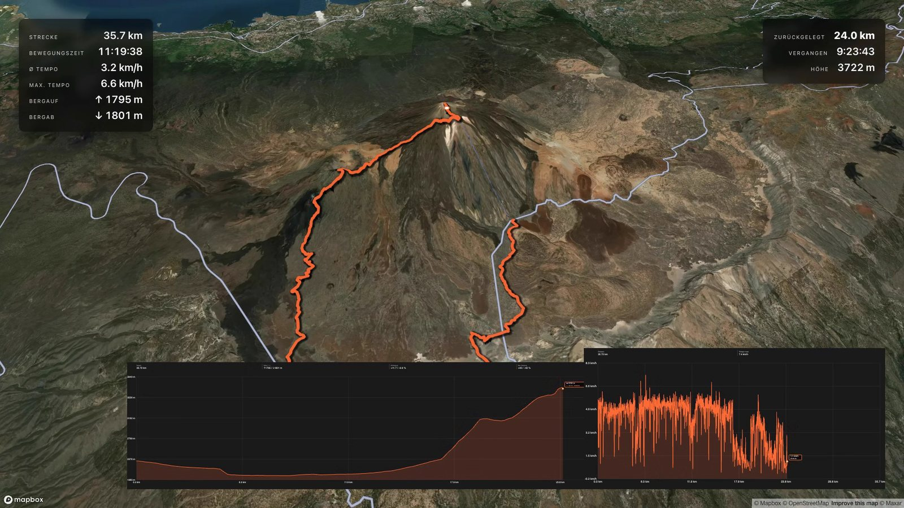
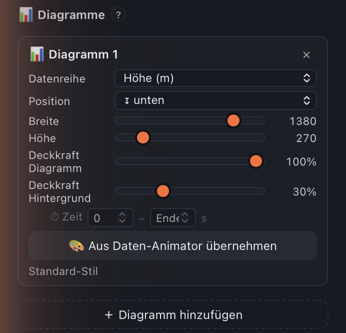

# Reisezoom GPS Studio — Benutzer-Handbuch

Cross-Plattform-Suite für GPS-Workflows (macOS · Windows · Linux). **v0.3.3** — Beta.

> **🚀 Neu hier?** Jedes Modul hat einen eigenen **Schnell-Einstieg** — über **Hilfe → Erste Schritte** (oder das Hilfe-Fenster) bekommst du 3 Schritte mit Screenshot für genau das Modul, in dem du gerade bist.

Module:
- **Animator** — GPX-Track als animiertes 3D-Karten-Video (MP4)
- **Reiseroute** — Anreise als Video: Start/Ziel → berechnete Strecke animiert, das geladene GPX als Ghost
- **Tour-Map** — GPX-Track als statisches PNG (z.B. für YouTube-Thumbnails)
- **Geotagger** — GPS-Koordinaten aus GPX in JPG / RAW / Video-EXIF schreiben
- **GPX-Inspektor** — Track Punkt-für-Punkt reparieren: Ausreißer heilen, Lücken füllen, Punkte verschieben, Anfang/Ende abschneiden, mehrere Aufzeichnungen zu einem Track verbinden

---

## 1 · Installation

### Download
Lade dir die richtige Version für dein Betriebssystem:

| Plattform | Datei | Link |
|-----------|-------|------|
| macOS (Apple Silicon, M1 oder neuer) | `ReisezoomGPSStudio-macos.dmg` | https://s.reisezoom.com/gps-studio-mac |
| Windows (x64) | `ReisezoomGPSStudio-windows-setup.exe` | https://s.reisezoom.com/gps-studio-win |
| Linux (x64) | aus Quellcode | siehe **Linux**-Abschnitt unten |

> **⚠️ macOS nur mit Apple Silicon (M1/M2/M3/…).** Ältere **Intel-Macs werden nicht unterstützt** — die App startet dort nicht. Ob du einen Apple-Silicon-Mac hast, siehst du unter  → **Über diesen Mac**: steht dort „Chip: Apple M…", passt es; steht dort „Prozessor: Intel", leider nicht.

**Auf macOS & Windows brauchst du nichts extra installieren** — `ffmpeg` und `exiftool` sind in der App enthalten. **Linux** läuft direkt aus dem Quellcode (System-Pakete + `python app.py`, siehe unten).

### macOS (.dmg)
1. `.dmg` doppelklicken
2. App per Drag & Drop in den **Programme**-Ordner ziehen
3. Beim **ersten Start** fragt macOS einmal kurz nach („… ist eine aus dem Internet geladene App. Möchtest du sie wirklich öffnen?" — mit dem Hinweis, dass Apple sie geprüft und **keine Malware gefunden** hat) → auf **„Öffnen"** klicken.
4. Ab dem zweiten Start reicht normaler Doppelklick.

> Die App ist von **Apple signiert und notarisiert** — die frühere „nicht verifizierter Entwickler"-Blockade gibt es nicht mehr. Die einmalige „Wirklich öffnen?"-Frage zeigt macOS bei **jeder** aus dem Netz geladenen App (auch bei signierten) und kommt nur beim ersten Mal.

Falls macOS ausnahmsweise „beschädigt und kann nicht geöffnet werden" sagt (z.B. nach einem unvollständigen Download):
```bash
xattr -dr com.apple.quarantine "/Applications/Reisezoom GPS Studio.app"
```

### Windows
1. `ReisezoomGPSStudio-windows-setup.exe` doppelklicken
2. SmartScreen-Dialog: **„Weitere Informationen"** → **„Trotzdem ausführen"**
3. Setup-Wizard durchklicken (Sprache wählen → Pfad bestätigen → optional Desktop-Shortcut)
4. Fertig — App startet automatisch und legt einen Start-Menü-Eintrag an
5. Beim ersten Render lädt die App noch Chromium nach (~150 MB, einmalig, dauert 1-2 Min)

> **Ganz sichergehen?** Die Windows-Version ist (noch) nicht signiert. Wer möchte, kann die heruntergeladene `.exe` vorab bei einem Dienst wie [VirusTotal](https://www.virustotal.com) gegenprüfen — die Builds stammen aus einer automatisierten GitHub-Pipeline ohne manuelle Zwischenschritte.

Deinstallieren wie jede andere Windows-App: **Systemsteuerung → Apps & Features → Reisezoom GPS Studio → Deinstallieren**.

### Linux (aus Quellcode)

Für Linux gibt es **kein fertiges Binary** — das Karten-/Render-Backend (pywebview) braucht die System-GTK-/WebKit-Bindings, die sich nicht zuverlässig in ein Einzel-Binary packen lassen. Stattdessen läuft die App direkt aus dem (offenen) Quellcode:

**1. System-Pakete** (einmalig — inkl. ffmpeg + ExifTool für Render & Foto-Metadaten):

```bash
# Fedora / RHEL
sudo dnf install git python3 python3-gobject gobject-introspection \
                 webkit2gtk4.1 python3-cairo ffmpeg perl-Image-ExifTool

# Debian / Ubuntu
sudo apt install git python3 python3-venv python3-gi python3-gi-cairo \
                 gir1.2-webkit2-4.1 libwebkit2gtk-4.1-0 ffmpeg libimage-exiftool-perl

# Arch
sudo pacman -S git python python-gobject webkit2gtk-4.1 ffmpeg perl-image-exiftool
```

**2. Repo holen & starten:**

```bash
git clone https://github.com/docarzt123/reisezoom-gps-studio.git
cd reisezoom-gps-studio
python3 -m venv --system-site-packages .venv   # --system-site-packages → venv sieht das System-GTK (gi)
source .venv/bin/activate
pip install -r requirements.txt
python app.py
```

Beim ersten Render lädt die App einmalig Chromium nach (~150 MB).

Ohne ExifTool funktionieren JPEG-, TIFF- und HEIC-Fotos trotzdem (via piexif +
pillow-heif, beides eingebaut). Nur RAW-Dateien (CR3, NEF, ARW, RAF, RW2, ORF,
DNG, PEF, RWL, SRW) und Video-Metadaten brauchen exiftool, und GPS-Schreiben
in HEIC ebenfalls.

---
---

## 1b · Anfängerleitfaden: vom Download zum ersten Video 🚀

Dieses Kapitel ist für den allerersten Tag gedacht. Es geht einmal geradeaus durch —
installieren, Track laden, erstes Bild, erstes Video. Alles andere in diesem Handbuch ist
Nachschlagewerk; hier steht nur, was Sie wirklich brauchen.

Entstanden ist der Leitfaden aus echten Fragen von Einsteigern. Wenn Sie an einer Stelle
hängen, merken Sie sich die **Schrittnummer** — damit lässt sich am schnellsten helfen.

### Schritt 1 — Programm installieren und öffnen

Der Download liegt unter [reisezoom.com/downloads/gps-studio/latest](https://reisezoom.com/downloads/gps-studio/latest/),
die ausführliche Anleitung steht in Kapitel 1.

- **macOS:** DMG öffnen, App in den Programme-Ordner ziehen, doppelklicken. Beim ersten Start
  fragt macOS einmal „Möchtest du sie wirklich öffnen?" → **Öffnen**. Das kommt bei jeder aus
  dem Netz geladenen App und nur beim ersten Mal.
- **Windows:** Setup starten, SmartScreen mit **„Weitere Informationen" → „Trotzdem
  ausführen"** bestätigen, durchklicken.

Beim ersten Start werden Sie gefragt, ob Sie mit oder ohne Mapbox-Zugang arbeiten wollen.

### Schritt 2 — Die Frage nach dem Mapbox-Token

Das ist die einzige Hürde am Anfang, und sie entscheidet, was Sie machen können:

| | ohne Token | mit Token (kostenlos) |
|---|---|---|
| Tracks ansehen, reparieren, verbinden | ✅ | ✅ |
| Fotos verorten | ✅ | ✅ |
| Tour-Karte als Bild | ✅ (Standard-Karte) | ✅ (auch Satellit & 3D) |
| **Video mit dem Animator** | ❌ | ✅ |

**Wenn Sie ein Video wollen, brauchen Sie den Token.** Er ist kostenlos, dauert zwei Minuten
und die Anleitung steht in Kapitel 2. Ohne ihn meldet sich der Animator später mit
„Render braucht Mapbox-Token" — das ist keine Fehlfunktion, sondern genau diese fehlende
Angabe.

Nachtragen können Sie ihn jederzeit: **⚙ oben rechts** (macOS auch über Menü → Einstellungen).

### Schritt 3 — Track laden

Oben sitzt die Track-Leiste. Zwei Wege:

1. Auf **„📁 Track-Datei auswählen …"** klicken und Ihre Datei wählen, **oder**
2. die Datei einfach in das Fenster ziehen.

Es müssen keine GPX-Dateien sein — FIT (Garmin, Wahoo), TCX, KML/KMZ, GeoJSON und NMEA werden
ebenso gelesen und im Hintergrund umgewandelt.

Danach steht oben der Name der Tour mit Strecke, Dauer und Höhenmetern. **Der geladene Track
gilt für alle Module** — Sie laden ihn einmal und wechseln dann frei zwischen den Werkzeugen.

> **Viele Dateien statt einer?** Wenn Sie eine Reise als Tagesdateien vorliegen haben, machen
> Sie zuerst Schritt 7 — daraus wird eine einzige Tour.

### Schritt 4 — Welches Modul ist das richtige?

Oben in der Leiste stehen die Werkzeuge. Was Sie vorhaben, entscheidet:

| Sie wollen … | Modul |
|---|---|
| ein **Bild** der Tour für Blog, Fotobuch oder Ausdruck | **Tour-Map** |
| ein **Video**, in dem die Strecke nachgezeichnet wird | **Animator** |
| **Fotos** mit den Koordinaten der Tour versehen | **Geotagger** |
| einen Track **reparieren** oder mehrere **verbinden** | **GPX-Inspektor** |
| einen Überblick über **alle** Ihre Touren | **Archiv** |
| Puls, Höhe, Tempo als **Diagramm-Video** | **Daten-Animator** |

Fangen Sie mit der **Tour-Map** an. Sie ist in zwei Minuten fertig, und Sie sehen sofort, ob
Ihr Track vollständig ist.

### Schritt 5 — Erstes Ergebnis: die Tour-Karte

1. Oben auf **„Tour-Map"** klicken.
2. Kurz warten, bis die Karte aufgebaut ist — Ihre Strecke liegt darauf.
3. Links **„🗺️ Karte"** → **„Stil"**: Satellit sieht in Bergen gut aus, die Standard-Karte
   ist bei Städten besser lesbar.
4. Unten links auf **„🗺 Karte als PNG rendern"**, Speicherort und Namen wählen.
5. Nach ein paar Sekunden liegt das PNG bereit — **„Im Finder zeigen"** führt Sie hin.

Sind alle Tage Ihrer Reise auf dem Bild? Dann stimmt der Track, und Sie können weiter zum
Video.

### Schritt 6 — Das erste Video mit dem Animator

Vier Schritte, mehr braucht es beim ersten Mal nicht.

1. Oben auf **„Animator"** klicken und warten, bis die Karte steht.
2. Links unter **„🎬 Video-Einstellungen"** bei **„Animation (s)"** eintragen, wie lang das
   Video werden soll. Für eine Tagestour reichen 20 Sekunden, für eine Zwei-Wochen-Reise
   nehmen Sie **40 bis 60** — sonst rast die Linie durchs Bild. Alternativ stellen Sie
   darunter auf **„Echtzeit ÷ Faktor"** um: Die Animation bekommt einen echten
   Zeitbezug — eine 6-Stunden-Tour ÷ 100 läuft 3:39 Minuten, die Rechnung steht
   live daneben. Braucht Zeitstempel im Track; ohne bleibt der Modus grau.
3. **„Auflösung"** auf **1920 × 1080** stehen lassen. Das reicht für YouTube, Fernseher und
   Fotobuch-Video; 4K sieht kaum besser aus und dauert beim Berechnen ein Vielfaches.
4. Unter der Karte auf **„▶ Probe-Lauf"**. Das Programm fliegt die Strecke einmal ab, so wie
   es später im Video aussieht — **ohne** dass etwas berechnet wird. Passt das Tempo nicht,
   ändern Sie die Zahl aus Schritt 2 und lassen es noch einmal laufen. Das kostet nichts.
5. Erst wenn es gefällt: **„▶ Video rendern"** (ganz unten in derselben Sektion), Speicherort
   und Namen wählen.
6. Jetzt rechnet das Programm, der Fortschritt läuft mit. Das dauert **einige Minuten** — Sie
   können den Rechner weiter benutzen, nur die App sollte offen bleiben.
7. Am Ende erscheinen **„▶ Abspielen"** und **„Im Finder zeigen"**.

Alles andere — Kartenstil, Neigung, Track-Farbe, die eingeblendeten Zahlen, Schilder,
Keyframes — ist Feinschliff für später. Kapitel 3 erklärt es in Ruhe.

> **Faustregel:** Erst Probe-Lauf, dann rendern. Der Probe-Lauf zeigt in Sekunden, was das
> Rendern in Minuten produziert.

### Schritt 7 — Mehrere Tagesdateien zu einer Tour verbinden

Der häufigste Fall bei Reisen: pro Tag eine Aufzeichnung, gewünscht ist die Gesamttour.

1. Modul **„GPX-Inspektor"** öffnen.
2. Oben die **erste** Tagesdatei laden.
3. In der linken Spalte nach unten scrollen bis **„Tracks verbinden"**.
4. Bei **„Einfügen"** die Option **„nach Uhrzeit"** wählen. Dann ist die Reihenfolge egal —
   das Programm sortiert die Tage anhand der Zeitstempel selbst.
5. **„Pause dazwischen"** auf 0 lassen.
6. Auf **„Weiteren Track anhängen …"** klicken und die zweite Tagesdatei wählen. Für jeden
   weiteren Tag wiederholen; nach jedem Anhängen wächst die Tour auf der Karte.
7. Unten auf **„Geheilten Track speichern …"** und die Gesamttour als neue Datei ablegen,
   z. B. `Suedschweden-2026-gesamt.gpx`.

Diese Gesamtdatei laden Sie dann oben in der Leiste — und machen mit Schritt 4 weiter.

> **Zu den Lücken zwischen den Tagen:** Sie haben nachts nicht aufgezeichnet, also fehlt dort
> ein Stück. Das Programm zieht dort **bewusst keine Linie** und rechnet die Lücke auch nicht
> als gefahrene Strecke mit. Ihre Gesamtkilometer stimmen also, und es gibt keine falschen
> geraden Striche quer über die Karte. Im Video springt die Kamera an diesen Stellen weiter —
> das wirkt wie ein Szenenwechsel und ist so gewollt.

### Schritt 8 — Wenn etwas klemmt

- **„Render braucht Mapbox-Token"** → Schritt 2, der Token fehlt.
- **Karte bleibt schwarz oder leer** → einen Moment warten; beim allerersten Render lädt die
  App unter Windows einmalig Chromium nach (~150 MB).
- **Video ist zu schnell** → „Animation (s)" erhöhen, Probe-Lauf wiederholen.
- **Ein Tag fehlt in der Gesamttour** → in Schritt 7 wurde eine Datei nicht angehängt; im
  Inspektor sehen Sie in der Punkteliste, wo die Tour endet.
- **Sonst:** **Hilfe → Fehler melden** in der App. Dort können Sie das Protokoll mit einem
  Klick auf den Schreibtisch legen und mitschicken — das erspart viel Rätselraten.


## 2 · Erste Schritte

### Mapbox-Token einrichten 🗺️
Ein Mapbox-Token ist ein **kostenloser Zugangsschlüssel** für Satellit-, 3D- und Premium-Karten. Der **Animator** (bewegte Karten-Animation) braucht ihn. **Vieles geht aber auch ohne Token:** 📷 Fotos verorten (Geotagger) · 🗺️ Tour-Karte als Bild/Export · 🧭 Tracks ansehen & aufräumen (Inspektor) · 📈 Höhenprofil-/Daten-Videos.

Beim ersten App-Start öffnet sich automatisch ein Onboarding-Modal mit zwei Optionen:
- **Mit Mapbox-Token** (empfohlen) — volle Features inkl. Animator, kostenlos in 2 Minuten
- **Ohne Token (OSM)** — funktioniert sofort; Standard-Karte statt Satellit/3D, kein Animator-Render. Du kannst den Token jederzeit später nachtragen.

> Landest du ohne Token im Animator, zeigt der Hinweisschirm, was ohne Token geht und bringt dich per Klick direkt zur **Tour-Karte** (läuft ohne Token).

**So bekommst du einen kostenlosen Mapbox-Token:**
1. Konto bei [account.mapbox.com](https://account.mapbox.com/auth/signup) anlegen
2. Bestätigungs-Mail klicken
3. Im Dashboard auf [Access tokens](https://account.mapbox.com/access-tokens/)
4. „Default public token" kopieren — beginnt mit `pk.eyJ…`
5. In der App ins Token-Feld einfügen → Speichern

> ⚠️ **Zahlungsdaten**: Das Anmeldeformular selbst fragt **keine** Kreditkarte ab — dort stehen Name, E-Mail, Benutzername und Passwort (nachgesehen am 01.08.2026). Mapbox kann im weiteren Verlauf oder ab einer gewissen Nutzung nach einer Karte fragen. **Abgebucht wird nichts**, solange du im Free-Tier bleibst.
>
> 💡 **Free-Tier: 50.000 Karten-Loads pro Monat — kostenlos.** Das reicht in der Praxis für sehr viele Renders. Bei normaler Hobby-Nutzung wirst du nie eine Rechnung sehen — du müsstest schon richtig intensiv produzieren, um an die Grenze zu kommen.

**Token später ändern**: macOS-Menü → **Reisezoom** → **Einstellungen…** (oder Cmd+,) — Windows/Linux: ⚙-Button oben rechts.

### Sprache wechseln 🌍
Die App startet automatisch in der **Systemsprache** (Deutsch, Englisch oder Spanisch — Fallback Englisch). Wechseln im **⚙-Einstellungen-Modal** → Sprache-Dropdown. Sofort aktiv, kein Restart nötig.

### Render-Qualität & Export einstellen (seit v0.9.245) ⭐
Im **⚙-Einstellungen-Modal** gibt es den Block **„Qualität & Export"** — gilt global für den Animator-Video-Export:
- **Frame-Erfassung:** **Schnell (JPEG)** ist der Standard und macht den Render **~10× schneller** (das Abgreifen der Einzelbilder war die eigentliche Bremse). Da das Video sowieso verlustbehaftet codiert wird, ist die Qualität visuell identisch. **Maximal (PNG, verlustfrei)** ist nur nötig, wenn du wirklich verlustfreie Einzelframes brauchst — deutlich langsamer.
- **JPEG-Qualität** (nur bei JPEG): Standard 92, völlig ausreichend.
- **Video-Codec:** H.264 (kompatibel, kleinste Datei) · H.265/HEVC (bessere Kompression) · ProRes 4444 (Master-Qualität, große Datei).
- **Video-Qualität (CRF)** und **Encoder-Tempo** (Geschwindigkeit ↔ Dateigröße).

Der **Alpha-Modus** („Ohne Karte" im Animator) nutzt automatisch verlustfreie PNG-Frames und ProRes 4444 — den brauchst du hier nicht extra einstellen.

### Was die App sich merkt
- Letzte Modul-Auswahl
- Alle Render-Einstellungen pro Modul (Stil, Pitch, Auflösung, Farbe, Codec, FPS etc.)
- Letzter Save-Ordner (pro Modul)
- Mapbox-Token
- Sprach-Auswahl

Settings-Datei:
- macOS: `~/Library/Application Support/Reisezoom GPS Studio/settings.json`
- Windows: `%APPDATA%\Reisezoom GPS Studio\settings.json`
- Linux: `~/.local/share/Reisezoom GPS Studio/settings.json`

### Sessions & Projekte (seit v0.8) ⭐

**Sessions** sind track-gebunden: jeder GPX-Track bekommt automatisch eine eigene Session (über einen Hash der Track-Koordinaten erkannt). Lädst du den selben Track ein zweites Mal, kriegst du **alle vorher gemachten Einstellungen + Keyframes** zurück — kein „verloren" mehr beim Modul-Wechsel.

**Projekte** sind Varianten innerhalb einer Session — z.B. „Standard-Variante" + „Hochformat-Reels" + „mit Foto-Inserts". Pro Track kannst du beliebig viele Projekte anlegen.

**Wo finde ich das?** Topbar oben rechts — Projekt-Dropdown mit 4 Aktionen:
- 🆕 **Neues Projekt** (mit pristinen Defaults)
- 📋 **Aktuelles duplizieren** (kopiert alle Settings + Keyframes)
- ✏️ **Umbenennen**
- 🗑 **Löschen** (das letzte Projekt einer Session lässt sich nicht löschen — wird automatisch als „Standard" wiederhergestellt)

Die Session-Daten liegen unter:
- macOS: `~/Library/Application Support/Reisezoom GPS Studio/sessions/`

(Je Track-Hash ein Ordner mit GPX-Snapshot + projects.json mit allen Varianten.)

---

### Projekt exportieren & importieren (.rzproj, seit v0.9.537)

**Ein Projekt als eine Datei weitergeben — ganz ohne Cloud.** Im Projekt-Menü
(Klick auf „Session · Projekt“ oben) oder unter „Datei → Projekt exportieren“
entsteht eine `.rzproj`-Datei: darin der Track, **alle Projekte** der Session
(Keyframes, Schilder, Overlays, Einstellungen), die Tour-Daten aus dem Archiv
(Name, Schlagwörter, Notiz) und **Vorschaubilder** deiner Fotos sowie die **Bilder deiner Schilder** — die
Original-Fotos bleiben bei dir.

**Importieren:** „Datei → Projekt importieren“, im Projekt-Menü, oder die
`.rzproj` einfach auf die App ziehen. Der Track wird ins Archiv aufgenommen
(Ordner „projekt_importe“), die Projekte hängen sich an die Session des Tracks.
Gibt es den Track schon, werden die Projekte **dazugelegt** — nichts wird
überschrieben, gleichnamige bekommen den Zusatz „(importiert)“. Fehlen die
Original-Fotos auf dem anderen Rechner, zeigen die Fotos auf die mitgebrachten
Vorschauen.

Wozu: ein Projekt zur Fehlersuche schicken, auf einen zweiten Rechner umziehen,
eine Sicherung ohne Cloud.

## 2b · Track-Dateien öffnen — viele Formate (seit v0.9.282) ⭐

Du musst **keine GPX** haben. Öffne (über die GPX-Leiste oder per Drag & Drop) einfach eines dieser Formate — die App wandelt es beim Laden automatisch in eine GPX um und arbeitet damit weiter:

| Format | Endung | Kommt typischerweise von |
|---|---|---|
| **GPX** | `.gpx` | fast alle Apps (Komoot, Strava, Garmin Connect, …) |
| **FIT** | `.fit` | Garmin, Wahoo, Coros, Suunto, Strava (Radcomputer & Sportuhren) |
| **NMEA 0183** | `.nmea` / `.log` | Canon EOS 6D, Marine-GPS, GPS-Logger |
| **KML / KMZ** | `.kml` / `.kmz` | Google Earth, Google My Maps |
| **TCX** | `.tcx` | Garmin Training Center, Strava-Export |
| **GeoJSON** | `.geojson` | Web-/OSM-Tools |

Höhen und Zeitstempel werden — soweit im Format vorhanden — übernommen (wichtig fürs Geotagging und die Geschwindigkeits-Anzeige).

**Als GPX exportieren:** Über das Menü **Reisezoom → „Als GPX exportieren…"** speicherst du den aktuell geladenen Track als echte `.gpx`-Datei — auch wenn er aus einem anderen Format kam. Praktisch, wenn du z.B. aus einer Kamera-`.log` eine saubere GPX brauchst.

**Als CSV exportieren:** Über **Reisezoom → „Als CSV exportieren…"** bekommst du denselben Track als Tabelle (`index,lat,lon,ele,time`, Zeit als ISO-UTC). Ideal für Tabellenkalkulation, eigene Auswertungen oder den Import in andere Tools.

> Hinweis: Eine `.json` wird nur dann erkannt, wenn sie wie ein GeoJSON-Track aussieht; eine `.txt` nur, wenn echte NMEA-Sätze (`$GP…`) drinstehen.

---

## 2c · Modul: Archiv 📚 — alle Touren an einem Ort (seit v0.9.486) ⭐

Wer über Jahre Touren sammelt, hat irgendwann hunderte GPX-Dateien in irgendwelchen Ordnern
liegen — und findet die richtige nicht wieder. Das **Archiv** ist dafür da: Es liest deine
Track-Ordner ein und zeigt dir alle Touren mit Bild, Datum und Zahlen.

**Einrichten (einmal):** Reiter **📚 Archiv** öffnen → unten links **„📂 Ordner & Einlesen"**
→ **„+ Ordner hinzufügen"** → den Ordner wählen, in dem deine Tracks liegen. Die App liest
ihn sofort ein; **700 Dateien dauern gut 20 Sekunden.** Unterordner werden mitgenommen. Du
kannst beliebig viele Ordner beobachten lassen. (Solange kein Ordner da ist, steht auf der
leeren Fläche ein großer **„+ Ordner hinzufügen"**-Knopf.)

**Die Seitenleiste links entscheidet, welche Touren du überhaupt siehst:**

| Bereich | Zeigt |
|---|---|
| 📚 **Alle Touren** | alles, gemacht und geplant gemischt |
| ✅ **Gemachte** | nur, was du wirklich gefahren/gelaufen bist |
| 📝 **Geplante** | nur die Routen, die noch anstehen |
| ★ **Favoriten** | deine markierten Touren |
| 🚫 **Ausgeblendete** | was du beiseitegelegt hast (erscheint nur, wenn es welche gibt) |

Darunter stehen deine **Sammlungen**: ein Klick zeigt **nur diese eine**, ein zweiter Klick
hebt es wieder auf. Die App merkt sich den zuletzt gewählten Bereich.

**Weiter filtern** — in der Leiste über den Touren:

- **Suchfeld** — sucht in Name, Dateiname, Schlagwörtern und Notizen. Akzente sind egal
  („muritz" findet „Müritz").
- **Jahr**, **Fortbewegung** (Wandern, Rad, Laufen …), **Sortierung** (neueste, längste,
  meiste Höhenmeter …) und **Zurücksetzen**.

**Gemacht oder nur geplant?** Die App erkennt das selbst — und zwar unabhängig davon, aus
welcher App der Track kommt:

| Merkmal | Bedeutung |
|---|---|
| Sensordaten (Puls, Trittfrequenz …) | sicher **gemacht** — so etwas entsteht nur beim Mitschneiden |
| „(Completed)", „Aufgezeichnet", „Geplant" im Namen | wird direkt übernommen |
| keine Zeitstempel | kann keine Aufzeichnung sein → **geplant** |
| sonst: der **Rhythmus** | eine Aufzeichnung hat Pausen und schwankendes Tempo, eine geplante Route läuft gleichmäßig durch |

Der letzte Punkt ist eine Schätzung — sie liegt bei rund 9 von 10 Touren richtig. Deshalb
kannst du in der rechten Spalte pro Tour auf **Gemacht**, **Geplant** oder **Automatisch**
stellen; darunter steht, woran die App es erkannt hat. Deine Entscheidung bleibt auch nach
einem Neu-Einlesen erhalten.

**Sammlungen — mehrere Touren als eine Einheit.** Eine Mehrtagestour besteht aus sechs
GPX-Dateien, eine Reise aus zwanzig. Als Sammlung gehören sie zusammen:

- **Anlegen:** Tour auswählen → rechts **„+ Zu Sammlung"** → bestehende wählen oder neue
  anlegen. Oder links unter den Sammlungen **„+ Neue Sammlung"**. Schneller geht es über den
  Filter: nach „Märkischer Landweg" suchen und **„Alle 5 Treffer in eine Sammlung"** nehmen.
- **Anzeigen:** Links auf die Sammlung klicken — dann siehst du nur ihre Touren, und zwar in
  **ihrer eigenen Reihenfolge** (Etappe 1, 2, 3 …), sortiert nach Datum.
- **Verwalten:** **Rechtsklick** auf eine Sammlung öffnet umbenennen, anzeigen, „Alle im
  Animator" und löschen.
- **Weiterverarbeiten:** **„Alle im Animator"** übergibt die ganze Sammlung an den Animator —
  erste Etappe als Haupt-Track, alle weiteren als zusätzliche Touren. Aus sechs Etappen wird
  so ein Video.
- Eine Tour darf in beliebig vielen Sammlungen liegen; Löschen einer Sammlung löscht **keine**
  Touren.

**Vier Ansichten**, rechts in der Leiste umschaltbar (die App merkt sich deine Wahl):

| Symbol | Ansicht | Wofür |
|---|---|---|
| ▦ | **Kacheln** | Stöbern — Bild groß, Form der Tour sofort erkennbar |
| ☰ | **Liste** | Vergleichen — viele Touren mit Zahlen auf einen Blick |
| 🌍 | **Karte** | „Wo war ich überall?" — alle gefilterten Touren auf einer Weltkarte, Klick auf eine Linie wählt sie aus |
| 📊 | **Statistik** | „Was habe ich eigentlich zusammen?" — Zahlen zur aktuellen Auswahl |

**Die Statistik** rechnet immer genau das zusammen, was gerade gewählt ist — also auch „nur
diese Sammlung", „nur die gemachten Touren" oder „nur 2024". Sie zeigt Touren, Kilometer,
Höhenmeter, Stunden, Ø je Tour und die längste Tour, darunter die Aufteilung **gemacht gegen
geplant**, **Kilometer je Jahr**, **Touren je Monat** (deine Saison über alle Jahre), die
Verteilung **nach Fortbewegung** und die **fünf längsten Touren** — ein Klick darauf springt
zur Tour.

Auf der Karte werden weit entfernte Touren als **Punkte** gezeichnet und erst beim
Hineinzoomen zu Linien — sonst wären sie in der Weltansicht unsichtbar. Gezeichnet wird in
**Magenta mit dunkler Kontur**: Die Karte selbst hat orange Straßen und beige Flächen, darauf
verschwand ein orangefarbener Track. Favoriten sind bernsteinfarben.

**Klick auf eine Tour** hebt sie hervor (weiße Kontur, orange Linie, liegt vorn) und öffnet
direkt auf der Karte eine kleine **Info-Karte**: Name, Datum, Art, Strecke, Höhenmeter, Dauer
— und die beiden Knöpfe **„Im Animator öffnen"** und **„+ Zu Sammlung"**. Ein Klick ins Leere
schließt sie wieder.

**Weiterarbeiten:** Tour anklicken, dann rechts **„Im Animator öffnen"** (oder Tour-Karte,
Daten-Animator, Geotagger, Inspektor). Ein **Doppelklick** auf die Kachel schickt sie direkt
in den Animator. Das ist genau dasselbe, als hättest du die Datei über „Track wählen"
geöffnet — nur mit Bild und Suche davor. Über den **📚-Knopf** in der Track-Leiste kommst du
aus jedem Modul ins Archiv.

**Ordnen:** In der rechten Spalte vergibst du **Favorit ★**, **Schlagwörter** (z. B.
`Mallorca, Testfahrt`) und eine **Notiz**. Das bleibt erhalten, auch wenn du neu einliest.

**Umbenennen:** Der Titel oben in der rechten Spalte ist ein Eingabefeld — einfach
überschreiben. Der Datei-Name steht darunter weiter da; löschst du deinen Namen wieder, gilt
er erneut. Die Datei auf der Festplatte wird **nicht** umbenannt.

**Aufräumen** — drei Stufen, ganz unten in der rechten Spalte:

| Knopf | Was passiert |
|---|---|
| **Ausblenden** | Tour verschwindet aus allen Listen, bleibt aber im Bereich „Ausgeblendete" — für Doppelte oder Testfahrten, die du nicht sehen willst |
| **Aus Archiv nehmen** | Das Archiv vergisst den Eintrag, die Datei bleibt liegen (beim nächsten Einlesen ist sie wieder da) |
| **In den Papierkorb** | Legt die Datei nach Rückfrage in den Papierkorb des Systems — von dort holst du sie zurück, solange er nicht geleert ist |

**Was die Kacheln verraten:**

| Zeichen | Bedeutung |
|---|---|
| ★ | Favorit |
| „geplant" | Tour war nur geplant, nicht aufgezeichnet |
| „aus" | Tour ist ausgeblendet |
| ● (orange) | Für diese Tour gibt es schon gespeicherte Projekte |

**Doppelte finden:** Der Knopf unten links gruppiert Dateien mit **identischem
Streckenverlauf** — hilfreich nach einem Sammel-Export, bei dem dieselbe Tour mehrfach
heruntergeladen wurde. Gelöscht wird nichts; du siehst nur, was doppelt ist.

**Neue Dateien:** Nach jedem größeren Export einmal unten links **„📂 Ordner & Einlesen" → „Neu einlesen"** drücken. Bereits
bekannte Dateien werden übersprungen, das geht in Sekunden.

**Einen Zeitraum wählen.** Ganz links in der Filterleiste steht eine Auswahl mit
**„Dieses Jahr"**, **„Letzte 12 Monate"**, **„Letzte 12 Wochen"** und
**„Eigener Zeitraum …"**. Beim eigenen Zeitraum erscheinen zwei Datumsfelder für
*von* und *bis*; beide Tage zählen mit. Der Zeitraum wirkt auf alles gleichzeitig —
Liste, Karte und Statistik zeigen danach denselben Ausschnitt. Solange ein Zeitraum
eingestellt ist, ist das Jahres-Feld ausgegraut: beide meinen dasselbe, und der
Zeitraum ist der genauere von beiden.

**Nach Länge filtern.** Neben Jahr und Fortbewegung stehen zwei kleine Felder
**„ab km"** und **„bis km"**. Zusammen beantworten die drei Filter Fragen wie
*„alle Wanderungen über 20 km in 2025"*: Fortbewegung auf Wandern, Jahr auf 2025,
„ab km" auf 20 — fertig.

**Was die Statistik vergleicht.** Unter den Balken steht eine Tabelle
**„Fortbewegung im Vergleich"**: eine Zeile je Jahr (oder Monat), eine Spalte je
Fortbewegungsart. Oben rechts schaltest du zwischen **Jahren, Monaten und Wochen**
um und zwischen **Kilometern, Stunden und Anzahl**. Die Wochen sind
**ISO-Kalenderwochen** — dieselbe Zählung wie bei Garmin und Komoot, deshalb passen
die Zahlen zu dem, was du dort siehst. Über das ganze Archiv werden Wochen schnell
zu hunderten Zeilen; stell dazu oben einen Zeitraum ein, dann bleibt die Tabelle
lesbar. Ein Hinweis unter der Tabelle erinnert dich daran. Die stärkste Art jedes Zeitraums ist
hervorgehoben — so siehst du auf einen Blick, ob ein Jahr eher ein Rad- oder ein
Wanderjahr war. Darunter stehen deine **häufigsten Startpunkte**; die füllen sich,
sobald das Archiv im Hintergrund die Gegenden benannt hat.

**Fahrräder auseinanderhalten.** Neben *Rad*, *Mountainbike* und *Rennrad* gibt es
**E-Bike** und **Gravel/Trekking**. Erkannt wird das am Tour-Namen; wo das nicht
reicht, stellst du die Art in der rechten Spalte selbst ein — die Wahl hängt an der
Tour und überlebt jedes Neu-Einlesen.

**Werte aus der Aufzeichnung.** Wer mit Uhr oder Radcomputer aufzeichnet, hat in
der **FIT-Datei** weit mehr als die Strecke. Das Archiv liest das mit und zeigt es in
der Detailspalte unter **„Aus der Aufzeichnung"**: Durchschnitts-, Höchst- und
Tiefstpuls, Trittfrequenz, Leistung, Kalorien, Temperatur, Atemfrequenz, dazu das
Gerät und — falls die Uhr eine Vorhersage gezogen hat — das Wetter zur Aufnahmezeit.

**Die Fortbewegungsart kommt aus der Datei.** Ein Garmin schreibt selbst hinein, ob
es eine Rennrad-, Gravel-, Mountainbike- oder E-Bike-Fahrt war — zuverlässiger als
aus dem Dateinamen zu raten. Wer mehrere Räder am Gerät getrennt führt, bekommt sie
im Archiv automatisch getrennt. Die Reihenfolge: **geraten** aus Name und Tempo →
**aus der Datei**, wenn sie es hergibt → **von dir gesetzt**, was beides schlägt und
jedes Neu-Einlesen überlebt. Auch der **Profilname** wandert mit: wer sein Rad am
Gerät „Gravel" genannt hat, findet die Touren über die normale Suche wieder.

> **Was NICHT gelesen wird:** Ruhepuls, Alter, Geschlecht, Größe und Gewicht stehen
> ebenfalls in FIT-Dateien. Sie beschreiben dich, nicht deine Tour, und werden beim
> Einlesen verworfen — ebenso Trainingswerte wie Pulszonen oder Trainingseffekt.
> Dafür ist Garmin Connect da; hier geht es um die Tour.

**Bestehendes Archiv?** Beim ersten Start nach dem Update werden vorhandene
FIT-Touren einmalig neu eingelesen. Das dauert je nach Menge einen Moment, passiert
aber nur ein einziges Mal.

**Alle Räder oder alles zu Fuß auf einmal.** Ganz oben im Fortbewegungs-Filter
stehen zwei Sammelposten: **Alles mit dem Rad** (Rad, Rennrad, Gravel, Mountainbike,
E-Bike) und **Alles zu Fuß** (Wandern, Spaziergang, Laufen). Wer seine Räder getrennt
führt, kann sie damit trotzdem zusammen ansehen — Liste, Karte und Statistik ziehen
gleichzeitig mit. Sie erscheinen nur, wenn mindestens zwei Arten der Gruppe bei dir
vorkommen.

Dasselbe gibt es in der Statistik: Der Schalter **„Zusammenfassen"** über der Tabelle
„Fortbewegung im Vergleich" macht aus fünf schmalen Rad-Spalten eine breite. Die
Gesamt-Zeile bleibt dabei beim Scrollen stehen.

**Sortieren per Kopfzeile.** In der Listenansicht ist jede Spaltenüberschrift
anklickbar: einmal klicken sortiert danach, noch einmal dreht die Richtung um, ein
kleiner Pfeil zeigt an, wonach gerade sortiert wird. Leere Werte stehen immer am
Ende — sonst begänne „Startpunkt A–Z" mit einer Bildschirmseite leerer Zellen.
Dasselbe gilt in der Statistik für die Tabelle „Fortbewegung im Vergleich".

**Ausblenden, aus dem Archiv nehmen, Papierkorb — was ist der Unterschied?** Die
drei Knöpfe unten in der Detailspalte sehen ähnlich aus, tun aber sehr
Verschiedenes. Neben jedem steht ein **„?“**, das es erklärt; hier zum Nachlesen:

* **Ausblenden** — die Tour verschwindet nur aus der Liste und liegt unter
  „Ausgeblendete“. An der Datei ändert sich nichts.
* **Aus Archiv nehmen** — entfernt nur den Eintrag. **Deine Datei bleibt
  unangetastet dort liegen, wo sie ist.** Beim nächsten Einlesen taucht sie wieder
  auf, solange der Ordner noch beobachtet wird. Soll sie dauerhaft draußen
  bleiben, nimm den Ordner unter „Ordner & Einlesen“ heraus.
* **In den Papierkorb** — verschiebt die Datei wirklich, in den Papierkorb deines
  Systems. Genau wie beim Löschen im Finder oder Explorer.

**Wann ist eine Datei endgültig weg?** Erst, wenn du deinen Papierkorb leerst.
GPS Studio löscht nie selbst etwas endgültig; bis dahin kannst du die Datei dort
jederzeit zurückholen. Das gilt auch, wenn du mehrere Touren auf einmal in den
Papierkorb legst.

**Dateien, aus denen keine Tour wird.** Steht in der Kopfzeile ein Hinweis wie
**„12 Dateien ohne Strecke"** oder **„3 Dateien nicht lesbar"**, klick ihn an. Der Dialog
trennt zwei Dinge, die leicht verwechselt werden:

* **Ohne Streckendaten** — die Datei ist völlig in Ordnung, sie enthält nur keine
  Koordinaten. Bei FIT ist das der Regelfall für alles ohne GPS: Rolle, Kraftraum,
  Bahnschwimmen. Eine Sportuhr schreibt dafür genauso eine Datei. Eine Tour lässt sich
  daraus nicht bauen — kaputt ist trotzdem nichts.
* **Nicht lesbar** — hier ist wirklich etwas schiefgegangen: abgebrochene Übertragung,
  unbekanntes Format, beschädigte Datei.

Was du nicht mehr sehen willst, hakst du an und drückst **„Aus der Liste nehmen"**. Dabei
wird **nichts gelöscht** — weder die Datei auf der Platte noch der Eintrag; nur die Meldung
verschwindet, und sie bleibt auch nach dem nächsten Einlesen weg. Über **„Auch weggeräumte
zeigen"** kommt alles wieder zum Vorschein und lässt sich zurückholen.

**Die Filterleiste merkt sich, was du eingestellt hast.** Sortierung, Jahr und
Fortbewegungsart bleiben, wenn du eine Tour im Animator ansiehst und ins Archiv
zurückkommst — und auch über einen Neustart hinweg. Der **Suchtext** wird bewusst nicht
gemerkt, damit dich am nächsten Tag kein halbleeres Archiv empfängt. **„Zurücksetzen"**
räumt alles wieder ab.

**Kartenbilder holt die App von selbst.** Nach dem Einlesen und bei jedem Start läuft im
Hintergrund ein gemächlicher Lauf, der zu jeder Tour ein echtes Kartenbild von Mapbox holt —
ungefähr eines alle anderthalb Sekunden. In der Kopfzeile steht dabei „Kartenbilder werden
geladen 42/709", die Kacheln füllen sich nach und nach, und du kannst normal weiterarbeiten.
Jedes Bild wird **dauerhaft auf deinem Rechner abgelegt**: danach ist die Ansicht offline,
sofort da und kostet kein weiteres Kontingent. Ohne Mapbox-Zugang passiert einfach nichts,
dann bleibt es bei der Linienzeichnung. Wer nicht warten will, drückt in
**„📂 Ordner & Einlesen"** auf **„Kartenbilder holen"** — das holt alles am Stück.

**Eigenes Bild für eine Tour:** In der rechten Spalte **„Eigenes Bild wählen"** — zum
Beispiel das schönste Foto der Tour. Es ersetzt das Vorschaubild in allen Ansichten. Die App
legt eine verkleinerte Kopie an; dein Original bleibt unberührt und darf verschoben werden.

**Platte nicht angeschlossen?** Dann findet die App die Dateien beim Einlesen nicht — sie
wirft die Touren aber **nicht weg**. Sie bleiben in der Liste, zählen in der Statistik mit und
bekommen ein 🔌 auf die Kachel; links erscheint der Bereich **„Nicht erreichbar"**. Steckst du
die Platte wieder an, ist beim nächsten Einlesen alles wie vorher. Erst nach 90 Tagen ohne
Wiedersehen verschwindet der Eintrag — deine Angaben dazu bleiben trotzdem erhalten.

**Was du zu einer Tour sagst, bleibt — an der Tour, nicht an der Datei.** Favorit,
Schlagwörter, Notiz, eigener Name, ausgeblendet, die Korrektur gemacht/geplant, dein
Titelbild und die Sammlungen hängen am Streckenverlauf. Deshalb gilt:

- Ordner abmelden und später wieder hinzufügen → alles ist wieder da, inklusive der
  Kartenbilder (die werden **nicht** neu geladen).
- Dieselbe Tour liegt in einem zweiten Ordner → sie erbt automatisch dasselbe.
- Datei umbenannt oder verschoben → deine Angaben finden wieder zu ihr zurück.

Aufgeräumt wird nur sehr zurückhaltend: Vorschaubilder von Touren, die seit über einem Jahr
in keinem deiner Ordner mehr liegen und zu denen du nichts gesagt hast, werden irgendwann
gelöscht. Alles andere — besonders deine eigenen Titelbilder — bleibt.

> **Deine Dateien bleiben, wo sie sind.** Das Archiv verschiebt und kopiert nichts — es merkt
> sich nur, was wo liegt. Die einzige Ausnahme ist **„In den Papierkorb"**, und die fragt
> vorher nach.

### Mehrere Touren auf einmal bearbeiten (seit v0.9.496)

**⌘-Klick** (Windows: Strg-Klick) nimmt eine Tour zur Auswahl dazu, **Umschalt-Klick** einen
ganzen Bereich. Ab zwei gewählten Touren wird die rechte Spalte zum Sammel-Panel:

- **Sammlungen zuweisen** — beliebig viele; eine Tour darf in mehreren Sammlungen liegen.
- **Fortbewegung** für alle setzen, **Schlagwörter ergänzen** (vorhandene bleiben),
  **gemacht/geplant**, Favorit setzen oder wegnehmen, **ausblenden**, **in den Papierkorb**.

Ein Werkzeug öffnen geht bei Mehrfachauswahl nicht — der Animator müsste sonst raten, welche
Tour gemeint ist. **„Auswahl aufheben"** oder ein einfacher Klick auf eine Tour beendet die
Mehrfachauswahl.

### Fortbewegungsart selbst festlegen (seit v0.9.496)

Das Archiv schätzt die Art aus Namen und Tempo — meistens richtig, manchmal nicht. In der
Detailspalte steht deshalb eine Auswahl; **„Automatisch erkannt"** zeigt daneben, was die
Schätzung sagt. Deine Wahl hängt am Streckenverlauf, überlebt jedes Neu-Einlesen und gilt
sofort für alle Kopien derselben Tour. Zurück auf „Automatisch" stellt die Schätzung wieder her.

### Nach Gegenden suchen (seit v0.9.496)

Tippst du **„Teneriffa"** ein, bekommst du nicht nur die Touren, in deren Namen das Wort
steht, sondern **alle Touren, die dort liegen** — auch wenn „Teneriffa" in keiner Datei
vorkommt. Über der Liste steht dann, was passiert ist:

> 📍 Gegend: Teneriffa — 163 Touren hier · 8 über den Namen ✕

Das ✕ schaltet zurück auf reine Textsuche. Es funktioniert mit jedem Ortsnamen in jeder
Sprache — Insel, Stadt, Landkreis, Land. Voraussetzung ist Internet; ohne findest du weiter
über Namen, Schlagwörter und Notiz.

Zusätzlich benennt die App im Hintergrund die Gegend jeder Tour (Ort, Provinz, Region, Land)
und merkt sie sich. Oben steht währenddessen **„Gegenden werden benannt 47/493"**. Das läuft
gemächlich und stört nicht; beim nächsten Start macht es weiter, wo es aufgehört hat.

### Die Übersichtskarte (Weltkugel-Knopf)

Jede Tour bekommt eine **eigene Farbe**, abgeleitet aus ihrem Streckenverlauf — bei
siebenhundert Touren wären sonst alle Linien gleich und keine mehr zu verfolgen. Die Farbe
bleibt über Sitzungen hinweg dieselbe. Favoriten behalten ihre Signalfarbe.

Gefällt dir eine Farbe nicht, setzt du in der Detailspalte unter **„Track-Farbe auf der
Karte"** deine eigene; **„Automatisch"** stellt die abgeleitete wieder her. Diese Farbe gilt
**nur im Archiv** — Animator und Tour-Karte haben ihre eigene Farbwahl je Projekt.

Oben links auf der Karte liegt **🖼 PNG**: Damit sicherst du die Karte genau so, wie sie
gerade zu sehen ist — selber Ausschnitt, selbe Zoomstufe, selbe Farben.

---

## 3 · Modul: Animator — GPX als Video rendern

### Was es macht
Lädt eine GPX-Datei und rendert ein MP4 in dem die Track-Linie animiert über eine 3D-Mapbox-Karte gezeichnet wird. Einsatz: Intro für YouTube-Videos, Loops für Webseiten, Erinnerungs-Animation.

### Workflow
1. **GPX laden**: Button „📁 GPX-Datei auswählen" oder Drag & Drop ins Fenster
2. **Track wird auf der Karte angezeigt** (Vorschau live, im WYSIWYG-Letterbox-Rahmen)
3. **Einstellungen tunen** (siehe unten) — alle Änderungen sind sofort in der Vorschau sichtbar
4. **„▶ Video rendern"** klicken

**Aktuellen Frame als Bild (Snapshot, seit v0.9.412):** Unter dem Render-Button liegt **„📸 Aktuellen Frame als Bild"**. Scrubbe die Vorschau auf eine schöne Stelle und klick den Button — es wird **genau dieser Frame** (Track bis zur aktuellen Position, dein Kamera-Ausschnitt, die Overlays des Moments) als **Bild in voller Auflösung** gespeichert. Perfekt für Thumbnails oder ein Standbild aus einem laufenden Flug.

**Als Tour-Map öffnen (seit v0.9.412):** Der Button **„🗺 Als Tour-Map öffnen"** wechselt in die Tour-Map und **übernimmt genau deinen aktuellen Ausschnitt** (Position, Zoom, Drehung, Neigung) — statt wie sonst die ganze Route einzupassen. Dort kannst du das Standbild als **PNG** rendern; es behält den übernommenen Blickwinkel. *(Eine interaktive Karte fürs Web gibt es im eigenen Modul [„🌐 Web Karte"](#5c--modul-web-karte).)* Mit dem **⤢**-Button (rechts unten auf der Karte) springst du zurück zur Gesamtansicht.

5. **Save-Dialog**: Wohin soll das MP4? Vorschlag: `<GPX-Name>_<WxH>_<codec>.mp4`
6. Render läuft — Live-Vorschau zeigt jedes Frame
7. Fertig → Result-View zeigt MP4 + „Im Finder zeigen"-Button

> **Overlays: Regler nur bei eingeschalteter Box (seit v0.9.452):** Position, Zeitfenster und Feldliste erscheinen nur, wenn die jeweilige Box auch **an** ist — eine ausgeschaltete Box erscheint ja nicht im Video, ihre Position wäre folgenlos. Eingeschaltete Boxen zeigen **alle** Regler direkt, ohne Aufklappen. Ausgeschaltete schrumpfen auf ihre Titelzeile mit dem Schalter.

> **Karten-Beschriftungen als Chips (seit v0.9.451):** Ortsnamen, Straßen, Sehenswürdigkeiten, ÖPNV und Grenzen sind eine kompakte **Chip-Zeile** — antippen schaltet um, die Erklärung erscheint beim Draufzeigen.

> **Anreise/Route animieren?** Dafür gibt es seit v0.9.205 ein eigenes Modul **🛣 Reiseroute** (Start/Ziel → berechnete Strecke). Siehe Kapitel 4.

### Einstellungen

> **↩︎ Rückgängig für alles (seit v0.9.322):** Jede Einstellungsänderung lässt sich mit **⌘Z** (Mac) / **Strg+Z** (Windows) rückgängig machen — in **Animator, Tour-Map, Geotagger und Daten-Animator**: Farben, Schrift, Linienbreite, Glow, Overlay-Felder, Keyframes, Trim, Zeit-Offset usw. **Wiederherstellen** mit **⌘⇧Z** / **Strg+Y**. (Ein Slider-Zug = ein Schritt.)

**Karte:**
- **Stil**: 6 Mapbox-Stile (Satellite 3D, Satellite+Streets, Outdoors, Streets, Hell, Dunkel)
- **3D-Terrain** aktivieren — bei Alpentouren sieht das spektakulär aus
- **Track-Farbe + Dicke** — frei wählbar
- **Linien-Stil** (seit v0.6.5) — Durchgezogen / Gestrichelt / Gepunktet / Strich-Punkt / **Röhre**. Bei Strich-/Punkt-Varianten gibt's einen zusätzlichen **Punktabstand**-Slider (multipliziert die Strich- bzw. Punkt-Längen). „Röhre" (seit v0.8.10, im Linien-Stil-Dropdown seit v0.8.12) legt einen weißen Highlight-Streifen oben auf die Linie → wirkt plastischer wie ein Schlauch.
- **Schlagschatten unter Track** (seit v0.4) — lässt den Track wie eine schwebende Linie über der Karte wirken. Stärke 0–10 px (Default 4). Bei aktivem 3D-Terrain bleibt der Schatten auf dem Boden während der Track 150 m darüber gerendert wird → plastischer 3D-Look.
- **Schatten-Richtung (global, seit v0.9.478)** — direkt unter der Schatten-Stärke steuerst du mit dem Slider **„Schatten-Richtung"** (0–360°), aus welcher Richtung das Licht kommt: **0° = rechts, 90° = unten, 180° = links, 270° = oben**. Das ist eine **gemeinsame Lichtquelle** — sie gilt gleichzeitig für den **Track-Schatten** und für den **Schlagschatten aller Schilder** (Wegpunkt-Schilder), damit alles wie von derselben Sonne beleuchtet wirkt.
- **Wegpunkt-Schilder (seit v0.9.171, voll gestaltbar seit v0.9.179)** — setze Text-Schilder auf die Route (z.B. „Gipfel erreicht!"). Bereich **„🚩 Schilder"** in der Seitenleiste:
  - **Platzieren:** **„📍 Auf Track"** → Klick auf den Track (rastet ein), oder **„📌 Frei platzieren"** → Klick **irgendwo** auf die Karte (z.B. eine Sehenswürdigkeit abseits der Route). Bei freier Platzierung richtet sich der **Anzeige-Zeitpunkt** weiter nach dem nächstgelegenen Track-Punkt (Anker am Track + freier Koordinaten-Offset).
  - **Bearbeiten:** Klick auf ein Schild (Liste oder Karte) öffnet ein **schwebendes Editor-Panel** — an der Kopfzeile (⠿) frei verschiebbar, auch aus der Karte heraus. Das gerade bearbeitete Schild ist immer sichtbar (egal wo der Abspiel-Punkt steht).
  - **Verschieben (Drag & Drop):** Im Editor auf **„↔ Verschieben"** klicken — danach **ziehst du das Schild direkt auf der Karte** an die gewünschte Stelle und lässt es los. Es übernimmt die neue Position als **freie Platzierung** (der Anzeige-Zeitpunkt richtet sich danach neu nach dem nächsten Track-Punkt). Das Editor-Fenster bleibt dabei, wo du es hingelegt hast.
  - **Optik (alles live):** Form (Sprechblase · Zielbanner · Stecknadel · Wegweiser · Schlicht), **Hintergrund**- + Textfarbe (der **„Hintergrund"-Picker** ist die **eine** Box-/Blasenfarbe des Schilds — seit v0.9.271 gibt es keine separate „Akzentfarbe" und kein „Auto" mehr), Schriftart (System · Rundlich · Schmal · Serif · Monospace · Plakativ), Größe/Stärke/Kursiv/**Ausrichtung** (Links/Mitte/Rechts — wirkt sichtbar, sobald du unter **„Breite"** eine feste Mindestbreite > 0 einstellst; bei „Auto" schmiegt sich die Box an den Text und die Ausrichtung hat keinen Spielraum, seit v0.9.479), mehrzeiliger Text, Eckenradius, **Deckkraft Hintergrund** (seit v0.9.478 dimmt der Regler **nur den Hintergrund** — der Text bleibt voll lesbar), Rahmen (Breite+Farbe), **Stangen-Länge** (nur bei Zielbanner + Wegweiser — wie lang die Pfosten/Stange unter dem Schild sind) und **Schlagschatten** (Weichheit ab v0.9.478 bis **0** = harte Kante; die **Richtung** kommt aus dem globalen „Schatten-Richtung"-Regler in der Track-Sektion). **Bild hinzufügen** macht aus dem Schild eine **Foto-Karte** (der Text wird dann zur Bildunterschrift); die Bildgröße ist separat einstellbar.
    - **Sprechblasen-Pfeilrichtung (seit v0.9.408):** Beim Stil **Sprechblase** wählst du im Editor unter **„Pfeilrichtung"**, wohin die Spitze zeigt — **unten, oben, links oder rechts**. Die Blase rückt automatisch auf die Gegenseite, damit die Spitze immer auf den Ort deutet. (Analog zur Richtungswahl beim Wegweiser; gilt für Animator und Tour-Map.)
    - **Zeiger-Farbe + Zeiger-Position (seit v0.9.481):** Bei **Sprechblase** und **Stecknadel** stellst du im Editor unter **„Zeiger-Farbe"** ein, welche Farbe die Spitze bzw. die Nadel hat — unabhängig vom Hintergrund. Der Knopf **„Auto"** bedeutet „wie bisher": der Zeiger folgt dem Hintergrund. Damit geht auch **Hintergrund „Keine" (transparent) + farbige Stecknadel**; vorher verschwand mit dem Hintergrund auch der Zeiger. Darunter wählst du unter **„Zeiger-Position"** zwischen **Links · Mitte · Rechts** — praktisch, wenn die Spitze sonst genau auf der Spur liegt und den Track verdeckt: Schild bleibt stehen, der Zeiger rutscht zur Seite. Steht der Hintergrund auf **„Keine“** und die Zeiger-Farbe auf **„Auto“**, bleibt der Zeiger unsichtbar (es gibt ja keine Hintergrundfarbe, der er folgen könnte) — dann einfach eine eigene Farbe wählen.
    - **Eine Farbe statt zwei (seit v0.9.271):** Früher gab es „Akzentfarbe" **und** „Hintergrund" — beide füllten dieselbe Fläche, das war verwirrend. Jetzt gibt es nur noch den **„Hintergrund"-Picker** = die Farbe des Schilds (bei der Stecknadel auch des Tropfens). Den **Rahmen** stellst du separat unter „Rahmen" ein.
    - **Hintergrund „Keine" (transparent, seit v0.9.269):** Beim Hintergrund kannst du neben „Auto" jetzt **„Keine"** wählen → die Schild-Box wird komplett **durchsichtig**. Praktisch für **Foto-Karten ohne farbigen Rahmen**: dann siehst du nur das Bild (plus optionalem Rahmen), statt eines farbigen Rands rund ums Foto, der zusammen mit dem Rahmen sonst wie ein **doppelter Rahmen** wirkt.
  - **Bearbeiten ist flackerfrei (seit v0.9.255):** Beim Ziehen der Regler (Größe, Ecken, Rahmen, Schatten, Stangen-Länge …) ändert sich die Vorschau sofort und ruhig. Im Probelauf und im fertigen Video laufen die Schilder flüssig mit der Kamera mit.
  - **Verhalten & Timing:** „Mit Zoom wachsen" an/aus, **„Ganze Zeit zeigen"** (durchgehend sichtbar), **Vorlauf** X Sek. (erscheint früher) + **„Sichtbar nach"** X Sek. (verschwindet später; 0 = bleibt bis zum Ende), **Einblendung** — seit v0.9.479 vier echte Varianten: **Hart** (sofort da), **Einblenden** (sanft eingeblendet), **Aufpoppen** (skaliert mit leichtem Überschwinger auf) und **Ein- + Aufpoppen** (beides zusammen). Vorher sahen die animierten Varianten gleich aus. Erscheint im Video sonst genau dann, wenn der Marker den Punkt erreicht; steht aufrecht zur Kamera. **Seit v0.9.204:** Ein Schild ganz am Track-Anfang mit **Vorlauf** erscheint jetzt schon **im Intro** (Vorlauf = 1 Sek. → taucht in der letzten Intro-Sekunde auf, statt erst beim Track-Start aufzupoppen).
  - **Auslöse-Zeitpunkt (seit v0.9.259) — für Hin-und-zurück-Strecken:** Wenn dein Track denselben Ort **zweimal** passiert (z.B. hin und zurück), kann die App aus der Klick-Position allein nicht erkennen, welchen Durchgang du meinst. Lösung im Block **„Auslöse-Zeitpunkt"**:
    1. Schiebe den **Scrubber** der Zeitleiste genau auf den Moment, an dem der Marker beim **gewünschten Durchgang** an der Stelle ist.
    2. Klick auf **🕐 „Auf Zeitleisten-Position"** → das Schild ist fest an genau diesen Zeitpunkt gebunden (Statuszeile: „Fester Zeitpunkt: NN %").
    3. **„Auto"** stellt wieder auf automatische Positions-Erkennung um.
    Das funktioniert in Vorschau und fertigem Video identisch. (Bei **Foto-Karten** passiert das automatisch über die Aufnahme-Zeit des Fotos.)
  - **Vorschau-Hilfe:** Checkbox **„In der Vorschau ALLE Schilder zeigen"** — zeigt beim Platzieren alle Schilder gleichzeitig (nur Vorschau; im Video gilt weiter das Timing).
- **Ghost-Track (seit v0.9.169)** — zeigt die **komplette Route** schon halbtransparent im Hintergrund, während nur der animierte Teil voll deckend darüber gezeichnet wird. So sieht man von Anfang an, wo es noch hingeht. Einstellbar: **eigene Ghost-Track-Farbe** (eigener Color-Picker, unabhängig von der Track-Farbe — z.B. dezentes Grau, seit v0.9.170) und **Deckkraft** (Slider 5–80 %, Default 30 %). Wirkt in Vorschau und Render inkl. Alpha/Transparent-Modus. Standard aus.
- **Mehrere Track-Farben (seit v0.9.435, erweitert v0.9.448)** — die Track-Linie kann die **Farbe wechseln**. Mit dem Selektor **„Einfärben nach"** wählst du, wonach:
  - **Distanz (km)** — Farb-Stops **ab km** (Zahl), **an der aktuellen Marker-Position** (übernimmt die Scrubber-Position) oder **an allen GPX-Wegpunkten** (automatisch). Die erste Farbe gilt ab km 0 (= Track-Farbe).
  - **Jede Datenreihe des Tracks** — seit v0.9.448 steht hier **alles zur Auswahl, was auch der Daten-Animator plotten kann**: Höhe, Tempo, Steigung und sämtliche Sensorwerte aus FIT/TCX-Dateien (**Puls, Leistung, Trittfrequenz, Temperatur** …). Die Liste zeigt **nur, was der geladene Track wirklich enthält**; die Einheit steht in Klammern dahinter.

    Farb-Stops setzt du dann **im Wertebereich der Reihe** (z. B. „ab 145 bpm", „ab 8 %", „ab 2400 m"). **„＋ ab &lt;Reihe&gt; (hier)"** übernimmt den Wert an der Marker-Position, **„Auto (min → max)"** legt automatisch eine Blau→Rot-Rampe über die Spannweite. Negative Werte sind erlaubt — wichtig bei **Steigung** (Abfahrten) und **Temperatur** (Frost).

  Pro Stop stellst du **Wert + Farbe** ein, 🗑 entfernt ihn. Der Schalter **„Übergang"** legt fest, ob die Farbe **hart** (crispe Bänder) oder als weicher **Verlauf** wechselt. Wirkt WYSIWYG in Vorschau, Probelauf und Render. Standard aus. *(Aktuell nur Einzeltrack-Animator.)*
- **Karte ohne Beschriftungen** (seit v0.4.4) — blendet Ortsnamen, Straßennamen und POI-Icons auf der Karte aus. Macht die Karte zum reinen Hintergrund — guter Look wenn du den Track als visuellen Hauptdarsteller haben willst statt einer Google-Maps-mäßigen Übersicht. Funktioniert mit allen Karten-Stilen und auch im Tour-Map-Modul.

**Overlays** (alle einzeln togglebar, frei platzierbar):
- **Totals-Box** — Gesamt-Werte des Tracks
- **Live-Box** — Werte, die während der Animation mitlaufen
- **Höhenprofil** — animierte Linie

**🆕 Stats-Editor (seit v0.9.321): du wählst, was angezeigt wird — und in welcher Reihenfolge.** Unter der Totals- und der Live-Box steht jeweils eine **Feldliste**. Häkchen setzen/entfernen bestimmt, was erscheint; mit dem **⠿-Griff ziehst du die Felder in die gewünschte Reihenfolge**. Wählbare Werte:
- **Live (läuft mit der Animation mit):** Zurückgelegt, Verbleibend, **Tempo (km/h)**, Vergangen, **Restzeit**, Höhe, **Steigung (%)**.
  - *WYSIWYG (seit v0.9.325):* Diese Werte laufen schon **in der Vorschau** mit — beim Ziehen des Scrubbers und im Probelauf zählen sie genau wie im fertigen Video, und das Höhenprofil füllt sich bis zur Marker-Position. Du siehst also vorab bildgenau, wie die Stats im Render aussehen.
- **Gesamt:** Strecke, Zeit (Gesamtzeit), **Fahrzeit** (Bewegungszeit ohne Pausen), **Ø Tempo** (aus Fahrzeit), **Ø Tempo (gesamt)** (aus Gesamtzeit), **Max. Tempo**, Bergauf, Bergab, **Höchster Punkt**, **Tiefster Punkt**.
  - *Standard (seit v0.9.324):* Neue Tracks zeigen **Strecke · Fahrzeit · Ø Tempo · Max. Tempo · Aufstieg · Abstieg**. Die **Fahrzeit** ist die angezeigte Zeit statt der Gesamtzeit — beides bleibt frei wählbar. Hast du deine Lieblings-Auswahl eingestellt, merkt sich die App sie mit **„Als eigene Standardwerte speichern"** (Projekt-Menü) für **alle** neuen Projekte.
  - *Pausenerkennung:* Eine Pause ist ein Abschnitt, in dem du über ein **60-Sekunden-Fenster netto kaum vorangekommen** bist — nicht das momentane Tempo zählt. So gilt langsames Steil-Gehen (~1 km/h, aber stetig) als Bewegung, nur echtes Stehenbleiben als Pause.
  - *Genauigkeit (seit v0.9.324):* **Fahrzeit** und **Max. Tempo** werden auf der **vollen Track-Auflösung** berechnet — das Spitzentempo wird nicht mehr durch die Render-Vereinfachung weggeglättet.
- **❤️ Sensorwerte (seit v0.9.330):** Bringt dein Track Sensordaten mit — etwa eine **FIT-/TCX-Datei** von Garmin, Wahoo, Polar oder Coros, oder eine **GPX-Datei mit Herzfrequenz-Extensions** —, erscheinen die vorhandenen Felder (**Herzfrequenz, Trittfrequenz, Temperatur, Leistung** und ggf. weitere) automatisch **unten in der Live-Feldliste**. Anhaken, sortieren und stylen wie jeden anderen Live-Wert; sie laufen im Render und in der Vorschau **Punkt für Punkt synchron zum Track** mit (WYSIWYG). Hat dein Track keine Sensoren, taucht hier auch nichts auf.
  - **✎ Umbenennen & Einheit (seit v0.9.334):** Jedes Sensorfeld hat ein **✎**. Damit kannst du **Bezeichnung und Einheit pro Projekt** ändern — kryptische Geräte-Kürzel wie `GRD_PCT` oder `NGP` lesbar machen, „Trittfrequenz" beim Laufen in „Schrittfrequenz / spm" umbenennen oder beim Segeln die Geschwindigkeit in „Knoten" angeben. „Zurücksetzen" stellt den Standard wieder her.
- Werte, die dein Track nicht hergibt (z. B. Tempo/Zeit ohne Zeitstempel, Höhe/Steigung ohne Höhendaten), werden **automatisch ausgegraut**.

**🎨 Aussehen der Stats-Boxen (seit v0.9.321):** unten in der Overlays-Sektion wählst du **Schriftart** (System, Nunito, Quicksand, Fredoka, Oswald, Bebas Neue), **Textfarbe**, **Hintergrundfarbe** und **Deckkraft des Hintergrunds** — gilt für alle Boxen, mit Live-Vorschau auf der Karte.

**Schatten + Einblendung der Stats-Boxen (seit v0.9.479):** Die Boxen werfen jetzt einen **richtungsabhängigen Schatten**, der derselben **globalen Lichtquelle** folgt wie Track und Schilder (Regler **„Schatten-Richtung"** in der Track-Sektion). Zusätzlich gibt es den Selektor **„Einblendung"** (Hart / Einblenden / Aufpoppen / Ein- + Aufpoppen) — er bestimmt, wie die Boxen im **gerenderten Video** (und im Probe-Lauf) erscheinen.

**Positionen (seit v0.9.284):** Stats-Boxen in einem **3×3-Raster** — vier Ecken plus **oben (↥)**, **unten (↧)**, **links (⇤)**, **rechts (⇥)** mittig und **Mitte (✛)** (z.B. für eine Titel-/Eröffnungs-Einblendung). Das **Höhenprofil** ist schmaler und bietet zusätzlich **oben breit / unten breit** (über die volle Breite).

**📊 Diagramme im Video (seit v0.9.443):** In der Overlays-Sektion gibt es unter dem einfachen Höhenprofil den Abschnitt **📊 Diagramme**. Damit blendest du **beliebig viele** voll gestaltete Datenreihen-Diagramme direkt ins Karten-Video ein — Höhe, Puls, Tempo, Leistung und jede andere Reihe, die dein Track hergibt, inklusive **Farbzonen** und **zweiter Y-Achse**.



- **„＋ Diagramm hinzufügen"** legt eine Karte an. Pro Diagramm wählst du die **Datenreihe**, die **Position** (9 Ecken/Mitten), **Breite** und **Höhe** sowie ein **Zeitfenster** (ab/bis Video-Sekunde).
- **Vorder- und Hintergrund-Deckkraft getrennt (seit v0.9.445):** Mit **„Deckkraft Diagramm"** steuerst du die Kurve und Beschriftung, mit **„Deckkraft Hintergrund"** die Box dahinter. Ziehst du den **Hintergrund auf 0 %**, scheint die Karte vollständig durch und nur die Datenlinie schwebt über dem Video. Die Vorschau zeigt das jetzt **WYSIWYG** (echte Transparenz statt eines weißen Kastens).
- **Achsen pro Diagramm (seit v0.9.447):** Jede Diagramm-Karte hat eigene Schalter **„Achsen"** und **„Schrift Achsen"** (8–60 px). Sie überstimmen den Stil aus dem Daten-Animator — so kann ein kleines Overlay große Beschriftung tragen oder ganz ohne Achsen auskommen. Wichtig: Die Schriftgröße bezieht sich auf die **Video-Auflösung**, nicht auf die Diagramm-Box.



- **Den Look gestaltest du im Daten-Animator** (Linienfarbe, Fläche, Farbzonen, Info-Leiste, Marker, zweite Reihe …) und klickst dann im Diagramm auf **„🎨 Aus Daten-Animator übernehmen"** — das Diagramm sieht danach genau so aus. So kannst du z.B. ein aufwendiges Puls-Diagramm einstellen, übernehmen und daneben ein zweites für die Höhe legen.
- Jedes Diagramm **läuft synchron zum Punkt auf der Karte**: der Marker sitzt exakt über der aktuellen Position — das siehst du schon in der Vorschau beim Scrubben und im Probelauf.
- Funktioniert auch im **Alpha-Export** (transparente ProRes-4444-.mov): die Diagramme liegen dann als eigener Overlay-Layer über deinem Video in Premiere / Final Cut / DaVinci.
- Das **bisherige einfache Höhenprofil** bleibt unverändert — die Diagramme sind ein zusätzliches Werkzeug, kein Ersatz.

**⏱ Zeitfenster pro Box** (seit v0.9.228): Unter jeder Overlay-Box kannst du
einstellen, **ab welcher und bis zu welcher Video-Sekunde** sie eingeblendet
wird — z.B. die Live-Box erst ab Sekunde 2 zeigen, oder die Totals-Box nach
Sekunde 8 wieder ausblenden. Zwei Felder „ab … s" / „bis … s", gezählt über das
**ganze Video** (Intro + Animation + Hold). **Leer oder 0** = wie bisher (ganze
Zeit sichtbar). Das Ein-/Ausblenden siehst du schon im **Probelauf**, bevor du
renderst.

**Kamera:**
- **🎥 Ruhige Kamera (3D-Terrain)** (Checkbox, ganz oben in der Sektion, **Standard: aus**) — *gegen das Hoch-Runter-Hüpfen der Kamera über bergigem Gelände.* Bei Keyframe-Kameraflügen über 3D-Terrain „reitet" die Kamera normalerweise auf den Bergen mit und hüpft auf jeder Steigung hoch und im Tal runter (vor allem bei starker Neigung). Hak diese Box an, dann fliegt die Kamera **entkoppelt durch den Raum wie eine Drohne** — an deinen Keyframes trifft sie exakt das eingestellte Bild, dazwischen läuft sie ruhig, ohne das Gelände-Hüpfen. **Standard ist aus** (klassisches Verhalten); nur anhaken, wenn dich das Hüpfen über Bergen stört. Gilt sowohl im **Probelauf** als auch im fertigen **Render** (was du siehst, kriegst du). *Tipp:* Falls ein spezielles Projekt mit eingeschalteter ruhiger Kamera mal komisch aussieht (z.B. ein Anflug aus der Welt-Ansicht), einfach wieder aushaken.
- **🎥 Ruhige Kamera nur in einem Abschnitt** (seit v0.9.534) — Klick auf das Übergangs-Symbol zwischen zwei Keyframes öffnet das Fenster „Übergang zum nächsten Keyframe“; dort gibt es das Häkchen „🎥 Ruhige Kamera in diesem Abschnitt“. Die Gelände-Glättung wirkt dann nur zwischen diesen beiden Keyframes (mit kurzer Überblendung an den Rändern) — praktisch, wenn eine Tour teils über Berge, teils flach läuft. Das Symbol trägt dann ein kleines 🎥. Das Häkchen in der Seitenleiste gilt weiterhin für das ganze Video.
- **Neigung (Pitch)** 0–80° — wie schräg die Kamera draufschaut
- **Rotation** 0–60° — Sweep der Kamera während des Videos. Bei 0 = keine Rotation. Bei 20° dreht sie sich um 20° gleichmäßig über die Video-Länge.
- **Kamera folgt Track** — die Kamera bleibt am laufenden Punkt statt auf der ganzen Route.
  - **Kamera-Trägheit** (erscheint dann) — weiches Nachziehen statt hartem Kleben am Punkt (gegen GPS-Zittern).
- **Terrain-Übertreibung** 0–4× — wie ausgeprägt die Berge wirken

**Zeit & Größe:**
- **Animation-Dauer** in Sekunden — wie lang der Track gezeichnet wird
- **Hold** in Sekunden — wie lang das fertige Bild am Ende stehen bleibt
- **Auflösung**: 4K (3840×2160), 1080p, 4K↕ und 1080↕ (Hochformat für Shorts/Reels), oder eigene
- **FPS**: 24 (Kino) · 25 (PAL/Europa-TV) · 30 (Standard) · 50 (PAL HFR) · 60
- **Codec**: H.264 (universell kompatibel) oder H.265 (HEVC, ~30% kleiner)

**Der Laufpunkt selbst (seit v0.9.509):** Unter *Track* steht **„Laufpunkt
zeigen"** — dort schaltest du ihn aus, wählst zwischen **Kugel** und einem
**Pfeil, der in Fahrtrichtung zeigt**, und stellst die Größe ein. Der Punkt ist
in Vorschau und Probe-Lauf genauso zu sehen wie im fertigen Video, und er
gleitet stufenlos — auch bei langen Videos, wo er früher ruckelte.

**Wie sich der Punkt über die Strecke bewegt (seit v0.9.506):**

Unter *Track* steht ganz oben **„Verteilung über den Track"**. Sie bestimmt
nicht, wie lang das Video wird (das macht die Dauer), sondern **wo der Punkt
wann ist**:

- **Gleichmäßig** — der Punkt läuft mit gleichbleibendem Tempo über die Strecke.
  Sieht ruhig aus, funktioniert immer, und ist bei neuen Projekten voreingestellt.
- **Echtes Tempo** — der Punkt ist da schnell, wo du schnell warst: er zieht auf
  der Abfahrt davon und quält sich den Anstieg hoch. Dafür braucht die Datei
  **Zeitstempel**; geplante Routen haben keine, dort ist die Auswahl gesperrt.
- **Wie aufgezeichnet** — folgt dem Rhythmus deines Geräts. Das ist
  unberechenbar (in einer gemessenen Datei lagen zwischen zwei Punkten einmal
  1121 Meter) und nur dafür da, dass ältere Projekte aussehen wie bisher.

Der **Probe-Lauf zeigt die gewählte Verteilung gleich mit** — was du in der
Vorschau siehst, kommt so auch aus dem Render.

**Pausen** (nur bei „Echtes Tempo"): Wer eine halbe Stunde Rast macht, hätte
sonst eine halbe Stunde Standbild im Video — bei einer gemessenen Bergtour mit
27 Rasten wären das 63 von 232 Sekunden gewesen. Deshalb kannst du wählen:

- **Kürzen** (Vorgabe) — jede Rast über der Schwelle dauert im Video nur noch
  ein paar Sekunden. Man sieht, *dass* eine Pause war, ohne dass das Bild
  einschläft.
- **Überspringen** — Pausen fallen ganz raus, das Ergebnis ist reine Bewegung.
- **Voll zeigen** — ehrlich, aber nur bei kurzen Touren mit wenig Stopps schön.

Darunter steht immer, was das **für deine Tour** bedeutet: Gesamtzeit,
Stillstand, Zahl der Pausen und wie viele Sekunden davon im Video übrig bleiben.

**Performance & Output (seit v0.4):**
- **Track-Glätte (Punkte-Dichte)** — wie fein der Track gezeichnet wird:
  - **Niedrig** (100 Punkte) — schnellster Render, gut für Vorschau
  - **Mittel** (250 Punkte) — empfohlener Default
  - **Hoch** (500 Punkte) — feinere Kurven bei vielen S-Schwüngen
  - **Maximum** — alle Original-GPX-Punkte (langsamer, selten nötig)
  
  ℹ️ Die Render-Zeit hängt **viel stärker** von **Dauer × FPS × Auflösung** ab als von der Punkte-Anzahl. Wenn ein Render zu lange dauert: erst FPS/Auflösung reduzieren.

- **Animation ohne Karte (Alpha-Kanal)** ⭐ **Für Video-Editor-Composit**:
  - Aktiviere die Checkbox → rendert **nur Track + Punkt + Stats-Overlays** auf transparentem Hintergrund.
  - Output ist eine **`.mov`-Datei** (ProRes 4444 mit Alpha-Kanal, größer als MP4 aber dafür NLE-tauglich).
  - In **Premiere Pro, Final Cut Pro, DaVinci Resolve, CapCut Pro** kannst du diese Datei direkt **über echtes Video** legen — der Track erscheint als animiertes Overlay auf deinem Drohnen-, GoPro- oder Vlog-Material.
  - Mapbox-Token ist in diesem Modus **nicht erforderlich** (es wird ja keine Karte gerendert).
  - Karten-Stil, Terrain, Neigung und Codec werden im Alpha-Modus ignoriert.

**Manuelle Karten-Position (WYSIWYG):**
Du kannst die Vorschau-Karte mit der Maus **panen** (Click+Drag) und mit Scroll-Wheel **zoomen**. Der Render übernimmt deine Position 1:1 — was du in der Vorschau siehst, kommt im Video raus.

Wenn du den Track wieder mittig haben willst: Button **⤢** unten rechts.

### Camera-Keyframes (Timeline-Bar, seit v0.7) ⭐

> **Seit v0.8.16 ist das ein optionales Pro-Feature.** Default neuer Projekte: nur eine Checkbox „🎥 Keyframe-Editor" in der Sidebar. Erst wenn aktiviert: Timeline-Bar erscheint unter der Karte, Detail-Editor wird in der Sidebar zugänglich, Karten-Pins werden gezeichnet. Bestehende Projekte mit Keyframes werden automatisch aktiviert.

Mit der Timeline-Bar **unter** der Karten-Vorschau kannst du den Kamera-Flow dynamisch gestalten — Neigung, Drehung und Zoom an beliebigen Punkten im Track frei setzen. Die Engine interpoliert sauber zwischen den Keyframes (genau wie in Premiere oder Final Cut).

**Aufbau der Bar:**
- **Timeline-Achse 0–100 %** — gesamte Render-Dauer (Animation **+** Hold)
- **Orangener senkrechter Trenner** markiert das **Ende der Animations-Phase**. Links davon läuft der Track, rechts davon ist die Hold-Phase (Track-Endpunkt steht still, aber Kamera kann weiter interpolieren).
- **Hold-Bereich** ist orange schraffiert mit „HOLD"-Label oben drüber
- **🎥-Marker** pro gesetztem Keyframe (gelb umrandet wenn ausgewählt). Keyframes können auch in die Hold-Phase gesetzt werden — z.B. „am Ende auf die ganze Route rauszoomen" während der Track schon zu Ende ist.
- **Scrubber** (gelbe Linie) — zeigt die aktuelle Vorschau-Position
- **Position-Anzeige**: `Punkt 234 / 1500 · 15.6 %` plus Mode-Indikator:
  - `🎥 auf Keyframe #2` — Detail-Editor in der Sidebar ist aktiv
  - `frei (📍 = neuer Keyframe)` — Karte frei manipulierbar, ohne Keyframes zu ändern
  - `⏸ Hold` — Scrubber ist in der Hold-Phase, der Track-Endpunkt steht

**Snapshot-Workflow** (der Kern):
1. Karte ganz normal mit der Maus hinziehen, scrollen für Zoom
2. **<kbd>Cmd</kbd> + Drag** (Mac) oder **Rechtsklick + Drag** kippt die Karte (Pitch + Bearing gleichzeitig)
3. Wenn die Karte so steht wie du willst → **„📍 Hier Keyframe"** drücken
4. Position, Pitch, Bearing und Zoom werden alle automatisch festgehalten
5. Wiederholen für weitere Stellen im Track

**Frei-Modus vs. Edit-Modus:**
- **Auf einem Keyframe** (Scrubber genau drauf) → Detail-Editor in der Sidebar erscheint mit 4 Slidern (Anchor, Pitch, Bearing, Zoom-Δ) zum Feintunen. Karten-Edits werden NICHT automatisch in den Keyframe übernommen — dafür drückst du „📍 Hier Keyframe" nochmal (das updated den bestehenden) oder den Button „Mit aktueller Karten-Ansicht aktualisieren" im Editor.
- **Zwischen Keyframes** → Editor weg. Karte ist **frei** — pan/zoom/cmd-drag verändert KEINEN existierenden Keyframe. „📍 Hier Keyframe" legt an dieser Position einen neuen an.

**Probe-Lauf:** Der **▶-Button** spielt den ganzen Track in deiner echten Animations-Dauer ab (also wenn du 12 s eingestellt hast, dauert die Probe 12 s). Zweiter Klick (oder <kbd>Space</kbd>) stoppt sofort. Reines Vorschau-Feature, kein Render nötig.

**Tastatur-Navigation** (wie im NLE):
| Taste | Aktion |
|---|---|
| <kbd>←</kbd> / <kbd>→</kbd> | Ein GPS-Punkt vor/zurück |
| <kbd>⇧</kbd> + <kbd>←</kbd>/<kbd>→</kbd> | 10er-Sprung |
| <kbd>Home</kbd> / <kbd>End</kbd> | Track-Anfang / -Ende |
| <kbd>Space</kbd> | Probe-Lauf starten/stoppen |
| <kbd>Entf</kbd> / <kbd>Backspace</kbd> | Ausgewählten Keyframe löschen |

Funktioniert nur wenn kein Slider/Input gerade Fokus hat. Wenn du gerade einen Slider verstellt hast und Pfeiltasten nicht reagieren → einmal auf die Karte klicken.

**Keyframe löschen** geht auf 4 Wegen:
1. **Detail-Editor** → Button „🗑 Diesen Keyframe löschen" unten
2. **Rechtsklick** auf den 🎥-Marker in der Bar oder den Karten-Pin
3. <kbd>Entf</kbd>/<kbd>Backspace</kbd>-Taste bei ausgewähltem Keyframe
4. „🗑 Alle weg"-Button (entfernt ALLE → klassisches Verhalten zurück)

**Timeline-Anker (seit v0.8.11):** Die Keyframes hängen an einer **Position auf der gesamten Timeline** (Animation + Hold), in der Range 0..100 %. Bei z.B. 12 s Animation + 5 s Hold liegt das Track-Ende bei ~70.6 % — Keyframes davor laufen mit dem Track, Keyframes danach bewegen nur die Kamera (Track-Endpunkt steht).

Damit klappt z.B. **„am Ende auf die ganze Route rauszoomen"**: Keyframe am Anfang zoomt auf den Start-Punkt, Keyframe am Track-Ende zoomt zurück auf normal, Keyframe ganz hinten in der Hold-Phase zoomt raus auf die ganze Route → cinematischer Outro.

**Fallback auf klassisches Verhalten:** Wenn keine Keyframes gesetzt sind, läuft alles klassisch — statischer Pitch (aus dem Sidebar-Slider) + linearer Bearing-Sweep (aus dem Rotation-Slider). Sobald du den ersten Keyframe setzt, kriegen die zwei Sidebar-Slider einen gelben Hinweis „⏱ Wird durch Timeline-Keyframes gesteuert" und werden visuell sekundär. „🗑 Alle weg" macht sie wieder zur Primärsteuerung.

### Welt-Drehung — Erde dreht sich auf dem Weg zum Track (seit v0.9.136) ⭐

Wenn du am Anfang **die ganze Erdkugel** zeigen willst und sie sich beim Reinzoomen auf den Track ein- oder mehrmals dreht, läuft das jetzt — genau wie bei der **Insta360** — direkt über den **Längengrad** der Karten-Position. Es gibt keine separate „Welt-Drehung"-Spur mehr; die Drehung steckt im Längengrad-Wert selbst.

**So funktioniert's:** Jeder Keyframe hat im Editor zwei neue Felder **Lon** (Längengrad) und **Lat** (Breitengrad) — Slider plus klick-editierbares Zahlenfeld, genau wie Pitch/Drehung/Zoom. Der Längengrad ist **abgewickelt**: Werte über ±180° bedeuten volle Erd-Umdrehungen auf dem Weg vom vorherigen Keyframe.

- Längengrad `10` und beim nächsten KF `370` → die Erde dreht sich **einmal komplett** und landet wieder bei Längengrad 10.
- `10` → `730` → **zwei volle Umdrehungen**, dann Landung bei 10.
- `10` → `380` → eine Umdrehung **plus** 10° nach Osten.

**Workflow für „Erde dreht sich, dann Reinzoom":**

1. **KF1 am Anfang** (anchor 0): Zoom auf ~0 (Weltkugel sichtbar), Pitch=0. Optional **Welt zentrieren**-Button für sinnvolle Defaults.
2. **KF2 am Ende** (anchor 1): Zoom auf z.B. 14 (Track-Detail), und den **Längengrad** auf den Track-Längengrad **plus 360°** (eine Drehung) oder **+720°** (zwei Drehungen) setzen.

Die Erde dreht sich gleichmäßig zwischen den beiden KFs und kommt am Schluss exakt beim Track raus — der Zoom-/Schwenk-Flug bleibt dabei sauber (kein „Wildflug"), weil die vollen Umdrehungen separat von der Flugkurve berechnet werden.

**Beim Ziehen der Karte zählt der Wert automatisch hoch:** Drehst du die Erde mit der Maus über die Datumsgrenze hinaus, springt der Längengrad nicht auf −180° zurück, sondern zählt weiter (181°, 182°, … 370°, …). Mach einfach so viele Umdrehungen wie du willst und drück dann den Snapshot-Button — der Wert wird mit allen Drehungen übernommen.

**Slider-Tricks:**
- **Lon-Label klicken** → direkt Zahl eintippen statt am Slider ziehen
- Auch Werte **außerhalb des Slider-Bereichs** (z.B. `1090` für 3 Umdrehungen) sind erlaubt
- Das Lon-Label zeigt automatisch den **Umdrehungs-Counter**: `370° (1↻)`, `730° (2↻)`
- Funktioniert genauso für alle anderen KF-Slider (Pitch, Bearing, Zoom, Lat)

> **Hinweis für alte Projekte:** Projekte aus früheren Versionen mit der alten „Welt-Drehung"-Spur laden weiterhin, die alte Drehungs-Spur wird aber ignoriert. Setz die Drehung bei Bedarf neu über den Längengrad.

### Render-Bereich begrenzen — Trim-Handles (seit v0.9.41) ⭐
Manchmal willst du nur einen **Ausschnitt des Tracks** rendern statt der ganzen Strecke. Beispiel: 30 km Tour, du willst aber nur die Berg-Sektion als Video.

In der Timeline-Bar findest du **zwei Schieber** mit grauem Griff — den linken und rechten Trim-Handle. Zieh sie nach innen, um den Render-Bereich zu kürzen. Der ausgewählte Bereich wird hellorange hinterlegt; die ausgegrauten Bereiche bleiben links/rechts.

- **Linker Trim-Handle** = wo der Render-Track losläuft
- **Rechter Trim-Handle** = wo der Render-Track aufhört
- **Keyframes außerhalb** bleiben sichtbar (blass), wirken als „Anlauf"-Setup: die Kamera-Interpolation läuft durch sie durch, der Track-Marker selbst startet aber erst am linken Handle
- **Werte direkt am Marker aufziehen** (seit v0.9.512): Klick auf das kleine
  Symbol einer Eigenschaft (Neigung, Drehung, Zoom, Welt-Position) — sie wird
  in der Seitenleiste hervorgehoben. Halte dann **Option** und zieh mit der
  Maus: du änderst den **Wert**, statt den Keyframe zu verschieben. Karte und
  Seitenleiste ziehen live mit, **Shift** stellt fein.
  ⚠️ **Option + Ziehen auf dem Cluster-Symbol 🎬 dupliziert** weiterhin den
  ganzen Keyframe. Die Spur „Karte" lässt sich nicht aufziehen — einen
  Kartenmittelpunkt verschiebt man auf der Karte.
- **Keyframes hängen an der Strecke, nicht an der Uhr** (seit v0.9.511): Ein
  Keyframe, den du an einer bestimmten Kurve setzt, löst seine Kamerafahrt
  genau dort aus — auch wenn du danach die Griffe verschiebst oder die Dauer
  änderst. Er wandert also mit der Landschaft mit, nicht mit der Sekunde.
  ⚠️ Projekte aus älteren Versionen, in denen geschnitten wurde, zeigen ihre
  Kamerafahrt dadurch an einer anderen Stelle — dort einmal neu setzen.
- **Probe-Lauf + Render** spielen nur den getrimmten Bereich ab (Render-Output-Länge bleibt aber gleich, weil Animation-Dauer fest ist)

### Intro / Animation / Hold (seit v0.9.59) ⭐
Drei Eingabefelder im Block „Zeit & Größe" steuern wie lange dein Render-Video läuft:

| Feld | Was passiert |
|---|---|
| **Intro** | Sekunden BEVOR der Track losläuft. Marker steht am linken Trim-Handle, Kamera-Keyframes laufen → für Setup-Shots (z.B. Erdkugel → Routenstart-Zoom) |
| **Animation** | Sekunden in denen der Track abgefahren wird |
| **Hold** | Sekunden NACH dem Track-Ende. Marker steht am rechten Trim-Handle, Kamera-Keyframes laufen → für Outro (z.B. „rauszoomen auf die ganze Route") |

Die **Timeline visualisiert** das in drei Zonen:
- 🔵 **Hellblaue INTRO-Region** links (sichtbar wenn Intro > 0)
- ⚪ **Anim-Region** in der Mitte (zwischen den Trim-Handles)
- 🟠 **Orange HOLD-Region** rechts (sichtbar wenn Hold > 0)

Default-Werte: Intro 0 / Animation 12 / Hold 5. Insgesamt also 17 Sekunden Output-Video.

### Track vor Trim-Start anzeigen (seit v0.9.55) ⭐
Wenn du nur einen Teil des Tracks renderst, kannst du wählen ob die **Track-Linie davor** sichtbar bleibt (als blasse Hintergrund-Linie zur Orientierung) oder ob die Linie erst am linken Trim-Handle anfängt. Checkbox im Overlay-Settings-Modal („🧭 Stats vom Trim-Bereich" / „🧭 Track vor Trim-Start zeigen"). Default an.

### Render-Live-Vorschau
Während des Renders siehst du das aktuell entstehende Frame im Vorschau-Fenster. Wenn dir die Kombination aus Stil und Kamera-Winkel nicht passt: **„⨯ Abbrechen"** klicken — dann wird die halb-fertige Datei sofort gelöscht und du kannst neu konfigurieren, ohne 5 Min auf einen Render gewartet zu haben, der dann nichts wird.

### 📷 Fotos auf der Karte (seit v0.9.74) ⭐

Fotos mit GPS-EXIF erscheinen als kleine Thumbnails an ihrer Aufnahme-Position. Perfekt für Reise-Vlogs: Track läuft entlang, die Foto-Punkte sind als Polaroids auf der Karte sichtbar.

**Workflow:**

1. **Foto-Quelle wählen:**
   - **„Ordner wählen"** → Native Folder-Picker. Die App scannt alle Fotos im Ordner (JPEG/HEIC/RAW).
   - **Drag&Drop** ins „📷 Fotos"-Panel (mehrere Dateien oder ein Ordner).
   - **„Aus Geotagger übernehmen"** — wenn du die Fotos vorher durch das Geotagger-Modul geschickt hast (mit frisch geschriebenen GPS-Tags), kommt die Liste mit einem Klick rüber.

2. **Was passiert:** Fotos mit GPS landen als Mini-Thumbnail auf der Karte. Fotos ohne GPS werden übersprungen — du kriegst eine Meldung „X von Y Fotos geladen, Z übersprungen".

3. **Größe einstellen:** Der **Größe**-Slider (24–80 px) regelt wie groß die Thumbnails auf der Karte erscheinen. Wirkt sofort live in der Vorschau und im fertigen Render.

4. **„Auf Karte anzeigen"**-Checkbox blendet alle Pins aus, ohne die Liste zu löschen — praktisch wenn du sie nur fürs Tour-Map willst und im Animator-Video nicht.

5. **„🗑 Alle entfernen"** leert die Liste fürs aktuelle Projekt komplett.

**Liste in der Sidebar:** zeigt jedes Foto mit Thumbnail + Dateinamen + Koordinaten. Klick fliegt die Karte zum Foto.

**Geteilt zwischen Animator und Tour-Map:** Die Foto-Liste liegt auf Projekt-Ebene. Was du im Animator lädst, ist auch sofort im Tour-Map drauf (und umgekehrt). Die Größe ist pro Modul separat — Video kann kleinere Pins haben als die Druck-Karte.

**Persistierung:** Pfade + GPS-Koordinaten werden im Projekt gespeichert. Beim nächsten Öffnen werden die Thumbnails automatisch frisch erzeugt (Disk-Cache, deshalb schnell). Falls du eine Foto-Datei zwischenzeitlich verschoben oder gelöscht hast, fällt sie still aus der Liste raus — kein Crash.

**Im Render:** Foto-Pins erscheinen, **sobald der animierte Marker ihre Position erreicht** (seit v0.9.187 — vorher waren sie versehentlich ab dem ersten Frame sichtbar), und bleiben dann bis zum Ende stehen. Position ist exakt die EXIF-GPS-Position (auch wenn die nicht auf dem Track liegt, z.B. Gipfel-Foto neben dem Wanderweg).

---

### Keyframes kopieren (seit v0.9.505)

Hast du eine Kameraeinstellung einmal so, wie du sie haben willst, musst du sie
nicht noch einmal bauen:

* **Alt/Option gedrückt halten und ziehen** — das Original bleibt liegen, an der
  Stelle, wo du loslässt, entsteht eine Kopie. Solange du ziehst, ist der Marker
  gestrichelt umrandet; daran erkennst du, dass kopiert und nicht verschoben wird.
* **⌘C, dann ⌘V** — Keyframe anklicken, kopieren, den Abspielkopf an die Stelle
  setzen, wo er hin soll, einfügen. Bequemer, wenn du ihn über die halbe
  Zeitleiste bewegen willst.

Ziehst du den **großen** Marker, kommt der ganze Keyframe mit: Neigung,
Blickrichtung, Zoom und Mittelpunkt. Ziehst du einen der **kleinen** Marker
darunter, wird nur diese eine Eigenschaft kopiert — praktisch, wenn nur der Zoom
an einer zweiten Stelle derselbe sein soll.

Liegt am Ziel schon ein Keyframe mit derselben Eigenschaft, wird er ersetzt. Zwei
verschiedene Werte an derselben Stelle könnte das Programm nicht abspielen.

> **Nicht möglich:** Keyframes in ein **anderes Projekt** übernehmen. Sie hängen
> am Track und an der Position darin — bei einer anderen Route mit anderer Länge
> und anderem Verlauf gibt es diese Stelle schlicht nicht.

## 3c · Mehrere Touren zu einem Video zusammenführen 🧭 (seit v0.9.539)

**Aus mehreren Tagen wird eine Erzählung.** Markiere im **Archiv** mehrere
Touren (⌘-Klick, Umschalt für einen Bereich) und klicke rechts auf
**„🧭 Zu einem Video zusammenführen …“**.

Im Fenster:

- **Reihenfolge** — jede Tour hat links einen Griff **⠿** zum Hoch- und
  Runterziehen. Vorgabe ist nach Datum, also meist schon richtig.
- **Übergang** zwischen den Touren:
  - **Kino-Flug** — die Kamera fliegt hinüber, die Verbindung bleibt
    **unsichtbar** (Vorgabe)
  - **Luftlinie** — die Verbindung wird als Linie **gezeigt**
  - **Straße folgen** — die **echte Anreise** wird berechnet und gezeigt
    (braucht den Mapbox-Token)
  - **Harter Schnitt** — es geht ohne Übergang direkt weiter
- **Dauer** je Übergang und ein **Name** für das Ganze.

Danach entsteht **eine ganz normale GPX-Datei** — jede Tour wird eine *Etappe* —,
sie wird ins Archiv aufgenommen und gleich im Animator geöffnet. Weil es ein
normaler Track ist, geht alles wie sonst: Keyframes, Schilder, Zeitleiste,
Trim, Fotos, Höhen-Animator.

**Wo liegen sie?** In der Seitenleiste des Archivs im eigenen Bereich
**🧭 Zusammengefügt**. Sie stehen bewusst **nicht** bei den normalen Touren und
zählen **nicht** in der Statistik mit — sonst stünden die Kilometer deiner
Quelltouren ein zweites Mal in der Bilanz.

**Was das Video zeigt:** Strecke und Zeit sind die **Summe deiner Touren** — der
Übergang zählt nicht mit. Während eines unsichtbaren Übergangs fliegt nur die
Kamera: kein Laufpunkt, keine wachsende Linie, die Zahlen stehen still.

**Etappen-Werte einblenden:** In den Overlay-Feldern gibt es jetzt zusätzlich
**Etappe** (Name), **Etappe Nr.** (2 / 4), **In dieser Etappe** (Strecke) und
**Zeit in der Etappe**. So läuft links der Tageswert mit, während rechts die
Gesamtsumme weiterzählt. Jede Etappe kann außerdem **ihre eigene Farbe** haben.

> **Übrigens:** Auch eine einzelne GPX mit mehreren Etappen (mehrere `<trk>`
> oder `<trkseg>`, z. B. eine Mehrtages-Tour aus einem Stück) wird jetzt
> richtig gezeichnet — zwischen den Etappen läuft kein Strich mehr quer über
> die Karte.

## 4 · Modul: Reiseroute — Anreise als Video 🛣️ (seit v0.9.205)

### Was es macht
Animiert die **Anreise** zu einer Tour: du gibst Start und Ziel an, daraus wird eine Strecke berechnet und wie ein Track animiert — z.B. als Intro vor dem eigentlichen Wander-Video. Das geladene GPX (die Wanderung) wird dabei als **Ghost** im Hintergrund gezeigt.

Reiseroute ist ein **vollwertiger Klon des Animators**: alles was dort geht (Kartenstil, Keyframes, Schilder, Render-Optionen) geht hier genauso — nur wird statt eines GPX die berechnete Route animiert. Eigene Einstellungen und eigene Schilder (unabhängig vom Animator).

### Workflow
1. **GPX laden** (die Wanderung) — ganz normal über die GPX-Leiste. Im Reiseroute-Tab erscheint sie automatisch als **Ghost** (schwache Linie).
2. Bereich **„🛫 Route / Anreise"**: **Stil** wählen — **🛣️ Straße folgen** (Mapbox-Route) oder **✈️ Flugroute (Großkreis)** (kürzester Weg auf der Kugel, wie echte Flüge — wölbt sich auf der Karte polwärts).
3. **Stationen** angeben — **Start, beliebig viele Zwischenziele und Ziel**. Jede Station als **Adresse/Ort** (z.B. „Dresden Hauptbahnhof") tippen, per **📍 Klick auf die Karte** setzen, oder als `lat,lon`. **„➕ Zwischenziel"** fügt eine Station vor dem Ziel ein; **✕** entfernt eine. Mit **„📍 Klick-Modus"** klickst du die Stationen einfach **nacheinander auf die Karte** — jeder Klick erscheint als neue Station in der Liste (Esc beendet). Praktisch, wenn die echte Strecke (z.B. eine Fähre) nicht dem direkten Weg folgt.
4. Bei „Straße folgen": **Fortbewegung** (Auto/Fuß/Rad) + **Detailgrad**-Slider (fein → grob). Grob macht eine bewusst **geschwungene, vereinfachte** Linie, die sich locker an der Route orientiert (nicht so kleinteilig wie eine echte Wanderung). Die Animation bleibt dabei immer flüssig.
5. **„Route berechnen"** → die Strecke wird als animierter Track geladen, die Wanderung bleibt als Ghost dahinter. Distanz + Fahrtzeit stehen unter dem Button.
6. Wie im Animator weiter: Probelauf, Kamera, Schilder, **Video rendern**.

> **Detailgrad wirkt erst beim nächsten „Route berechnen"** — Slider schieben, dann neu berechnen.

### Stationen sortieren und prüfen (seit v0.9.538)

**Reihenfolge ändern:** Jede Station hat links einen Griff **⠿** — damit ziehst
du sie in der Liste hoch oder runter. Start und Ziel ergeben sich aus der
Reihenfolge, wandern also mit (die oberste ist der Start, die unterste das Ziel).

**Ort prüfen:** Adresse eintippen und **Enter** drücken — die Adresse wird
gesucht und die Karte fliegt hin, der gefundene Ort steht unter dem Feld. So
merkst du einen Tippfehler sofort, statt erst nach „Route berechnen“.
„47.05, 13.59“ fliegt direkt dorthin, ohne Adress-Suche.

### GPX-Ghost konfigurieren
Bereich **„👻 GPX-Ghost"**: anzeigen an/aus, **Farbe**, **Deckkraft**, **Linienbreite**, **gestrichelt**. Wirkt live in der Vorschau und im gerenderten Video. (Im Reiseroute-Modul sind dafür die Stats-Overlays ausgeblendet.)

### Wird gespeichert
Alle Stationen (Start, Zwischenziele, Ziel), Stil, Detailgrad, Profil **und die zuletzt berechnete Route** werden im Projekt gespeichert — nach einem Neustart ist alles wieder da (die Route erscheint ohne erneutes Berechnen).

### Braucht einen Mapbox-Token
Straßen-Routen + Adress-Suche laufen über Mapbox (derselbe Token wie die Karte, siehe Erste Schritte). Die Flugroute (Großkreis) braucht keinen API-Call.

## 5 · Modul: Tour-Map — Statische Karten-PNG

### Was es macht
Wie der Animator, aber **ein einziges Bild statt einem Video**. Output: PNG in beliebiger Auflösung. Einsatz: YouTube-Thumbnails, Instagram-Posts, Blog-Cover, Komoot-Galerie-Bilder.

Die Tour-Map ist **dieselbe Oberfläche wie der Animator** — nur im **Standbild-Modus**: alles, was nur für ein bewegtes Video Sinn ergibt (Timeline, Keyframes, Live-Stats, Trim, Kameraflug, FPS/Dauer), ist ausgeblendet. Was du auf der Karte siehst, ist **genau** das gerenderte PNG (WYSIWYG).

### Workflow
1. **GPX laden** (gleicher Weg wie Animator)
2. **Format wählen**: YouTube 16:9 (1920×1080) · 4K · Shorts 9:16 (1080×1920) · Instagram 1:1 (1080×1080) · oder eigene
3. **Stil + Kamera** wie im Animator — Karten-Stil, Linien-Optik, Neigung, Zoom-Stufe, Schilder/Fotos
4. **Bildausschnitt feintunen** über die Kamera-Regler (siehe unten) oder direkt mit Pan/Zoom auf der Karte
5. **„🗺 Karte als PNG rendern"** → Save-Dialog → PNG ist in 3-5 Sekunden fertig

### Standbild-Kamera-Regler (seit v0.9.310)
In der **Kamera**-Sektion gibt es drei Regler, die nur im Standbild-Modus auftauchen — alle wirken **sofort live in der Vorschau**:
- **Ausrichtung** (−180…180°) — dreht die Karte (welche Kompass-Richtung oben ist)
- **Randabstand** (0–30 %) — wieviel Luft zwischen Track und Bildrand bleibt
- **Start/Ziel-Markierung** (An/Aus) — zwei Punkte: **Start weiß** mit Track-farbigem Rand, **Ziel in Track-Farbe** mit weißem Rand

Dazu wie im Animator: **Neigung** (Pitch) und **Zoom-Stufe**. Die Sektion **„Bild-Einstellungen"** enthält nur noch die Auflösung.

### Result-View
Nach dem Render: großes Vorschaubild, „Im Finder zeigen", „Pfad kopieren", „Neue Karte".

### Karten-Stil wählen — auch OpenStreetMap (seit v0.9.406) ⭐
Im **Karten-Stil**-Dropdown stehen im Tour-Map-Modul zusätzlich zu den Mapbox-Stilen (Satellit, Streets …) vier **OpenStreetMap-Stile** zur Wahl: **OSM Standard, OpenTopoMap, CyclOSM, Humanitarian** — und zwar **auch dann, wenn du einen Mapbox-Token hinterlegt hast**. Wählst du einen OSM-Stil, zeigt ihn die Vorschau sofort an. *(OSM-Stile brauchen keinen Token.)*

> **Interaktive Karte fürs Web?** Die Tour-Map erzeugt ein **Standbild (PNG)**. Wenn du eine **zoom-/verschiebbare Karte für deinen Blog** brauchst, nutze das eigene Modul **„🌐 Web Karte"** (seit v0.9.422) — siehe [Abschnitt 5c](#5c-modul-web-karte).

---

## 5c · Modul: Web Karte 🌐 — interaktive Karte fürs Blog (seit v0.9.422) ⭐

### Was es macht
Ein eigener, bewusst **schlanker** Tab für **interaktive Karten fürs Web/Blog** — komplett getrennt von der Tour-Map. Der Track wird automatisch aus dem geladenen GPX gezeichnet, dazu setzt du **Text-Beschriftungen direkt auf die Karte**. Ergebnis ist eine leichte, eigenständige HTML-Datei (~40 KB) mit tokenfreier OpenStreetMap-Karte — zum Zoomen und Verschieben im Browser, wie die eingebetteten Karten in Reisezoom-Blogposts. Die Vorschau in der App ist **exakt** der Export.

*(Wenn du stattdessen ein hochwertiges Standbild mit Satellit/3D/Schildern/Fotos willst, nimm die [Tour-Map](#5--modul-tour-map).)*

### Workflow
1. **GPX laden** (globale GPX-Leiste oben). Der Track erscheint sofort und wird eingepasst.
2. **Track-Farbe/-Breite** und **Kartenstil** links einstellen.
3. **Beschriftungen setzen:** **„＋ Beschriftung hinzufügen"** anklicken → auf die Karte tippen. In der **Beschriftungs-Liste** darunter stellst du pro Eintrag **Text, Farbe und Größe** ein und löschst ihn per 🗑. Auf der Karte lässt sich jede Beschriftung **ziehen** (verschieben); ein Klick darauf springt zur passenden Zeile in der Liste. Die Textfarbe (hell/dunkel) wählt sich automatisch passend zur gewählten Farbe.
4. Optional den **DSGVO-Button** aktivieren (siehe unten).
5. **„🌐 Als HTML exportieren"** → Fenster mit den Ausgabe-Optionen.

### Mehrere Tracks (seit v0.9.432) ⭐
Du kannst mehrere GPX-Tracks in **einer** Karte zeigen — z. B. mehrere Etappen einer Tour oder Hin- und Rückweg. Der **erste Track kommt aus dem geladenen GPX** (globale GPX-Leiste). Weitere fügst du in der Sidebar-Sektion **„Weitere Tracks"** über **„＋ Track hinzufügen"** hinzu und wählst je Datei eine GPX. Pro Track stellst du **Name, Farbe, Breite** und **Start/Ziel-Pins** ein; mit 🗑 entfernst du ihn wieder. Die Karte passt sich automatisch auf **alle** Tracks zusammen ein, und die Vorschau ist wie immer **exakt** der Export.

### DSGVO-Button (optional)
Mit der Checkbox **„DSGVO-Zustimmungs-Button"** bekommt die Karte einen vorgeschalteten Zustimmungs-Layer — die externen Kartenkacheln (und damit die IP-Übertragung an OpenStreetMap) werden **erst nach Klick** geladen. Zustimmungs-Text und Button-Beschriftung sind frei editierbar und sinnvoll vorbefüllt. Hinter dem Text liegt ein **geblurrtes Vorschaubild deiner Karte**, das **fest in die HTML eingebettet** ist (kein Nachladen von außen) — so wirkt das Gate nicht leer und ist trotzdem DSGVO-konform. *(Der Export mit aktivem Consent dauert ein paar Sekunden länger, weil die Karte dafür einmal gerendert wird.)*

### Leaflet-Quelle (seit v0.9.430)
Im Export-Bereich wählst du, **woher die eingebettete Karte Leaflet lädt**:
- **CDN (unpkg)** — Standard, kleinste Datei; Leaflet kommt vom öffentlichen CDN (bei aktivem DSGVO-Button erst nach „Karte laden").
- **Selbst gehostet (URL)** — du gibst eine Basis-URL an (z.B. `https://deinblog.de/leaflet/`); die HTML lädt `leaflet.css` + `leaflet.js` von dort. Du legst die beiden Dateien selbst auf deinen Server.
- **In HTML einbetten** — Leaflet wird komplett in die Datei geschrieben: **kein externer Abruf** (DSGVO-sauber, funktioniert offline), die Datei wird ~160 KB größer.

### Nach dem Export
- **▶ Im Browser öffnen** — zeigt die Karte sofort im Standard-Browser. *(Doppelklick auf die Datei öffnet je nach System nur einen Editor — darum diesen Button nutzen.)*
- **Snippet kopieren (kein Upload):** ein fertiges **`<iframe>`-Snippet** für einen WordPress-**„Custom HTML"-Block**. Die ganze Karte steckt im Snippet (`srcdoc`) — kein separater Datei-Upload nötig.
- **Im Finder zeigen:** findet die `.html` auf der Platte zum Hochladen auf den eigenen Server.

**Bewusst minimal:** nur Track + Text-Beschriftungen. Keine Fotos, keine Schilder-Grafiken, kein 3D/Overlay — das ist der leichte „Blog-Karten"-Export.

---

## 5b · Modul: Daten-Animator — Messwerte als Video 📊

> **Neu ab v0.9.437:** Das Modul hieß früher **Höhen-Animator** und konnte nur die Höhe. Jetzt animiert es **jede Messreihe aus deinem Track** — deshalb der neue Name. Deine bestehenden Projekte funktionieren unverändert weiter und starten wie gewohnt mit der Höhe.

### Was es macht
Baut aus deinem Track ein **Video, in dem sich eine Messkurve live aufbaut** — ein mitlaufender Marker zeigt den aktuellen Wert und die Distanz. Ideal als Einblendung im Schnitt (auch mit **transparentem Hintergrund** via ProRes-4444-Alpha).

### Datenreihe wählen (seit v0.9.437) ⭐
Ganz oben in der Seitenleiste steht **„Datenreihe"**. Dort wählst du, was animiert wird:
- **Immer verfügbar:** **Höhe**, **Tempo** und **Steigung** — die rechnet die App aus dem Track aus.
- **Aus FIT-/TCX-Dateien** (z. B. von Garmin, Wahoo, Suunto): **Herzfrequenz**, **Trittfrequenz**, **Leistung**, **Temperatur** und weitere Sensorwerte.

Die Liste zeigt **nur, was dein Track wirklich enthält**. Lädst du eine schlichte GPX-Datei ohne Sensordaten, bleiben Höhe/Tempo/Steigung übrig. Achsen-Beschriftung, Marker und Info-Leiste übernehmen Name und Einheit automatisch — bei Puls steht dann „139 bpm" statt „1240 m".

Zwei Anzeigen sind höhen-spezifisch und erscheinen nur bei der Reihe **Höhe**: das Berg-Symbol ⛰ und alles rund um **Auf-/Abstieg und Steigung**. Bei Puls oder Leistung wären sie sinnlos und bleiben aus.

### Zwei Reihen gleichzeitig (seit v0.9.438) ⭐
Direkt unter der ersten Auswahl steht **„Zweite Datenreihe (rechte Achse)"**. Wählst du dort etwas aus, laufen **zwei Kurven gleichzeitig** — klassisch: **Höhe links, Puls rechts**.

Die zweite Reihe bekommt eine **eigene Achse am rechten Rand**, die sich automatisch auf ihren Wertebereich einstellt. Sie ist in der Linienfarbe der zweiten Kurve beschriftet, damit klar ist, welche Achse zu welcher Kurve gehört — Farbe und Linienbreite stellst du daneben ein. Die Marker-Box zeigt beide Werte übereinander.

Getrennte Achsen sind Absicht: Höhe (m) und Puls (bpm) haben keinen gemeinsamen Wertebereich — auf einer gemeinsamen Achse wäre eine der beiden Kurven ein flacher Strich. Die zweite Kurve wird bewusst **nur als Linie** gezeichnet (ohne Fläche/Farbzonen), weil zwei gefüllte Flächen übereinander unlesbar wären. Ohne zweite Reihe bleibt alles wie gewohnt.

### Workflow
1. GPX/FIT/TCX laden (globale GPX-Leiste oben). Die Vorschau spielt sofort.
2. **Datenreihe** wählen (Standard: Höhe).
3. Optik, Info-Leiste und Punkte einstellen (siehe unten). Alles läuft **WYSIWYG** in der Vorschau.
4. Mit den **Trim-Handles** unter der Kurve den animierten Bereich eingrenzen (optional).
5. **▶ Video rendern** — Codec/Alpha wählen, Fortschritt läuft mit.

### Sachliche Info-Leiste (seit v0.9.394) ⭐
Über dem Profil blendest du eine **Werte-Leiste** ein — in der Sektion **„Info-Leiste"** an-/abschaltbar und pro Feld wählbar: **Distanz, Höhenmeter ↑/↓, Ø-Steigung, max. Steigung (↑/↓), Höhe (max/min/Ø)**. Zusätzlich zeigt der **Marker-Callout** die **aktuelle Steigung** (z. B. „↗ +6.2 %" / „↘ −4.7 %") neben Höhe und Distanz — abschaltbar über „Steigung % am Marker zeigen".

### Punkte auf der Strecke (seit v0.9.394) ⭐
In der Sektion **„Punkte auf der Strecke"** setzt du beschriftete Marker ins Profil — aus vier Quellen, einzeln zuschaltbar:
- **Selbst setzen:** **„Punkt aufs Profil setzen"** klicken, dann in die Kurve klicken. Name eingeben, Farbe wählen, später umbenennen oder löschen.
- **Aus den Fotos:** die im Projekt verorteten Fotos erscheinen an ihrer Track-Position (Name = Dateiname).
- **GPX-Wegpunkte:** `<wpt>`-POIs aus der GPX-Datei (z. B. von Komoot/Garmin) werden übernommen.
- **Auto-Marker:** höchster/tiefster Punkt sowie steilster An- und Abstieg werden automatisch erkannt und beschriftet.

Jeder Punkt **taucht animiert auf, sobald die Linie ihn erreicht**. Einzelne Punkte aus einer Quelle kannst du in der Liste per 👁 aus-/einblenden. Deine manuellen Punkte + alle Einstellungen werden **pro Projekt** gespeichert.

**Achsen komplett konfigurierbar (seit v0.9.447):** Unter dem Schalter „Achsen-Beschriftung zeigen" liegt jetzt ein Detail-Block. Dort schaltest du **X-Achse**, **linke Y-Achse** und **rechte Y-Achse** (zweite Datenreihe) einzeln an und aus, wählst die **Schriftgröße** (8–60 px) und legst fest, **wie viele Werte** je Achse beschriftet werden (1–12). Ist eine Achse aus, fällt ihr Rand auf ein Minimum — die Kurve bekommt den freien Platz. Der Haupt-Schalter darüber schaltet weiterhin alles auf einmal ab.

**Farben (seit v0.9.395):** In der „Optik"-Sektion wählst du neben Hintergrund und Linienfarbe jetzt auch **Gitterfarbe** (Hilfsgitter) und **Beschriftungsfarbe** (Achsen, Info-Leiste, Marker-Callout).

**Glättung (seit v0.9.400):** Der Regler **„Glättung"** in der Optik-Sektion (0–20) macht zackige Profile weicher — hilfreich bei Tracks mit vielen GPS-Punkten und kleinen Höhensprüngen. Er legt einen gleitenden Mittelwert über die Höhendaten; 0 = Rohdaten, höhere Werte = glatter. Die Glättung wirkt WYSIWYG auf alles: Linie, Fläche, Info-Leiste, die Steigung am Marker und die Punkt-Höhen — in Vorschau, Video-Render und HTML-Export gleich.

**Fläche unter der Linie (seit v0.9.402):** In der Sektion **„Fläche unter der Linie"** legst du fest, **ob** die Fläche unter der Kurve gefüllt wird, in welcher **Füllfarbe** und mit welcher **Deckkraft** (0–100 %).
Darunter kannst du **Farbzonen nach Höhe** anlegen: Mit „**Höhe hinzufügen**" definierst du eine Höhe (in Metern) plus Farbe — **ab dieser Höhe** wechselt die Füllfarbe. So entsteht der klassische Reliefkarten-Look (z. B. Grün im Tal, Braun in mittleren Lagen, Weiß am Gipfel). Unterhalb der niedrigsten Zone gilt die normale Füllfarbe. Über **Farbübergang** wählst du zwischen **weichem Verlauf** (die Farben blenden ineinander) und **harten Bändern** (die Farbe springt an jeder Höhe um). Ohne Zonen wird einfach die Füllfarbe für die ganze Fläche verwendet.

**Höhenstufen automatisch anlegen (seit v0.9.403):** Statt jede Zone von Hand zu setzen, gibst du bei **„Anzahl Stufen"** eine Zahl ein (z. B. 4) und klickst **„Stufen anlegen"** — der Höhenbereich deines Tracks wird dann automatisch in so viele gleich große Stufen geteilt und mit einer Terrain-Farbrampe (Grün → Braun → Weiß) belegt. Die erzeugten Stufen kannst du danach ganz normal weiter editieren (Höhe/Farbe ändern, löschen, ergänzen).

**Höhenstufen für Hintergrund und Linie (seit v0.9.403):** Dieselben Höhen-Farbzonen gibt es zusätzlich in den Sektionen **„Hintergrund-Höhenstufen"** und **„Linien-Höhenstufen"**. Damit färbst du den **Hintergrund** bzw. die **Höhenlinie** nach Höhe ein — jeweils mit demselben Generator, Zonen-Editor und weich/hart-Umschalter. Die Basisfarbe ist die jeweilige Grundfarbe aus der Optik-Sektion („Hintergrund" bzw. „Linienfarbe").

**Punkt & Info-Box getrennt (seit v0.9.405):** In der Sektion „Marker" gibt es zwei unabhängige Schalter: **„Punkt zeigen (zeichnet die Linie)"** steuert den laufenden Punkt an der Spitze der Animation, **„Info-Box zeigen"** steuert die Info-Box daneben. Damit kannst du z. B. die Info-Box komplett ausschalten und trotzdem den Punkt behalten (oder umgekehrt). Punktfarbe und Punktgröße darüber gelten für den Punkt.

**Hintergrund nur im Diagramm (seit v0.9.404):** In der Sektion „Hintergrund-Höhenstufen" gibt es die Checkbox **„Nur im Diagramm-Bereich (innerhalb der Achsen)"**. Ist sie aktiv, wird der Höhen-Farbverlauf des Hintergrunds nur **innerhalb des Achsen-Rahmens** gezeichnet (genau dort, wo die Höhenlinie und die Fläche liegen) — der Rand rundherum behält die normale Hintergrundfarbe. Ohne Häkchen färbt der Verlauf wie bisher das ganze Bild.

**Marker konfigurieren (seit v0.9.396):** Die eigene Sektion **„Marker"** macht den laufenden Punkt und seine Info-Box komplett gestaltbar: **Punktfarbe + -größe**; für die Box **Hintergrundfarbe + Deckkraft, Randfarbe + Randdicke, Schriftgröße**; und welche Werte drinstehen — **⛰-Symbol, Höhe, Steigung (%), Distanz** je einzeln an-/abschaltbar (die Box passt ihre Größe automatisch an).

**Rückgängig:** **⌘Z / Strg+Z** nimmt im Daten-Animator **alles** zurück — Optik, Farben, Info-Leiste-Felder, Wegpunkte und Quellen-Schalter (ein Druck pro Schritt).

**Hinweis-Link (seit v0.9.513):** Über dem Export-Knopf sitzt der Haken
**„Link ‚erstellt mit Reisezoom GPS Studio' einbetten"** — genau wie in der
Web-Karte. Ist er an (Voreinstellung), erscheint unten rechts in der Grafik ein
kleiner Verweis auf die Webversion. Der Text richtet sich nach der
eingestellten Sprache. Wer den Export ohne Hinweis braucht, nimmt den Haken
heraus.

**Als HTML exportieren (Blog/Web, seit v0.9.397):** Unter dem Video-Render-Button liegt **„Als HTML exportieren"**. Das erzeugt eine **selbst-laufende `.html`-Datei** — dieselbe Animation wie im Video, aber sie läuft **komplett im Browser** (reines HTML, kein Video), mit Auto-Loop und **„↻"-Replay-Button**. Ideal für einen Blogpost. Nach dem Export öffnet sich ein **Fenster in der Bildschirmmitte** mit diesen Optionen:
- **▶ Im Browser öffnen** — zeigt die fertige Animation sofort im Standard-Browser. *(Ein Doppelklick auf die Datei im Finder startet je nach System nur einen Editor — dann siehst du nur Quelltext; darum diesen Button nutzen.)*
- **Snippet kopieren (kein Upload):** Ein fertiges **`<iframe>`-Snippet** — in einen WordPress-**„Custom HTML"-Block** einfügen. Die ganze Animation steckt im Snippet (`srcdoc`), sauber vom Theme abgeschottet.
- **Im Finder zeigen:** findet die `.html` auf der Platte; lade sie auf deinen Server und binde sie per `<iframe src="…">` ein.
Kein WordPress-Plugin nötig; kein Mapbox/CDN — die Datei läuft eigenständig.

**Einstellungen bleiben erhalten (seit v0.9.399):** Farben, Marker-Einstellungen, Auflösung, Dauer usw. werden **pro Projekt gespeichert** und beim nächsten Öffnen wiederhergestellt.

---

## 6 · Modul: Geotagger — Fotos mit GPS taggen

> **Den Geotagger gibt es in zwei Varianten:**
> 1. **Im GPS Studio** (dieses Modul) — zusammen mit Animator, Tour-Map & Co.
>    Du brauchst dafür **keinen Mapbox-Token**: ohne Token zeigt die App eine
>    OpenStreetMap-Karte, das Verorten funktioniert vollständig.
> 2. **Als Web-Tool im Browser** — taggt **JPEG**-Fotos komplett lokal (nichts wird hochgeladen), ohne Installation. Für RAW/HEIC/Video brauchst du die Desktop-App.
>
> Beide nutzen dieselbe Logik. Die folgenden Workflow-Schritte gelten für die Desktop-Variante.
>
> *Die frühere Solo-App „Reisezoom Geotagger" wird seit dem 15.08.2026 nicht
> mehr gebaut — ihr einziger Vorteil war der Verzicht auf den Mapbox-Token, und
> den braucht die volle App längst nicht mehr.*

### Was es macht
Liest die Aufnahmezeit aus den EXIF-Daten jedes Fotos und sucht im GPX-Track den dazu passenden Track-Punkt. Schreibt die GPS-Koordinaten als EXIF-Tag ins Foto. **Funktioniert mit JPG, RAW (CR3/NEF/ARW/RAF/RW2/ORF/DNG/PEF/RWL/SRW/HEIC) und Video (MP4/MOV/INSV)** (Web-Tool: nur JPG).

### Workflow
1. **GPX laden** — die Karte zeigt den Track
2. **Fotos auswählen** — entweder „📁 Fotos auswählen", „📁 Ganzen Ordner laden", oder Drag & Drop
3. **Foto-Tiles** erscheinen in der Mitte mit Thumbnails. Marker auf der Karte zeigen wo jedes Foto basierend auf Aufnahmezeit zugeordnet wurde. **Weitere Fotos reinziehen oder einen weiteren Ordner laden ergänzt die Liste** (seit v0.9.176 — wird *hinzugefügt*, nicht ersetzt; Dubletten werden übersprungen). Zum Leeren das **„🗑 Alle entfernen"** nutzen.
4. **Offset prüfen** (siehe „Zeitzonen" unten) — meist passt's direkt
5. **„GPS in Fotos schreiben"** → **Zielordner wählen** → die fertig getaggten **Kopien** landen dort, deine **Originale bleiben unangetastet** → fertig, der Ordner öffnet sich

### So werden die getaggten Fotos gespeichert (seit v0.9.372)
- **Deine Originale werden nie angefasst.** Beim Schreiben wählst du **einmal einen Zielordner**; dorthin schreibt die App die fertig getaggten **Kopien**. Die Originale bleiben damit als Sicherung erhalten — ein separates Backup-ZIP gibt es nicht mehr (unnötig).
- **Ein einheitlicher Ablauf**, egal ob du die Fotos per **Drag & Drop** oder über **„Ordner wählen"** geladen hast: es entsteht immer ein sauberer Ordner mit den getaggten Bildern. Der Fertig-Dialog zeigt **„Gespeichert in …"** + **„Ordner öffnen"**.
- **Originale doch direkt taggen?** Wähle einfach den **Ordner deiner Originale** als Ziel. Dann fragt die App **„Originale hier wirklich überschreiben? (kein Backup)"** — bestätigst du, wird in-place getaggt. Ohne Bestätigung überschreibt die App **nie** ein Original.

### Ghost-Spuren: mehrere Tracks im Hintergrund (seit v0.9.544)

Manchmal erzählt eine Tour erst im Zusammenhang: der offizielle Wanderweg, deine
Planung, und was du am Ende wirklich gelaufen bist. Dafür gibt es im Animator den
Abschnitt **👻 Ghost-Spuren**.

Füge so viele Tracks hinzu, wie du brauchst — **📚 Aus dem Archiv** (dort die
Touren markieren und „👻 Als Ghost-Spur in den Animator" wählen) oder **📂 Datei**.
Jede Spur stellst du einzeln ein: Farbe, Deckkraft, Linienbreite und gestrichelt
oder durchgezogen. Das Häkchen links blendet eine Spur aus, ohne sie zu löschen.

Ein typischer Aufbau: der offizielle Weg kräftig und durchgezogen, die geplanten
Runden dünn gestrichelt, und darüber läuft animiert deine tatsächliche Tour. Die
Spuren gehören zum Projekt und sind im fertigen Video zu sehen.

### Zeitzonen-Magie
Die App liest den `OffsetTimeOriginal`-EXIF-Tag aus jedem Foto und rechnet die
Aufnahmezeit nach UTC um. Schreibt deine Kamera diesen Tag, passt der Track
**sofort**, ohne dass du irgendetwas einstellst.

**Nicht jede Kamera schreibt ihn.** Der Tag kam erst mit **Exif 2.31** (2016);
in Kameras steckt er verbreitet ab etwa **2017/2018**. Ältere Modelle speichern
nur die Uhrzeit — **die Uhr kann völlig richtig gestellt sein**, es fehlt bloß
die Angabe, wie weit sie von UTC entfernt war. Genau dann liegen Fotos und Track
um den Zeitzonen-Abstand auseinander (in Deutschland im Sommer 2 Stunden),
obwohl beides für sich stimmt. Die App sagt dir das jetzt: Sobald Fotos ohne
gespeicherte Zeitzone geladen sind, steht unter dem Offset-Regler ein Hinweis mit
den betroffenen Kameras.

**Und sie rechnet dir die Zeitzone aus (seit v0.9.540).** Ist ein Track geladen,
steht im selben Hinweis gleich der Vorschlag: *„Aus dem Track gerechnet: UTC+2 —
damit liegen 11 von 11 Fotos im Track."* Ein Klick auf **Übernehmen** setzt die
Kamera-Zeitzone, die Zuordnung wird sofort neu gerechnet. Andere Programme lassen
die Zeitzone über einen **Webdienst** nach dem Aufnahmeort nachschlagen und die
Sommerzeit von Hand dazurechnen — hier wird sie **gemessen**: Das Programm
probiert alle Zeitzonen durch und nimmt die, bei der deine Fotos in den Track
fallen. Kein Internet nötig, und die Sommerzeit ist automatisch drin, weil es
nicht darauf ankommt, *warum* es zwei Stunden sind.

Vorgeschlagen wird nur, was der Track wirklich hergibt: Decken deine Fotos bloß
eine Stunde einer Tagestour ab, passen mehrere Zeitzonen gleich gut — dann kommt
**kein** Vorschlag, sondern der Weg von Hand. Passen mehrere, aber nur knapp
verschiedene, sagt der Hinweis das ausdrücklich dazu.

So bringst du es zusammen (z. B. weil die Kamera keine Zeitzone schreibt oder
weil die Uhr wirklich falsch stand):
- **Offset-Slider** im linken Panel — ±2h Default, mit aufklappbaren ±3 / ±6 / ±12h-Optionen
- **Referenz-Foto setzen** — Klick auf ein Foto-Tile, dann auf der Karte auf die tatsächliche Aufnahme-Position klicken. Die App berechnet den Offset selbst.
- **Kamera-Zeitzone wählen** (✎ → „Genauen Offset eingeben") — manche Kameras (viele Olympus/OM, GoPro) speichern **keine** Zeitzone im Foto. Reist du z.B. nach Vietnam (UTC+7), liegen die Bilder dann um 7 Stunden neben dem Track. Stell im Offset-Dialog einfach die **Zeitzone der Kamera-Uhr** ein — einmal gesetzt, passt alles. Fotos, die ihre Zeitzone selbst gespeichert haben (Handys etc.), bleiben unangetastet, du kannst also Handy- und Kamera-Fotos derselben Reise problemlos zusammen taggen. Die aktive Zeitzone steht unter dem Offset-Wert.
- **Offset pro Kamera (seit v0.9.354)** — taggst du Fotos von **zwei Kameras gleichzeitig** und nur eine hat die falsche Uhr, kannst du jeder Kamera einen eigenen Versatz geben:
  1. Oben in der Übersicht auf den **Kamera-Knopf** der betroffenen Kamera klicken (filtert nur deren Fotos).
  2. Jetzt gilt der **Offset-Slider** und das **Referenzbild** nur für diese Kamera. Stell den Versatz ein (Slider oder Referenz-Foto).
  3. Bei Bedarf zur zweiten Kamera filtern und dort separat justieren.
  4. Filter wieder auf **„Alle"** — beide Kameras behalten ihren eigenen Offset.
  Der Knopf jeder Kamera zeigt ihren gesetzten Offset als kleines Badge (z.B. `📷 OM-3 +1h`). Ohne Kamera-Filter („Alle") stellst du den **globalen Standard** ein, der für alle Kameras ohne eigenen Offset gilt. Die Pro-Kamera-Offsets bleiben gespeichert und greifen auch bei der optionalen Aufnahmezeit-Korrektur.

### Wenn die Position unsicher ist (seit v0.9.499)

Hat dein Track eine **Aufzeichnungslücke** und ein Foto fällt hinein, bekommt es den
zeitlich nächstgelegenen Punkt. Das ist meistens genau richtig: Gehst du ins Wirtshaus,
verlierst du drinnen den Empfang — der letzte Punkt liegt am Eingang, und dort war das
Foto ja auch.

Falsch wird es nur, wenn während der Lücke **weitergegangen** wurde: Die Uhr geht mit
leerem Akku aus und du wanderst zwei Stunden weiter. Oder du pausierst die Aufzeichnung
und fährst mit der Seilbahn hoch. Dann liegt der zugeordnete Punkt kilometerweit weg.

Solche Fotos erkennst du jetzt sofort:

- **Gelbes ⚠︎ auf der Kachel** statt des orangen Punkts
- **Ein Hinweis mit den echten Zahlen** — „12 min Lücke, 2,0 km weiter"
- **Eine Zeile in der Übersicht** („3 mit unsicherer Position")
- **Ein eigener Filter**, um sie sich zusammen anzusehen

**Verortet werden sie trotzdem, ganz normal.** Sie bekommen dieselbe Position wie vorher
und werden genauso geschrieben — sie sind nur ehrlich beschriftet. Eine ungefähre
Position ist in aller Regel besser als gar keine.

Willst du eine davon genauer haben, nimm das **Referenz-Foto**: Foto anklicken, dann auf
der Karte die tatsächliche Stelle anklicken.

> **Warum die Strecke und nicht die Dauer zählt:** Beim Wirtshaus liegen der Punkt vor und
> der nach der Lücke fast übereinander — auch nach zwei Stunden. Bei der Seilbahn trennen
> sie Kilometer, schon nach zehn Minuten. Ab **150 m** gilt die Position als geraten.

### Optionen
- **Kein Backup nötig** (seit v0.9.372) — die Originale werden nie angefasst (getaggte Kopien landen im gewählten Zielordner), deshalb gibt es keine Backup-Checkbox mehr.
- **Wenn ein Foto schon Daten hat** (seit v0.9.339) — drei Modi:
  - **Behalten, nur Fehlendes ergänzen** (Default): Vorhandenes GPS bleibt unangetastet, es wird nur ergänzt, was fehlt (z.B. Adresse, Blickrichtung). Ideal für gemischte Stapel (Handy-Fotos mit eigenem GPS + Kamera-Fotos ohne). **Ein im Foto gespeicherter Standort hat dabei Vorrang vor der Zeit-Zuordnung** — ein Foto, das schon „Porto" als GPS hat, wird in Porto verortet, nicht auf den per Uhrzeit getroffenen Track-Punkt.
  - **Alles überschreiben**: ersetzt auch vorhandene Daten durch die Track-Werte.
  - **Fotos mit GPS ganz auslassen**: rührt Fotos mit eigenem GPS nicht an.
- **Foto-Aufnahmezeit ebenfalls mit Offset anpassen** (Default aus)

### Blickrichtung aus dem Reisezoom Logger 🧭 (seit v0.9.336)
Wenn dein GPX-Track mit der **Reisezoom-Logger-App** (Android) aufgezeichnet wurde, enthält er pro Punkt die **echte Kamera-Blickrichtung** (Kompass, true north). Der Geotagger schreibt diese als **GPSImgDirection** ins Foto — so weiß z.B. Lightroom oder Apple Fotos später, in welche Richtung du fotografiert hast (Pfeil auf der Karte).

- Jedes Foto-Tile zeigt einen **🧭-Chip** mit der Richtung und der Quelle:
  - **(Kamera)** — das Foto hatte die Richtung schon selbst gespeichert (Kamera mit Kompass) → bleibt unangetastet
  - **(geloggt)** — aus dem Reisezoom-Logger übernommen → wird ins Foto geschrieben
  - **(Bewegung)** — grob aus der Bewegungsrichtung geschätzt → wird **nicht** ins Foto geschrieben (nur als Hinweis angezeigt)
- Du musst nichts einstellen: Liegt eine geloggte Richtung vor, wird sie beim normalen „GPS in Fotos schreiben" automatisch mitgeschrieben.
- Funktioniert im Geotagger-Modul des Studios.

### Aufnahmerichtung selbst setzen — Karten-Kompass 🧭 (seit v0.9.337)
Du kannst die Blickrichtung jedes Fotos **direkt auf der Karte** bestimmen:
- **Foto auswählen** → es erscheint auf der Karte ein **Kompass** mit dem Foto-Thumbnail in der Mitte.
- **Am Ring ziehen** dreht die Richtung (N/O/S/W-Markierungen + Gradanzeige) — so legst du fest, wohin die Kamera zeigte.
- Das **rote ✕** schaltet die Richtung ab, wenn du sie nicht kennst (es wird dann keine Blickrichtung ins Foto geschrieben).
- Ist bereits eine Richtung vorhanden (aus der Kamera oder dem Reisezoom-Logger), wird sie **angezeigt** und ist korrigierbar.
- Manuell gesetzte Richtungen werden beim Taggen als **GPSImgDirection** geschrieben (der Chip zeigt „(manuell)").

### Mehrere Fotos am selben Punkt — auffächern (seit v0.9.347)
Wenn zwei oder mehr Fotos (fast) genau dieselbe Position haben, liegen ihre Karten-Pins übereinander und du triffst beim Klick nur den obersten. **Klick einfach auf den Pin** — er **fächert die Fotos kreisförmig auf** (mit kleinen Leitlinien), dann klickst du das gewünschte einzeln an. Auswählen klappt automatisch wieder zu; ein Klick auf die leere Karte oder Verschieben/Zoomen klappt ebenfalls zu. (Alternativ erreichst du jedes Foto auch über die **Liste links** + Pfeiltasten ↑/↓.)

### Foto-Details ansehen — EXIF-Tabs (seit v0.9.341)
Klick auf ein Foto (in der Liste oder auf den Karten-Pin) öffnet rechts das Vorschau-Panel mit zwei Tabs:
- **Info** — Aufnahme-Zeit, Koordinaten, Adresse und die Lichtstempel-Chips, **plus die wichtigsten Kamera-Daten**: Kamera, Objektiv, Brennweite (mit Kleinbild-Äquivalent, falls vorhanden), ISO, Belichtungszeit, Blende, Belichtungskorrektur und Blitz.
- **EXIF** — die **komplette** Liste aller im Foto gespeicherten Metadaten-Felder (alles, was ExifTool lesen kann), zum Durchscrollen. Vorschaubild-/Binär-Felder sind ausgeblendet.

**Felder direkt bearbeiten (seit v0.9.343, gesammelt seit v0.9.344):** Im **EXIF-Tab** kannst du jeden Wert **anklicken und ändern** — Eingabe öffnet sich inline, **Enter** (oder ✓) übernimmt, **Esc** (oder ✕) bricht ab. Feld leeren = Tag wird gelöscht. Ausgegraute Felder (Dateiname, Dateigröße, Bildmaße, ExifTool-Version …) sind systembedingt **nicht** editierbar, weil ExifTool sie nicht schreibt. Tipp: Kamera, Objektiv, ISO, Blende usw. findest du als einzeln editierbare Tags (`Make`, `Model`, `LensModel`, `ISO`, `FNumber`, `ExposureTime`) im EXIF-Tab.

**Wann wird gespeichert?** Deine Änderungen werden **nicht sofort** ins Foto geschrieben, sondern als **ausstehend** gesammelt (gelb markiert, mit Hinweiszeile + „verwerfen") — zusätzlich erscheint oben über Fotos/Karte ein kleines gelbes **Warnbanner**, solange ungespeicherte Änderungen offen sind. Geschrieben werden sie erst, wenn du unten auf **„Taggen schreiben"** klickst — gemeinsam mit GPS/Adresse/Richtung und **innerhalb desselben ZIP-Backups**. So gibt es vor jeder Änderung eine Sicherung. Der Schreib-Button ist auch dann aktiv, wenn du nur EXIF-Felder bearbeitet hast (ohne GPS).

### Auto-Tag per Bilderkennung 🔍 (seit v0.9.349, nur Mac)
Auf dem **Mac** kann der Geotagger zu jedem Foto automatisch **Stichwörter** erkennen — Szenen und Objekte wie „Outdoor, Wald, Reh, Strand". Das macht das **eingebaute Apple-Vision-Framework**: komplett **auf dem Gerät**, ohne Internet, ohne Konto, ohne Download, und schnell (Bruchteile einer Sekunde pro Foto). Häufige Begriffe werden ins Deutsche übersetzt.

So geht's: Button **„🔍 Auto-Tag (Bilderkennung)"** in der Schreib-Sektion klicken → die App analysiert alle sichtbaren/angehakten Fotos → die Vorschläge landen als **ausstehende Änderungen** (gelb, im `Keywords`-Feld) → du überfliegst/korrigierst sie im EXIF-Tab und schreibst sie dann mit **„Taggen schreiben"** (inkl. Backup). Die KI schlägt nur vor — du entscheidest.

> **Windows / Linux:** Diese Funktion gibt es dort **nicht** — Apple Vision ist Mac-exklusiv, und wir wollten dafür kein riesiges KI-Modell mitliefern. Der Button ist dort einfach ausgeblendet; alles andere im Geotagger funktioniert identisch.

### Globale Felder — Urheber & Copyright für den ganzen Stapel (seit v0.9.346)
Manche Felder willst du **einmal setzen und auf alle Fotos schreiben** — Name, Copyright usw. Dafür gibt es in der Schreib-Sektion den Button **„✎ Globale Felder (Urheber, Copyright …)"**. Im Formular trägst du ein, was du brauchst:
- **Urheber** (dein Name), **Copyright**, **Nutzungsbedingungen**, **Credit**, **Quelle**, **Website/URL**, **E-Mail**, **Stichwörter** (Komma-getrennt).

Diese Werte werden **als Profil gespeichert** — du tippst Name + Copyright **einmal**, danach stehen sie bei jedem Stapel schon drin. Beim **„Taggen schreiben"** werden sie auf **alle sichtbaren/angehakten Fotos** geschrieben, und zwar pro Feld in mehrere Metadaten-Tags gleichzeitig (EXIF + IPTC + XMP), damit Lightroom, Apple Fotos & Co. sie überall finden. Hast du im EXIF-Tab bei einem Foto denselben Wert von Hand geändert, hat **deine Einzeländerung Vorrang** vor dem globalen Wert. Feld im Formular leeren = wird nicht (mehr) geschrieben.

### Adresse ins Foto schreiben 📍 (seit v0.9.337, automatisch seit v0.9.338)
Sobald Fotos zugeordnet sind, ermittelt die App **automatisch** zu jedem die **komplette Adresse** (Straße, Ort, Bundesland, Land) und zeigt sie im Foto-Popup. Beim Taggen wird sie als **IPTC + XMP** ins Foto geschrieben — Lightroom, Apple Fotos & Co. zeigen dann Ort und Land an. Der Button **„📍 Adressen abrufen"** ist nur noch zum **erneuten Abrufen** da.

- **Clever statt langsam:** die Suche läuft als **3-Stufen-Pyramide** — erst eine Abfrage auf den Schwerpunkt aller Fotos (= Land), dann je ~1-km-Bereich eine (= Ort), dann fein die Straße. So sind alle Bilder nach wenigen Abfragen grob gefüllt, die Straße kommt nach.
- **Anbieter wählbar** (⚙ → „Adress-Suche"): **Automatisch** (nimmt Mapbox, falls du einen Token hinterlegt hast, sonst Photon), **Mapbox** (am schnellsten, braucht Token), **Photon/Komoot** oder **Nominatim/OpenStreetMap** — alle ohne Konto außer Mapbox. Jede Option ist im Dialog erklärt.
- **Abschaltbar:** In den Einstellungen lässt sich die Adress-Suche ganz **ausschalten** — dann wird gar nichts ins Internet gefunkt, und du tippst Adressen bei Bedarf von Hand ein.
- **Pro Foto korrigierbar:** Stimmt eine Adresse nicht, übers **✎** im Foto-Popup anpassen.

### Auswählen, was geschrieben wird
Im Schreiben-Bereich kannst du pro Durchgang festlegen, **was ins Foto kommt**: GPS-Koordinaten (immer), **Höhe**, **Blickrichtung** und **Adresse** — jede Option einzeln an- oder abschaltbar. Die Auswahl wird gemerkt.

### Track-Punkt antippen (seit v0.9.163) ⭐
Klick auf die **Track-Linie** auf der Karte → ein kleines Popup zeigt **GPS-Koordinaten, Höhe und Datum/Zeit (UTC)** der nächstgelegenen Track-Stelle. Praktisch, um schnell zu prüfen, wann/wo du an einer Stelle warst.

### Übersicht filtern (seit v0.9.163) ⭐
Die **„Übersicht"** im linken Panel zählt, wie viele Fotos getaggt werden, außerhalb der Track-Zeit liegen, keine brauchbare EXIF-Zeit haben oder schon GPS hatten. Hinter jeder Zeile sitzt ein **„zeigen"**-Button: ein Klick filtert die Foto-Liste auf genau diese Kategorie (z.B. nur die außerhalb der Zeit, um sie zu prüfen). **„Filter zurücksetzen"** holt wieder alle Fotos zurück.

### Nach Kamera filtern + gezielt taggen (seit v0.9.164) ⭐
- **Kamera-Filter:** Hast du Fotos von mehreren Kameras, listet die Übersicht jede **Kamera** mit Anzahl + **„zeigen"**-Button. Ein Klick zeigt nur die Bilder dieser Kamera.
- **Häkchen pro Foto:** Jedes Foto hat oben links eine Checkbox — **standardmäßig an**. Beim Schreiben werden **nur Fotos getaggt, die gerade sichtbar (durch den aktiven Filter) UND angehakt sind**. So taggst du z.B. mit Kamera-Filter gezielt nur eine Kamera, oder hakst einzelne Bilder ab, die nicht getaggt werden sollen.
- **Foto entfernen:** Kleines **✕** oben rechts auf dem Foto (beim Drüberfahren) oder **Backspace/Entf** auf dem ausgewählten Foto nimmt es aus der Liste. Die Datei selbst bleibt unangetastet.

### Fotos manuell auf der Karte platzieren (seit v0.9.166) ⭐
Manche Fotos lassen sich **nicht über die Zeit zuordnen** — z.B. weil sie nur das Export-Datum tragen und damit „außerhalb der Track-Zeit" landen. Statt sie aufzugeben, **zieh sie einfach aus der Foto-Liste auf die Karte** — dort, wo du loslässt, werden die GPS-Koordinaten gesetzt und geschrieben.

- **Frei platzieren** (Standard): Das Foto landet exakt an der Stelle, an der du es fallen lässt. Funktioniert **auch ganz ohne Track** — so kannst du Fotos auch ohne GPX geotaggen.
- **Auf Track einrasten:** Der Schalter **„Auf Track einrasten"** (Sektion „Manuell platzieren" links) setzt das Foto stattdessen auf den **nächstgelegenen Track-Punkt** (inkl. dessen Höhe). **⌘ gedrückt halten** beim Ablegen kehrt den Modus kurzzeitig um (frei ↔ einrasten).
- **Feinjustieren:** Manuell gesetzte Pins sind **blau** und lassen sich **direkt auf der Karte verschieben**. Beim Verschieben gilt dieselbe Einrast-Logik (Toggle + ⌘).
- Ein Hinweis-Balken auf der Karte zeigt beim Ziehen an, ob gerade **frei** oder **auf den Track** gesetzt wird.
- **Aufnahmezeit aus Track übernehmen (seit v0.9.281):** Der Schalter **„Aufnahmezeit aus Track übernehmen"** (direkt unter „Auf Track einrasten") schreibt beim Taggen für **eingerastete** Fotos zusätzlich die **Uhrzeit des Track-Punkts** als Aufnahmezeitpunkt (`DateTimeOriginal`) ins Foto. Perfekt für **WhatsApp-Fotos von Freunden**, die nur eine falsche Weiterleitungs-Zeit haben — so sortieren sie sich nach dem Taggen korrekt zwischen deine eigenen Fotos ein. Wirkt **nur** auf eingerastete Fotos; zeitlich automatisch gematchte Fotos behalten ihre Original-Zeit. Die Track-Zeit (UTC) wird in deine lokale Zeitzone umgerechnet — korrekt, wenn du in deiner Heim-Zeitzone unterwegs warst.

> Hinweis: Manuelle Platzierungen gelten für die laufende Sitzung. Wechselst du das Modul und kommst zurück, musst du sie ggf. neu setzen.

### Geschwindigkeit
ExifTool läuft als Daemon im Hintergrund — RAW-Verarbeitung ist ~8× schneller als bei naivem `subprocess`-Aufruf. 200 Fotos taggen dauert ~15 Sekunden.

---

## 7 · Modul: GPX-Inspektor — Track reparieren 🔍 (seit v0.9.233)

### Was es macht
Zeigt **jeden einzelnen Punkt** deines Tracks auf der Karte (den vollen Roh-Track, nicht das geglättete Vorschau-Downsample) und lässt dich kaputte Stellen reparieren: GPS-Ausreißer glätten, Lücken füllen, einzelne Punkte verschieben oder löschen. Braucht **keinen** Mapbox-Token (geht auch im OSM-Modus). Speichert als neue Datei `<name>_geheilt.gpx` — dein Original bleibt unangetastet. Öffnet **alle importierbaren Formate** (GPX, FIT, KML/KMZ, TCX, GeoJSON, NMEA/`.LOG`) — Fremdformate werden automatisch nach GPX konvertiert (seit v0.9.296).

> **❤️ FIT-/TCX-Sensoren bleiben erhalten (seit v0.9.334):** Bearbeitest du einen Track mit Sensordaten (Herzfrequenz, Temperatur, Trittfrequenz …), behält das geheilte GPX diese Werte. Unveränderte und geglättete Punkte tragen ihre echten Messwerte weiter, neu eingefügte Lücken-Punkte werden interpoliert. Du kannst den geheilten Track also danach ganz normal im Animator mit Sensor-Overlay nutzen.
>
> **💾 „Speichern unter…" + Format (seit v0.9.335):** Beim Speichern öffnet sich ein Datei-Dialog — Default-Ordner ist der deiner Original-Datei (nicht mehr ein versteckter System-Ordner). Wähle **GPX** (Sensoren stecken via `gpxtpx` direkt in der Datei) oder **TCX** (Garmin-Format mit Herzfrequenz/Trittfrequenz). So bleibt die Datei portabel und verliert auch außerhalb von Reisezoom keine Standard-Sensoren.

### Werkzeuge

**Heilen (Sprung glätten)** — für GPS-Zacken: Ein Punkt liegt kurz weit daneben (Tunnel, Häuserschlucht). Klick **Anker A** (grün, vor dem Sprung) und **Anker B** (rot, dahinter), dann **🩹 Heilen**. Die Punkte dazwischen werden auf die direkte Linie gelegt — **Position und Höhe interpoliert, die Zeitstempel bleiben unverändert**. Dadurch korrigiert sich die Geschwindigkeit von selbst (vorher z.B. „180 km/h zu Fuß").

**Lücke füllen (Luftlinie)** — wenn zwischen A und B *Punkte fehlen*: fügt neue Punkte auf der Geraden ein (Position, Höhe und Zeit interpoliert). Abstand per „Abstand beim Füllen" einstellbar.

**Pfad zeichnen & füllen** — wie „Lücke füllen", aber du zeichnest den Weg selbst: Anker A+B wählen → **✏️ Pfad zeichnen & füllen** → auf die Karte klicken (Cursor wird zum Fadenkreuz) → **✓ Pfad übernehmen**. Die Lücke wird entlang deiner gezeichneten Linie aufgefüllt.

**Einzelne Punkte:** Einen Punkt anklicken (nur Anker A) → **🗑 Diesen Punkt löschen** oder einfach **Entf/Backspace**. Oder den **grünen Punkt mit der Maus verschieben** — z.B. auf den echten Weg ziehen, ohne ihn zu löschen (Zeit + Höhe bleiben, Geschwindigkeit stimmt weiter).

**Anfang oder Ende abschneiden (seit v0.9.320):** Einen Punkt anklicken (nur Anker A) → **⏮ Alles davor abschneiden** (der Punkt wird der neue **Start**) oder **⏭ Alles danach abschneiden** (der Punkt wird das neue **Ende**). Genau das Richtige, wenn du am Tourende **vergessen hast die Aufzeichnung zu stoppen** und der Track einen sinnlosen Schwanz (Heimfahrt/Stillstand) hat — oder die Anfahrt am Anfang weg soll. ⌘Z macht's rückgängig.

**Punkt-Info / Zeitstempel (seit v0.9.263):** Sobald du einen Punkt anklickst (Anker A), steht in der Auswahl-Zeile sein **Index, die Uhrzeit (lokal) und die Höhe**. Hast du A **und** B gesetzt, zeigt sie zusätzlich die **Dauer** zwischen den beiden Punkten — praktisch, um zu sehen, wie viel Zeit auf einem Abschnitt liegt.

**🛣 Auf Straße/Weg matchen (Map Matching, seit v0.9.263):** Legt eine verrauschte GPS-Spur sauber auf das **Wegenetz** (glättet Drift entlang Wegen/Straßen). Profil wählen (**Zu Fuß / Fahrrad / Auto**), dann:
- **Strecke A→B (Straße folgen)** — findet die echte **Straßen-/Wege-Route** zwischen Anker A und B (Directions). A und B werden auf die nächste Straße gesnappt, dazwischen wird geroutet → **robust gegen jede GPS-Drift, kein 50-m-Limit**. Ideal für einen Abschnitt, der einem Weg folgt. Die gefundene Route wird auf die **typische Punktdichte deines Tracks nachverdichtet** und mit der **Durchschnittsgeschwindigkeit des Abschnitts** neu getaktet (statt in die alte A→B-Zeit gequetscht) — dadurch läuft die geheilte Stelle **im Animator nicht zu schnell**, und die nachfolgenden Zeitstempel verschieben sich konsistent mit (seit v0.9.268).
- **Ganzen Track snappen** — die komplette Spur per Map Matching auf nahe Wege (folgt der Form der Spur). Mit **Snap-Radius** (5–50 m) einstellbar.
Mit dem **Such-Radius** (5–50 m, Slider) stellst du ein, wie weit ein Punkt vom Weg entfernt sein darf, um noch gesnappt zu werden: klein = nur sehr nah am Weg, groß = fängt mehr GPS-Drift, kann aber eher auf eine **parallele** Straße springen. Position wird gesnappt, **Zeit und Höhe werden über die neue Länge verteilt**, alles ist **rückgängig machbar** (⌘Z). Lange Tracks werden automatisch in Stücke zerlegt (Mapbox-Limit). Findet die App in dem Radius **keinen** Weg, passiert nichts und du bekommst eine klare Meldung. **Wichtig:** nur sinnvoll, wenn der Track tatsächlich Wegen/Straßen folgt — bei **Querfeldein-Wanderungen** kann es die Spur verfälschen. Braucht **Internet + Mapbox-Token**.

### 🩹 Auto-Heilen: Ausreißer + Lücken (seit v0.9.295)
Statt von Hand zu suchen: **🩹 Auto-Heilen** scannt den ganzen Track und zeigt als **Vorschau auf der Karte**, was es tun würde — bevor etwas geändert wird:
- **🟠 Ausreißer** (orange) — GPS-Sprünge, die wegspringen *und wieder zurückkommen*. Werden beim Heilen geglättet.
- **🟣 Lücken** (magenta, gestrichelte Linie + helle Geister-Punkte) — größere Aussetzer/Dropouts ohne Punkte dazwischen. Werden beim Heilen mit interpolierten Punkten gefüllt (Position, Höhe und Zeit).

Mit **‹ / Nächster ›** springst du durch die Ausreißer, **🩹 Alle heilen** wendet beides auf einmal an. Der **Empfindlichkeits-Regler** (1–10) stellt ein, wie streng gesucht wird (niedrig = nur krasse Sprünge/große Lücken, hoch = auch kleine), der **Füll-Abstand** bestimmt, wie dicht Lücken aufgefüllt werden — beide aktualisieren die Vorschau live. Alles lässt sich mit **⌘Z** rückgängig machen.

**Lücken füllen als** (Profil): **Luftlinie** = gerade Verbindung (sicher, fasst nur die Lücke an). **Wandern/Fahrrad/Auto** = sucht die echte Route auf dem Wegenetz (Mapbox). ⚠️ **Schutz seit v0.9.315:** Falls die Straßen-Route einen großen **Umweg/eine Schleife** ergibt (Mapbox routet an Kreuzungen manchmal über Ausfahrt + Kreisel zurück), wird sie **automatisch verworfen und die Lücke gerade gefüllt** — so wird eine saubere Spur nicht mehr verbogen. Im Toast steht dann „… Umwege verworfen".

**Schleife/Abstecher rausschneiden:** Hast du im Track eine Stelle, die hin- und zurückläuft (z. B. ein alter Heil-Abstecher oder eine echte Wende, die du nicht im Video willst): unter **„Manuell bearbeiten (A→B)"** **Anker A** vor und **Anker B** nach der Stelle setzen, dann **✂️ Punkte zwischen A→B rausschneiden**. A und B bleiben, die Linie verbindet sie direkt. (⌘Z macht's rückgängig.)

**„Ganzen Track auf Wegenetz snappen"** legt den **kompletten** Track auf Mapbox-Straßen und **überschreibt deine Punkte** — das kann an Kreuzungen Umwege/Schleifen erzeugen. Daher seit v0.9.315 mit **Warnung + 2-Klick-Bestätigung**. Für nur Lücken/Ausreißer lieber das normale **Heilen** nehmen.

### 🔗 Tracks verbinden — seit v0.9.456
Zwei Aufzeichnungen, die eigentlich **eine Tour** sind? Typisch, wenn die Uhr mittendrin gestoppt hat, der Akku leer war oder eine Mehrtagestour als **eine Datei pro Tag** vorliegt. Unter **„🔗 Tracks verbinden"** hängst du eine weitere Datei an den geladenen Track:

1. **Einfügen** wählen: *am Ende* (Normalfall), *am Anfang*, oder *nach Uhrzeit* — dann entscheidet der Zeitstempel, was zuerst kommt.
2. **Weiteren Track anhängen …** klicken und die Datei wählen (jedes unterstützte Format: GPX, FIT, TCX, KML …).

Danach ist es **ein** Track: heilen, beschneiden, Höhe korrigieren, speichern — alles wie gewohnt. Auch in Animator, Tour-Map und Daten-Animator läuft er als Einheit.

**Was mit den Uhrzeiten passiert:**
- Liegt der angehängte Track **zeitlich nach** dem ersten, bleiben alle Zeitstempel **unverändert**. Die echte Pause dazwischen ist Teil deiner Tour und wird nicht wegretuschiert.
- **Überlappen** sich beide (oder liegt der neue davor), wird er nach hinten verschoben — sonst liefe die Zeitachse rückwärts und Tempo, Dauer und Diagramme wären Unsinn. Mit **Pause dazwischen** legst du fest, wie viele Sekunden Abstand dabei entstehen.
- **Ohne Zeitstempel** wird nichts verschoben, es zählt allein die gewählte Reihenfolge.

**Die Lücke an der Nahtstelle** wird dir angezeigt (Entfernung und Zeit) — aber **nicht automatisch überbrückt**. Eine gerade Linie von A nach B wäre eine Strecke, die du nie gegangen bist. Willst du sie schließen, nimm danach **🩹 Heilen → „Lücken mit Punkten füllen"**: das routet entlang echter Wege.

**Sensordaten** (Puls, Leistung, Trittfrequenz, Temperatur) bleiben pro Abschnitt bei ihrer eigenen Aufzeichnung — der Puls aus Track 1 wird nicht in Track 2 hineingerechnet.

### ⛰ Höhe korrigieren (Karte statt GPS) — seit v0.9.292
GPS-Höhenwerte sind oft verrauscht — gerade bei wenig Empfang springt die Höhe um ein paar Meter hin und her, und am Ende stehen viel zu viele **Höhenmeter** in den Stats (z. B. 1800 statt 1400). Hier kannst du die **glatte Gelände-Höhe aus der Mapbox-Karte** (digitales Höhenmodell) mit deiner GPS-Höhe mischen — und siehst dabei **genau, was passiert**:

1. **🗺 Höhenprofil aus Karte laden** — die App fährt einmal kurz auf den ganzen Track (lädt die Höhen-Kacheln) und liest für jeden Punkt die Karten-Höhe aus.
2. **Unter der Karte** erscheint ein **Höhenprofil** mit drei Linien übereinander: **GPS (orange, dünn)** = dein Original, **Karte/Mapbox (blau, dünn)** = das glatte Gelände, und die **fette grüne Ergebnis-Linie** = das, was rauskäme.
3. Mit dem Regler **GPS ⟷ Karte** mischst du live: ganz rechts (100 %) = reine Karten-Höhe (sehr glatt), ganz links (0 %) = unverändertes GPS, Standard **70 %**. Die grüne Linie und die Höhenmeter-Anzeige (GPS / Karte / Ergebnis) wandern sofort mit.
4. Passt es? **⛰ Diese Höhe übernehmen** schreibt die grüne Linie in den Track. Danach **💾 speichern** — die korrigierte Höhe landet im GPX und greift überall (Animator, Tour-Map, Daten-Animator).

> Braucht einen **Mapbox-Token** (Einstellungen) und Internet — ohne Token ist der „Laden"-Button ausgegraut. Das Übernehmen lässt sich mit **⌘Z** rückgängig machen. Wenn du danach Punkte änderst (löschst/einfügst), verwirft sich das Profil automatisch — einfach neu laden.

**Zoom-Sync & klickbare Punkte (seit v0.9.293):** Karte und Höhenprofil hängen zusammen — **zoomst/verschiebst du die Karte**, zeigt das Profil automatisch nur den sichtbaren Abschnitt; **Mausrad über dem Profil** zoomt, **Ziehen** verschiebt, und die Karte zieht jeweils mit. **Mauszeiger verknüpft (seit v0.9.294):** Fährst du mit der Maus über die **Karte**, zeigt ein **senkrechter Balken im Höhenprofil**, wo du gerade bist; fährst du über das **Profil**, erscheint ein **weißer Ring auf dem Track**. So findest du Stellen blitzschnell, ohne zu klicken.

**Einzelklick auf einen Punkt** (Karte oder Profil) zeigt ein **kleines Info-Feld direkt am Punkt** (ohne den Hintergrund abzudunkeln) mit allen Daten (Position, Höhe GPS + Karte, Zeit, Distanz, Geschwindigkeit, Steigung) und Buttons „Als Anker A/B". Klickst du einen anderen Punkt, wandert das Feld dorthin. **Doppelklick** setzt den Anker direkt — der schnelle Weg fürs Heilen.

### Rückgängig
**⌘Z** macht jede Bearbeitung rückgängig, **⌘⇧Z** stellt wieder her (oder die ↩︎/↪︎-Buttons). Beim Laden eines neuen Tracks startet die Historie frisch.

### Speichern
**💾 Geheiltes GPX speichern** schreibt `<name>_geheilt.gpx` und lädt es direkt als aktiven Track — alle Module nutzen ab dann die saubere Version.

---

## 8 · Allgemeine Features

### Workspace leeren ✕
Oben im Modul-Header, **direkt neben dem GPX-Namen**, sitzt ein **rotes ✕** (Tooltip „Workspace leeren"). Klick → kurze Sicherheitsabfrage → **alle geladenen Daten weg, in allen Modulen gleichzeitig**: GPX-Track, Fotos, Marker, Vorschau, Match-Daten — und der GPX-Name oben verschwindet ebenfalls. Praktisch wenn du mehrere unterschiedliche Touren hintereinander bearbeitest.

> Seit v0.9.155 gibt es **statt drei separater „↺ Workspace leeren"-Buttons** je Modul nur noch dieses eine zentrale ✕. Vorher blieb der GPX-Name nach dem Leeren stehen — das ist jetzt behoben.

**Was bleibt:** Mapbox-Token, alle Einstellungen (Stil, Pitch, Farbe etc.), zuletzt genutzter Save-Ordner.

### Save-Dialog vor Render
Animator und Tour-Map fragen **vor dem Render** wo das Output landen soll. Default-Name wird vorgeschlagen:
- Animator: `<GPX-Stem>_<WxH>_<Codec>.mp4` z.B. `Oderlandweg_1920x1080_h264.mp4`
- Tour-Map: `<GPX-Stem>_<WxH>.png` z.B. `Oderlandweg_1920x1080.png`

Beim nächsten Render landet der Dialog wieder im selben Ordner. **Cancel** → kein Render läuft (spart 5-15 Min beim Animator).

### Drag & Drop überall
Du kannst:
- GPX-Dateien in jedes Modul-Fenster ziehen
- Ganze Ordner mit Fotos in den Geotagger ziehen (rekursiv)
- Einzelne Fotos in den Geotagger ziehen

### App-Logo + Stats im Header
Oben links: App-Icon + Name. In der Mitte (wenn ein GPX geladen ist): Stats-Pills (Strecke, Zeit, Aufstieg, Abstieg). Oben rechts: **?** (Hilfe) und **⚙** (Einstellungen).

---

## 9 · Hilfe, Feedback & Bug-Reports

### Hilfe-Menü
Klick auf **?** oben rechts (oder macOS-Menü **Hilfe**) öffnet ein Modal mit fünf Aktionen:

1. **📖 Benutzerhandbuch** — öffnet die HTML-Version dieser Doku im Browser
2. **🔑 Mapbox-Token einrichten** — die Schritt-für-Schritt-Anleitung
3. **📧 Feedback / Bug-Report an Marc** — siehe unten
4. **📋 Logdatei öffnen** — für technische Diagnose bei Fehlern
5. **ℹ Über die App** — Version, Pfade, Credits

### Bug-Reports an Marc senden
Beim Klick auf **📧 Feedback / Bug-Report an Marc** (oder bei einem Render-Fehler) öffnet sich ein Modal mit:

- **Empfänger**: `marc@reisezoom.com` mit Copy-Button
- **Betreff** (vorbefüllt mit App-Version + Kurz-Fehler) mit Copy-Button
- **Nachricht** (vorbefüllt mit App-Version, OS, Python-Version und Log-Auszug) mit Copy-Button

**Was du tun musst:**
1. Empfänger-Adresse kopieren (📋)
2. In dein Webmail (Gmail / Outlook / iCloud im Browser) oder Mail-Programm wechseln, neue Mail starten, Empfänger einfügen
3. Betreff kopieren + einfügen
4. Nachricht kopieren + einfügen
5. Im Nachrichten-Text den Platzhalter `[hier deinen Text einfügen]` durch eine kurze Beschreibung ersetzen — was du gemacht hast, was nicht funktioniert hat
6. Senden

**Falls du ein lokales Mail-Programm hast** (Mac Mail.app, Outlook Desktop, Thunderbird): Button **„📧 Lokales Mail-Programm öffnen"** unten links — dann ist alles automatisch vorbefüllt.

### Logdatei
Bei Render-Fehlern öffnet sich automatisch ein Fehler-Modal mit ausklappbarem Log-Auszug + Buttons „Im Finder zeigen", „Log öffnen", „📧 An Marc senden". Die volle Logdatei findest du jederzeit unter:
- macOS: `~/Library/Application Support/Reisezoom GPS Studio/logs/app.log`
- Windows: `%APPDATA%\Reisezoom GPS Studio\logs\app.log`
- Linux: `~/.local/share/Reisezoom GPS Studio/logs/app.log`

---

## 10 · FAQ

### Wie bekomme ich neue Versionen? (seit v0.9.280)
Die App prüft beim Start im Hintergrund, ob auf GitHub eine neuere Version vorliegt. Falls ja, erscheint oben ein dezentes Banner **„Neue Version vX.Y.Z ist verfügbar"** mit **Herunterladen**-Button (öffnet den passenden Mac-/Windows-Download im Browser). Mit dem **✕** blendest du den Hinweis für diese Version aus. Du kannst auch jederzeit manuell im **Über-Dialog** (Hilfe → Über) auf **„Nach Updates suchen"** klicken. Heruntergeladene Updates installierst du wie beim Erst-Setup (DMG/Installer) — die App ersetzt sich aus Sicherheitsgründen nicht selbst.

**Die automatische Prüfung lässt sich abschalten** (⚙ Einstellungen → „Beim
Start nach einer neuen Version suchen"). Aus heißt: Die App baut von sich aus
keine Verbindung ins Netz auf — Karten holt sie nur, wenn du eine anzeigst,
und dann mit deinem eigenen Mapbox-Zugang. Der manuelle Knopf im Über-Dialog
funktioniert weiterhin.

### „Wirklich öffnen?" beim ersten Start (macOS)
Diese Rückfrage zeigt macOS bei **jeder** aus dem Netz geladenen App, auch bei signierten — einmal
bestätigen, danach nie wieder. Die App ist seit v0.9.4x **von Apple signiert und notarisiert**;
die alte Blockade „nicht verifizierter Entwickler" mit dem Rechtsklick-Trick gibt es nicht mehr.
Kommt sie trotzdem, ist die Datei unvollständig geladen — dann noch einmal herunterladen.

### „Der Computer wurde durch Windows Defender geschützt" (Windows)
Selbes Problem auf Windows. **„Weitere Informationen" → „Trotzdem ausführen"**.

### Beim ersten Animator-Render dauert's lange
Beim allerersten Render lädt die App einmalig Chromium für die Karten-Render-Pipeline runter (~150 MB). Modal erscheint mit Fortschritts-Anzeige. Danach läuft jeder weitere Render direkt los.

### „Mapbox-Token fehlt" beim Render
Animator + Tour-Map brauchen einen Mapbox-Token (Geotagger nicht). Im ⚙-Modal eintragen. Wenn du erstmal ohne probieren willst: OSM-Modus (Standard-Karte ohne Satellite), aber Animator-Render bleibt deaktiviert.

### Mein RAW-Format wird nicht erkannt
Aktuell unterstützt: CR3, CR2, NEF, ARW, RAF, RW2, ORF, DNG, PEF, RWL, SRW, HEIC, HEIF. Falls dein Format fehlt: Mail an Marc, vermutlich easy zu ergänzen.

**HEIC-Spezial:** iPhone-Fotos (HEIC) funktionieren seit v0.9.57 **out-of-the-box** — das nötige Decoder-Plugin (`pillow-heif` mit libheif) ist im App-Bundle drin, du brauchst kein extra installiertes Tool. Bei den anderen RAW-Formaten brauchst du weiterhin **ExifTool** auf dem System (auf macOS via `brew install exiftool`, auf Windows die offiziellen Standalone-Builds). Wenn ExifTool fehlt, sieht der Geotagger das beim Foto-Import und überspringt die RAW-Dateien.

### Render frisst Stunden / scheint zu hängen
Animator-Render bei 4K mit 30 fps × 17 Sek = 510 Frames. Pro Frame ~3-5 Sekunden bei aktiviertem Terrain = ~30 Min realistisch für ein 17-Sek-Video.

Seit v0.9.286 läuft bei **4K** zusätzlich **Supersampling (Anti-Flimmern)**: das Bild wird intern größer berechnet und sauber runtergerechnet, damit feines Satelliten-Detail beim Schwenk nicht flimmert. Das macht 4K-Renders **etwas langsamer**, aber spürbar ruhiger. 1080p ist davon nicht betroffen — wenn du Tempo brauchst und auf den letzten Schliff verzichten kannst, rendere in 1080p.

Am Ende dauert ffmpeg's `+faststart`-Phase nochmal 2-3 Min (Dateigröße bleibt konstant — **das ist kein Hänger**, das ist Mapbox-Encoder-Finalisierung).

### Merkt sich die App meine Einstellungen? Kann ich Standards festlegen?
Ja, in zwei Stufen:

- **Pro Track:** Jede Strecke merkt sich ihre **eigenen** Einstellungen (Stil, Farbe, Pitch, Overlays, Keyframes, Fotos, „Karte glätten" …). Öffnest du denselben Track später wieder, ist alles wie zuletzt. Erkannt wird der Track am **Inhalt** (nicht am Dateinamen).
- **Für neue Tracks:** Ein **neuer** Track startet normalerweise mit den Werkseinstellungen. Wenn du immer denselben Look willst, geh in die **Einstellungen** → **„Aktuelle Einstellungen als Standard speichern"**. Ab dann übernimmt jeder neue Track deinen Look. Mit **„Auf Werkseinstellungen zurücksetzen"** geht's wieder zum Auslieferungszustand. Bestehende Tracks bleiben dabei unangetastet. Track-spezifisches (Keyframes, Trim, Foto-Auswahl) wird absichtlich nicht als Standard übernommen.

### Mein 4K-Video flimmert leicht („wie falsche Belichtungszeit")
Das war ein bekanntes Thema bis v0.9.286 und ist jetzt behoben (Kachel-Überblendung abgeschaltet + Supersampling + ein leichter Karten-Weichzeichner gegen das Textur-Flimmern). Falls du noch ein altes Video hast: einfach mit der aktuellen Version neu rendern.

Die Stärke steuerst du über den Regler **„Karte glätten"** in den **Video-Einstellungen** (Animator). Standard ist ein dezenter Wert, der das Flimmern nimmt, ohne die Karte matschig zu machen. Wenn dir die Karte zu weich ist → Regler runter (0 = aus, schärfste Karte). Wenn noch Flimmern da ist → Regler hoch. Wirkt nur bei 4K-Renders; Statistik, Zahlen und die Track-Linie bleiben immer scharf.

### Track ist falsch positioniert auf der Karte
Wahrscheinlich Zeitzonen-Problem: Foto-Aufnahmezeit passt nicht zur GPX-Track-Zeit. Lösung im Geotagger:
- Offset-Slider verschieben bis Marker da landen wo sie hingehören
- **Kamera-Zeitzone** im Offset-Dialog (✎) wählen — wenn die Bilder um genau ganze Stunden daneben liegen (typisch bei Auslandsreisen mit Kameras ohne Zeitzonen-Tag, z.B. Olympus/OM)
- Oder Referenz-Foto setzen (siehe Geotagger-Workflow)

### Oben erscheint „Quelldatei nicht gefunden — Laufwerk gemountet?" (seit v0.9.305)
Deine zuletzt geladene GPX-Datei ist gerade nicht lesbar — meistens weil die **externe Festplatte abgesteckt** wurde oder die Datei verschoben/gelöscht ist. Schließ die Platte wieder an (das Banner verschwindet beim nächsten Laden) oder klick **„Datei neu wählen"** und such die GPX neu aus. Solange das Banner steht, können Tour-Map, Daten-Animator und Geotagger den Track nicht aufbauen.

### Wie melde ich einen Bug?
**Hilfe → 📧 Feedback / Bug-Report an Marc** — alles vorbefüllt (siehe Sektion 7).

---

## 11 · Tastatur-Shortcuts (macOS)

### Allgemein

| Shortcut | Aktion |
|----------|--------|
| `Cmd + ,` | Einstellungen öffnen |
| `Cmd + Q` | App beenden |
| `Cmd + M` | Fenster minimieren |
| `Cmd + W` | Fenster schließen (App läuft im Hintergrund weiter) |

### Undo / Redo (seit v0.9.66/67) ⭐

| Shortcut | Aktion |
|----------|--------|
| `Cmd + Z` | Letzte Aktion rückgängig (Undo) |
| `Cmd + Shift + Z` | Wieder vorwärts (Redo) |

Jedes Modul hat seinen **eigenen Undo-Stack mit 50 Schritten**:

- **Animator:** Keyframes setzen/löschen/verschieben, Trim-Handles, Intro/Animation/Hold-Werte, Keyframe-Editor-Toggle.
- **Tour-Map:** alle Sidebar-Settings (Linien-Farbe, -Breite, Glow, Stats-Box-Position, Pin-Größe, Karten-Stil…).
- **Geotagger:** Foto-Offset-Slider, Referenz-Punkt, „Unterordner einbeziehen". **Nicht** undoable: bereits in Fotos geschriebene GPS-Tags — dafür getrost, weil seit v0.9.372 immer in Kopien geschrieben wird und die Originale unangetastet bleiben (außer du wählst bewusst den Originalordner + bestätigst das Überschreiben).

Beim Wechsel zwischen Projekten wird der Undo-Stack des betroffenen Moduls geleert (es gibt kein „rückgängig" über Projekt-Grenzen hinweg).

Während eines kontinuierlichen Drags (Slider ziehen, Trim verschieben) wird **ein** Undo-Snapshot pro „Edit-Session" gespeichert (Throttle 800 ms). Discrete Aktionen wie KF-Snapshot oder Checkbox-Click pushen sofort.

### Animator-Timeline

| Shortcut | Aktion |
|----------|--------|
| `←` / `→` | 1 GPS-Punkt vor/zurück |
| `Shift + ← / →` | 10 GPS-Punkte vor/zurück |
| `Home` / `End` | Track-Anfang / -Ende |
| `Space` | Probe-Lauf Start/Stop |

Auf Windows/Linux entsprechend `Strg + …` statt `Cmd + …` und `Strg + Y` zusätzlich für Redo.

---

## 12 · Bekannte Einschränkungen (Beta v0.3.x)

- **macOS**: nur Apple Silicon (M1/M2/M3/M4) — kein Intel-Mac
- **Windows-Build ist nicht signiert** → SmartScreen meldet sich einmalig (macOS ist signiert + notarisiert)
- **Multi-Track**: ein GPX pro Render — Multi-Track-Vergleich kommt später
- **Video-Overlay** (live-stats über bestehendes MP4): noch nicht implementiert
- **Hochauflösendes Geocoding** (Foto exakt auf Trail-Kurve): nicht implementiert; Punkte werden auf den nächstgelegenen Track-Punkt gesnapped
- **Custom-Schriften/Logos im Overlay**: nicht möglich

Vollständige Roadmap im Repo unter `docs/IDEAS.md`.

---

## Cloud-Archiv — dein Archiv auf deinem eigenen Server (seit v0.9.515)

> **Das ist freiwillig.** Ohne Cloud arbeitet die App genau wie bisher: alles
> bleibt auf deinem Rechner, es gibt kein Konto und nichts einzurichten.

Wer sein Archiv auf mehreren Rechnern haben will — oder es nach einem Neuaufsetzen
1:1 zurückhaben will — kann es auf **den eigenen Webserver** legen. Nicht auf
unseren: du behältst deine Daten.

### Einrichten (einmal, dauert zwei Minuten)

1. Klick oben in der Leiste auf die graue **☁**-Wolke (oder öffne
   **Einstellungen → Cloud-Archiv**). Im Dialog steht die Anleitung — und ein
   Knopf **„rz-cloud.php auf den Schreibtisch legen"** gibt dir die
   Server-Datei; sie kommt mit der App mit und passt immer zur App-Version.
2. Lade diese Datei **`rz-cloud.php`** in einen Ordner deines Webspace, zum
   Beispiel nach `deineseite.de/archiv/` — mit deinem FTP-Programm oder dem
   Datei-Manager deines Hosters. Der Webspace braucht nur **PHP (ab 7.4) und
   HTTPS**; das kann praktisch jeder Hoster. Keine Datenbank, keine
   Einstellungen.
3. Die **Adresse der Datei** eintragen (`https://deineseite.de/archiv/rz-cloud.php`).
   Die App sagt sofort, ob sie dort etwas findet.
4. **Neues Archiv anlegen** — und dann das Wichtigste:

> ⚠️ **Die App zeigt dir einmalig ein Passwort.** Es öffnet deine Daten.
> Speichere es sofort in deinem Passwortmanager. Wir kennen es nicht und können
> es nicht wiederherstellen: **Geht es verloren, kommt niemand mehr an das
> Archiv — auch wir nicht.**

Danach wandert alles von selbst hoch. Oben in der Leiste zeigt ein **☁** den
Stand: ruhig, wenn alles abgeglichen ist; mit Zähler, während übertragen wird.

### Was hochgeht — und was nicht

**Ja:** Touren, alle Tourdaten (Name, Notiz, Schlagworte, Sammlungen), die
Animator- und Tour-Map-Projekte, die Geotagger-Einstellungen und
Vorschaubilder der Fotos, die du in einem Projekt gesetzt hast.

**Nein:** deine Originalfotos, fertige Videos, Kartenbilder. Fotos bleiben, wo
sie sind — ein Archiv ist kein Fotospeicher.

### Ein zweiter Rechner

Dort **Einstellungen → Cloud-Archiv → Mit vorhandenem verbinden**, Adresse,
Zugangsschlüssel und dein Passwort eingeben. Mehr nicht: Das Archiv erscheint,
und die Touren kommen, sobald du sie brauchst.

### Was der Server sieht

**Nichts Verwertbares.** Alles wird auf deinem Rechner verschlüsselt, bevor es
losgeht. Auf dem Server liegen undurchsichtige Namen, Dateigrößen und
Zeitpunkte — kein Tourname, kein Ort, keine Strecke. Selbst wer den kompletten
Webspace kopiert, hat verschlüsselte Klumpen.

### Papierkorb, ältere Stände, Entfernen (seit v0.9.532)

**Der Abgleich löscht nie etwas.** Liegt eine Tour nur noch in der Cloud (weil
du sie hier aus dem Archiv genommen hast), wird sie im Cloud-Dialog unter
„Touren im Archiv" aufgeführt — mit **Holen** und einem **🗑**-Knopf. Erst der
zweite Klick auf 🗑 entfernt sie aus der Cloud, und auch dann nur in den
**Papierkorb auf dem Server**.

**Ältere Stände.** Wird eine Tour in der Cloud überschrieben (neuer Name, neue
Projekte), bleibt der bisherige Stand als „älterer Stand" im Papierkorb — die
letzten fünf je Tour. Über **Wiederherstellen** wird er wieder zum aktuellen
Stand. Der Papierkorb räumt sich nach 30 Tagen selbst auf („Älteres als
30 Tage endgültig löschen").

**Nur https://.** Die Adresse der `rz-cloud.php` muss mit https beginnen — über
http ginge dein Zugangsschlüssel unverschlüsselt durchs Netz. Praktisch jeder
Hoster bietet https, oft über „Let's Encrypt" mit einem Klick.

## 13 · Support & Kontakt

- **Bug-Reports & Feedback**: Hilfe → 📧 (siehe Sektion 7) oder direkt `marc@reisezoom.com`
- **Blog & Updates**: [reisezoom.com](https://reisezoom.com)
- **YouTube-Kanal**: [@reisezoom](https://www.youtube.com/@reisezoom)

Viel Spaß beim Rendern! 🚀
